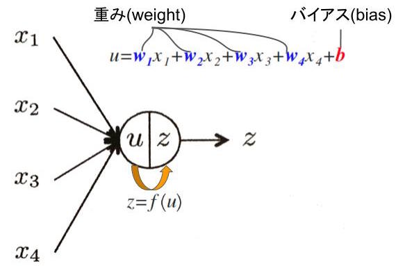

# 2 順伝播型ネットワーク
順伝播型ネットワークは最も基本的かつ最もよく使われているニューラルネットである。

## 2.1 ユニットの出力
**順伝播型(ニューラル)ネットワーク**(feedforward neural network): 層状に並べたユニットが隣接層間でのみ結合した構造を持ち、情報が入力層から出力層に一方的にのみ伝播するニューラルネットワーク。または、**多層パーセプトロン**(multi-layer perceptron)とも呼ばれる。

各ユニットは、複数の入力を受け取り、１つの出力を計算する。

 - ユニットが受け取る総入力: $u = w_{1}x_{1} + w_{2}x_{2} + w_{3}x_{3} + w_{4}x_{4} + b$
 - ユニットの出力: $z = f\left(u\right)$
    - $f\left(u\right)$: **活性化関数**(activation function)

順伝播型ネットワークでは、各ユニットが層状に並べられ、層間でのみそれらは結合を持つ。

右の層の3つのユニットが受け取る総入力
$$
{ u }_{ 1 }={ w }_{ 11 }{ x }_{ 1 }+{ w }_{ 12 }{ x }_{ 2 }+{ w }_{ 13 }{ x }_{ 3 }+{ w }_{ 14 }{ x }_{ 4 }+{ b }_{ 1 }\qquad (2.1a)\\ { u }_{ 2 }={ w }_{ 21 }{ x }_{ 1 }+{ w }_{ 22 }{ x }_{ 2 }+{ w }_{ 23 }{ x }_{ 3 }+{ w }_{ 24 }{ x }_{ 4 }+{ b }_{ 2 }\qquad (2.1b)\\ { u }_{ 3 }={ w }_{ 31 }{ x }_{ 1 }+{ w }_{ 32 }{ x }_{ 2 }+{ w }_{ 33 }{ x }_{ 3 }+{ w }_{ 34 }{ x }_{ 4 }+{ b }_{ 3 }\qquad (2.1c)
$$

それぞれの総入力$u_{j} \quad (j=1,2,3)$に活性化関数を適用したものが出力$z_{j} \quad (j=1,2,3)$となる。
$$
z_{j} = f\left(u_{j}\right) \quad (j=1,2,3) \qquad (2.2)
$$

一般化すると以下のようになる。第1層のユニットを$i=1,\cdots,I$、第2層のユニットを$j=1,\cdots,J$で表すと、第1層のユニットの出力から第2層のユニットの出力が決まるまでの計算は
$$
u_{j} = \sum _{i=1}^{I}{w_{ji}x_{i}} + b_{j}\\
z_{j} = f\left(u_{j}\right)
$$

行列とベクトルを用いて表記すると
$$
\left[ \begin{matrix} { u }_{ 1 } \\ { u }_{ 2 } \\ \vdots  \\ { u }_{ J } \end{matrix} \right] =\begin{bmatrix} { w }_{ 11 } & { w }_{ 12 } & \cdots  & { w }_{ 1I } \\ { w }_{ 21 } & { w }_{ 22 } & \cdots  & { w }_{ 22 } \\ \vdots  & \vdots  & \ddots  & \vdots  \\ { w }_{ J1 } & { w }_{ J2 } & \cdots  & { w }_{ JI } \end{bmatrix}\left[ \begin{matrix} { x }_{ 1 } \\ { x }_{ 2 } \\ \vdots  \\ x_{ I } \end{matrix} \right] +\left[ \begin{matrix} b_{ 1 } \\ { b }_{ 2 } \\ \vdots  \\ { b }_{ J } \end{matrix} \right] \\ \left[ \begin{matrix} z_{ 1 } \\ { z }_{ 2 } \\ \vdots  \\ { z }_{ J } \end{matrix} \right] =\left[ \begin{matrix} f\left( { u }_{ 1 } \right)  \\ f\left( { u }_{ 2 } \right)  \\ \vdots  \\ f\left( { u }_{ J } \right)  \end{matrix} \right]
$$

---
## 2.2 活性化関数
ユニットが持つ活性化関数には通常、単調増加する非線形関数が用いられる。

### ロジスティックシグモイド関数(logistic sigmoid function)
あるいは、**ロジスティック関数**

$$
f\left(u\right) = \frac {1}{1+e^{-u}}
$$

 - 定義域: $(-\infty, \infty)$
 - 値域: $(0,1)$

### 双曲線正接関数

$$
f\left(u\right) = tanh\left(u\right) = \frac { (e^{u} - e^{-u}) }{ (e^{u} + e^{-u}) }
$$

 - 値域: $(-1, 1)$

> 上の2つの関数も、
>
> - 入力の絶対値が大きな値をとると出力が飽和し一定値となること
> - その間の入力に対して出力が徐々にかつ滑らかに変化すること
>
> が特徴であり、一般に**シグモイド関数**(sigmoid function)と総称される。

### 正規化線形関数(rectified linear function)

$$
f\left(u\right) = \max { \left(u,0\right) }
$$

 - $z=u$の線形関数のうち$u<0$の部分を$u=0$で置き換えただけの単純な関数
 - 単純で計算量が小さい
 - 上述の2つの関数よりも学習がより速く進み、最終的にもよりよい結果が得られることが多い
 - この関数を持つユニットのことを**ReLU**(Rectified Linear Unit)と略記することがある

### 線形写像・恒等写像
ニューラルネットでは、各ユニットの活性化関数が非線形性を持つことが本質的に重要だが、部分的に線形写像を使う場合がある。

$$
f\left(u\right) = u \qquad (2.4)
$$

 - 回帰問題のためのネットワークでは、出力層に恒等写像を用いる

### ロジスティック関数を区分的に直線で近似した関数
$$
f\left( u \right) =\begin{cases} -1\qquad u<-1 \\ u\qquad -1\le u<1 \\ 1\qquad u\ge 1 \end{cases}
$$

### マックスアウト(maxout)
この活性化関数を持つユニット1つは、$K$個の異なるユニットをまとめて1つにしたような構造を持つ。それら$K$個の1つ1つが異なる重みとバイアスを持ち、それぞれの総入力を$u_{j1}, \cdots, u_{jK}$と別々に計算した後、それらの最大値をこのユニットの出力とする。
$$
u_{jk} = \sum _{i}{ w_{jik}z_{i} } + b_{jk} \qquad (k=1,\cdots, K)\\
f\left(u_{j}\right) = \max _{ k=1,\cdots,K }{ u_{jk} }
$$
各ユニットがこの活性化関数を持つネットワークは、各種ベンチマークテストで、正規化線形関数を使ったネットワークを凌ぐ結果を残している。

---
## 2.3 多層ネットワーク

---
## 2.4 出力層の設計と誤差関数
### 2.4.1 学習の枠組み
ある$x$が与えられたときに$d$を予測するモデルを学習することを目的とする。

> $N$ 個の訓練データを$D={ \left\{ \left( { x }_{i},y_{i} \right)  \right\}  }_{ i=1 }^{ N }$ としたとき、学習データでの誤差(以下の目的関数)を最小化するモデルパラメータ**$\theta$**の値を求める手続きを教師あり学習と呼ぶ。
>$$
> L\left( \theta \right) = \frac {1}{\left| D \right|}\sum _{i=1}^{\left| D \right|}{{ \ell  }_{ \theta  }\left( { x }^{ (i) },{ y }^{ (i) } \right) } \qquad (2.1)
>$$

> ${\ell}_{\theta}\left(x,y\right) \ge 0$: 個々の事例データに対して定義する**損失関数**(loss function)

| 問題の種別 | 出力層の活性化関数 | 誤差関数 |
|:---------|:----------------|:--------|
| 回帰 | 恒等写像 $f\left(u\right) = u$ | 二乗誤差　式(2.6) |
| 二値分類 | ロジスティック関数 $f\left(u\right) = \frac {1}{1+e^{-u}}$ | 式(2.8) |
| 多クラス分類 | ソフトマックス関数 | 交差エントロピー 式(2.11) |

### 2.4.2 回帰

### 2.4.3 二値分類

### 2.4.4 多クラス分類
