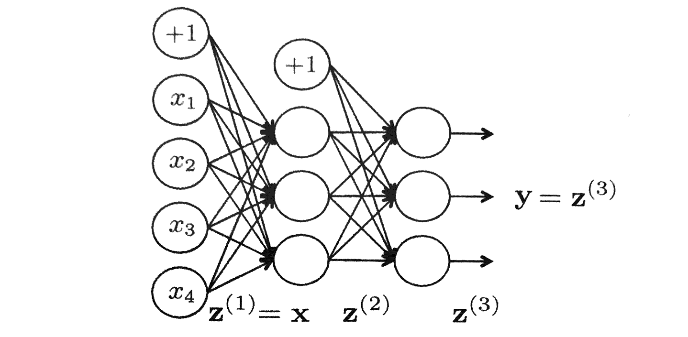
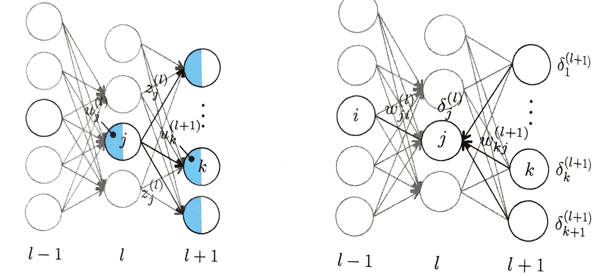
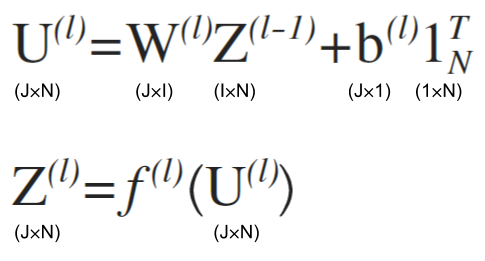

# 4 誤差逆伝播法

## 4.1 勾配計算の難しさ
確率的勾配降下法を実行するには、誤差関数$E\left( \mathrm {w} \right)$の勾配$\partial E\left( \mathrm {w} \right) / \partial \mathrm {w}$を計算する必要がある。

$$
{ \mathrm { w } }^{ (t+1) } = { \mathrm { w } }^{ (t) } - \epsilon { \nabla { E } }_{ i } \\
\nabla E = \frac { \partial E\left( \mathrm {w} \right) }{ \partial \mathrm {w} }
$$

 - 勾配のベクトルの各成分は、各層の$\partial E / \partial w_{ji}$と$\partial E / \partial b_{j}$

この誤差関数の微分計算は中間層、特に入力に近い深い層のパラメータほどその計算が面倒になる。

$$
\boldsymbol {\mathrm {u}}^{(l + 1)} = \boldsymbol {\mathrm {W}}^{(l + 1)} \boldsymbol {\mathrm {z}}^{(l)} + \boldsymbol {\mathrm {b}}^{(l + 1)}\\
\boldsymbol {\mathrm {z}}^{(l + 1)} = f\left( \boldsymbol {\mathrm {u}}^{(l + 1)} \right)
$$

ex)1つのデータ$x_{n}$に対する二乗誤差を第$l$層の重み$w^{(l)}_{ji}$で微分
$$
E_{n} = \frac {1}{2} \left[ f\left( x_{n} \right) - y_{n} \right]^{2} \\
\frac {\partial E_{n}}{ \partial {w}^{(l)}_{ji} } = \left[ f\left( x_{n} \right) - y_{n} \right] \frac {\partial f\left( x_{n} ; \mathrm {w} \right)}{\partial w^{(l)}_{ji}}
$$

順伝播型ニューラルネットのドキュメントで活性化関数は以下のように入れ子状態になっていることを示した。
$$
f\left( { W }^{ (L) }z^{ (L-1) }\left( x_{ n } \right) +{ b }^{ (L) } \right) \\ =f\left( { W }^{ (L) }f\left( { W }^{ (L-1) }z^{ (L-2) }\left( x_{ n } \right) +{ b }^{ (L-1) } \right) +{ b }^{ (L) } \right) \\ =f\left( { W }^{ (L) }f\left( { W }^{ (L-1) }f\left( \cdots f\left( { W }^{ (l) }z^{ (l-1) }\left( x_{ n } \right) +{ b }^{ (l) } \right) \cdots  \right) +{ b }^{ (L-1) } \right) +{ b }^{ (L) } \right) 
$$

このため、微分の連鎖規則を何度も繰り返す。

→プログラミングが大変面倒 
→計算量も大きくなる

この問題を解決する方法として、**誤差逆伝播法**(back propagation)がある。

※この問題は全学習データもしくはミニバッチに対する誤差関数の値に対しても言える。複数のデータに対する誤差関数の値は、各データに対する誤差関数の値の総和であるためである。

> 以降、表記を簡素化するために、下の図のように$+1$をいつも出力する特別な第0番ユニットを各層に導入し、バイアス$b_{j}$をそのユニットと各ユニット$j$との結合の重み$w^{l}_{0j} = b^{(l)}_{j}$と考えることとする。
>
> 
>
> つまり、$l$層のユニットへの入力は、$l - 1$層の第0ユニットの出力が常に$z^{(l - 1)}_{0} = 1$となることで
$$
u^{l}_{j} = \sum _{i=1}^{M}{ w^{(l)}_{ji} z^{(l - 1)}_{i} } + b_{j} = \sum _{i=0}^{M}{ w^{(l)}_{ji} z^{(l - 1)}_{i} }
$$

>  - $M$ : 成分数
> 
> と簡潔に書ける。

---
## 4.3 多層ネットワークでの微分計算
勾配降下法を実行するために各層の重みについて誤差関数を微分する必要がある。本節では、偏導関数を導出する。

 - 一つの学習データ$n$の特徴量 : $\mathrm {x}_{n} = \left( x_{n1}, x_{n2}, \cdots, x_{ni}, \cdots, x_{nI} \right)^{T}$
 - 中間層の出力 : $z_{j}^{(l)} = f\left( u_{j}^{(l)} \right) = f\left( \sum _{i}{ w_{ji}^{(l)} z_{i}^{(l-1)} } \right)$

$$
\left[ \begin{matrix} { u }_{ 1 }^{ (l) } \\ \vdots  \\ { u }_{ j }^{ (l) } \\ \vdots  \\ { u }_{ J }^{ (l) } \end{matrix} \right] =\begin{bmatrix} { w }_{ 11 }^{ (l) } & \cdots  & { w }_{ 1i }^{ (l) } & \cdots  & { w }_{ 1I }^{ (l) } \\ \vdots  & \ddots  & \vdots  & \ddots  & \vdots  \\ { w }_{ j1 }^{ (l) } & \cdots  & { w }_{ ji }^{ (l) } & \cdots  & { w }_{ jI }^{ (l) } \\ \vdots  & \ddots  & \vdots  & \ddots  & \vdots  \\ { w }_{ J1 }^{ (l) } & \cdots  & { w }_{ Ji }^{ (l) } & \cdots  & { w }_{ JI }^{ (l) } \end{bmatrix}\left[ \begin{matrix} { z }_{ 1 }^{ (l-1) } \\ \vdots  \\ { z }_{ i }^{ (l-1) } \\ \vdots  \\ { z }_{ I }^{ (l-1) } \end{matrix} \right] +\left[ \begin{matrix} { b }_{ 1 }^{ (l) } \\ \vdots  \\ { b }_{ j }^{ (l) } \\ \vdots  \\ { b }_{ J }^{ (l) } \end{matrix} \right] \\ \left[ \begin{matrix} { z }_{ 1 }^{ (l) } \\ \vdots  \\ { z }_{ j }^{ (l) } \\ \vdots  \\ { z }_{ J }^{ (l) } \end{matrix} \right] =\left[ \begin{matrix} f\left( { u }_{ 1 }^{ (l) } \right)  \\ \vdots  \\ f\left( { u }_{ j }^{ (l) } \right)  \\ \vdots  \\ f\left( { u }_{ J }^{ (l) } \right)  \end{matrix} \right] 
$$

第$l$層の重み$w_{ji}^{(l)}$について誤差関数を微分したとき簡潔に次式のように表せる。

$$
\frac {\partial E_{n}}{\partial w_{ji}^{(l)}} = \frac {\partial E_{n}}{\partial u_{j}^{(l)}} \frac {\partial u_{j}^{(l)}}{\partial w_{ji}^{(l)}}
$$

上式について右辺各項について考える。まず第1項について考える。

第1項は、$u_{j}^{(l)}$の変動が$E_{n}$に与える影響を表しており、このユニット$j$からの出力$z_{j}^{(l)}$を通じ、第$l + 1$層の各ユニット$k$の総入力$u_{k}^{(l + 1)}$を変化させることによってのみ生じる。

	

したがって、各$u_{k}^{(l+1)}$を経由した微分連鎖により、

$$
\frac { \partial E_{n} }{ \partial u_{j}^{(l)} } = \sum _{k^{(l+1)}}{ \frac {\partial E_{n}}{ \partial u_{k}^{(l + 1)} } \frac { \partial u_{k}^{(l + 1)} }{ \partial u_{j}^{(l)} } }
$$

となる。

 - $k^{(l + 1)}$ : 第$l + 1$層のユニット数

そして、上式は以下のように

$$
\begin{matrix} \delta _{ j }^{ (L-1) }=\sum _{ k^{ (l+1) } }{ \delta _{ k }^{ (L) }\left[ w_{ kj }^{ (L) }f^{ \prime  }\left( u_{ j }^{ (L-1) } \right)  \right]  }  \\ \vdots  \\ \delta _{ j }^{ (l) }=\sum _{ k^{ (l+1) } }{ \delta _{ k }^{ (l+1) }\left[ w_{ kj }^{ (l+1) }f^{ \prime  }\left( u_{ j }^{ (l) } \right)  \right]  }  \end{matrix}
$$

と表せる。この式を利用して$\delta_{k}^{(l + 2)}, \delta_{k}^{(l + 3)}, \cdots$と出力層$L$まで再帰的に計算することで、第$l$層のデルタが計算できる。

　第2項$\partial u_{j}^{(l)} / \partial w_{ji}^{(l)}$は、$u_{j}^{(l)} = \sum _{i}{ w_{ji}^{(l)}z_{i}^{(l-1)} }$の関係から簡単に

$$
\frac { \partial u_{j}^{(l)} }{ \partial w_{ji}^{(l)} } = z_{i}^{(l-1)}
$$

と計算できる。したがって、第$l$層の重み$w_{ji}^{(l)}$について誤差関数を微分した式は以下になる。

$$
\frac { \partial E_{n} }{ \partial w_{ji}^{(l)} } = \delta_{j}^{(l)} z_{i}^{(l-1)}
$$

デルタ$\delta_{j}^{(l)}$の計算は上で述べたように、出力層から入力層へ向かって繰り返し、$\delta _{ j }^{ (l) }=\sum _{ k^{ (l+1) } }{ \delta _{ k }^{ (l+1) }\left[ w_{ kj }^{ (l+1) }f^{ \prime  }\left( u_{ j }^{ (l) } \right)  \right] }$を適用することで求められる。逆伝播の最初の値は出力層での$\delta_{j}^{(L)}$が与えられているが、これは陽に

$$
\delta_{j}^{(L)} = \frac { \partial E_{n} }{ \partial u_{j}^{(L)} }
$$

と計算できる。ただし、具体的な計算は選択した出力層の活性化関数と誤差関数によって変わる。

上記の勾配式は一つの学習データ$n$から求まったものであり、具体的なアルゴリズムは以下の図で示してある。

そして、ミニバッチなどの複数の学習データに対する誤差の総和$E = \sum _{n}{E_{n}}$の勾配もこの手順を学習データ$\left( \mathrm {x}_{n}, \mathrm {y}_{n} \right)$ごとに並行に繰り返し、得られる勾配の和を

$$
\frac {\partial E}{\partial w_{ji}^{(l)}} = \sum _{n}{ \frac {\partial E_{n}}{\partial w_{ji}^{(l)}} }
$$

とすることで求められる。

---
## 4.4 勾配降下法の完全アルゴリズム
### 4.4.1 出力層でのデルタ
> 逆伝播計算の起点は出力層でのデルタ$\delta_{j}^{(L)} = \partial E_{n} / \partial u_{j}^{(L)}$である。その計算は使用する誤差関数および出力層の活性化関数に依存するが、代表的な場合を以下に示す。

**回帰** 

$$
E_{n} = \frac {1}{2} \sum _{j}{\left[ y_{j} - d_{j} \right]^{2}}
$$

出力層の活性化関数 : 恒等写像 $y_{j} = z_{j}^{(L)} = u_{j}^{(L)}$

$$
{\delta}_{j}^{(L)} \equiv \frac {\partial E_{n}}{\partial u_{j}^{(L)}} = y_{j} - d_{j}
$$

**二値分類** 

$$
E_{n} = -\left[ d \log {y} + (1 - d) \log {\left( 1 - y \right)} \right]
$$

出力層の活性化関数 : ロジスティック関数 $y = 1 / \left[ 1 + \mathrm {exp}\left( -u \right) \right]$

$$
{ \delta  }_{ j }^{ (L) }\equiv \frac { \partial E_{ n } }{ \partial u_{ j }^{ (L) } } =-\frac { d }{ y } \frac { dy }{ du_{ j }^{ (L) } } -\frac { 1-d }{ 1-y } \left( -\frac { dy }{ du_{ j }^{ (L) } }  \right)
$$

$dy/d u_{j}^{(L)}$は

$$
\frac {dy}{d u_{j}^{(L)}} = \frac {\mathrm {exp}\left( -u \right)}{ \left[ 1 + \mathrm {exp}\left( -u \right) \right]^{2} }\\
= \frac {1}{1 + \mathrm {exp}\left(-u\right)} \cdot \frac {\mathrm {exp}\left( -u \right)}{1 + \mathrm {exp}\left(-u\right)}\\
= y \cdot \left( 1 - y \right)
$$

なので、

$$
\frac { \partial E_{ n } }{ \partial u_{ j }^{ (L) } } =-\frac { d }{ y } y\left( 1-y \right) +\frac { 1-d }{ 1-y } y\left( 1-y \right) \\ =-d\left( 1-y \right) +\left( 1-d \right) y\\ =y-d
$$

となる。

**多クラス分類** 
出力層の活性化関数 : ソフトマックス関数

$$
E_{ n }=-\sum _{ k }{ d_{ k }\log { y_{ k } }  } =-\sum _{ k }{ d_{ k }\log { \left( \frac { \mathrm {exp}\left( u_{k}^{(L)} \right) }{ \sum _{i}{\mathrm {exp}\left( u_{i}^{(L)} \right)} }  \right)  }  } 
$$

$$
\delta_{j}^{(L)} \equiv \frac {\partial E_{n}}{\partial u_{j}^{(L)}} = - \sum _{k}{d_{k}\frac {1}{y_{k}} \frac {\partial y_{k}}{\partial u_{j}^{(L)}} }
$$

$k = j$のときの$\partial y_{k} / \partial u_{j}^{(L)}$

$$
\frac {\partial y_{k}}{\partial u_{j}^{(L)}} = \frac { \mathrm {exp}\left( u_{j}^{(L)} \right) \sum _{i}{\mathrm {exp}\left( u_{i}^{(L)} \right)} - \mathrm {exp}\left( u_{j}^{(L)} \right)\mathrm {exp}\left( u_{j}^{(L)} \right) }{ \left[ \sum _{i}{\mathrm {exp}\left( u_{i}^{(L)} \right)} \right]^{2} }\\
= y_{j} - y_{j}^{2}
$$

$k \neq j$のときの$\partial y_{k} / \partial u_{j}^{(L)}$

$$
\frac { \partial y_{ k } }{ \partial u_{ j }^{ (L) } } =\frac { -{ exp }\left( u_{ k }^{ (L) } \right) { exp }\left( u_{ j }^{ (L) } \right)  }{ \left[ \sum _{ i }{ { exp }\left( u_{ i }^{ (L) } \right)  }  \right] ^{ 2 } } \\ =-y_{ k }y_{ j }
$$

上式より

$$
\frac { \partial E_{ n } }{ \partial u_{ j }^{ (L) } } =-d_{ j }\frac { 1 }{ y_{ j } } \frac { \partial y_{ j } }{ \partial u_{ j }^{ (L) } } -\sum _{ k\neq j }{ d_{ k }\frac { 1 }{ y_{ k } } \frac { \partial y_{ k } }{ \partial u_{ j }^{ (L) } }  } \\ =-d_{ j }\frac { 1 }{ y_{ j } } \frac { \partial y_{ j } }{ \partial u_{ j }^{ (L) } } -\sum _{ k\neq j }{ d_{ k }\frac { 1 }{ y_{ k } } \frac { \partial y_{ k } }{ \partial u_{ j }^{ (L) } }  } \\ =-d_{ j }\frac { 1 }{ y_{ j } } \left( { y }_{ j }-{ y }_{ j }^{ 2 } \right) -\sum _{ k\neq j }{ d_{ k }\frac { 1 }{ y_{ k } } \left( -{ y }_{ k }{ y }_{ j } \right)  } \\ ={ y }_{ j }-{ d }_{ j }
$$

となる。ただし、$\sum _{k}{d_{k}} = 1$となる。

> 上記のように回帰、二値分類およびクラス分類のいずれかにおいても、出力層$L$のユニット$j$のデルタ$\delta_{j}^{(L)}$は、ネットワークの出力$y_{j}$とその目標出力$d_{j}$の差になる。

### 4.4.2 順伝播と逆伝播の行列計算
> 順伝播、逆伝搬およびパラメータ更新の各計算は、各層ごとに行列計算として表記できます。そこで以下では、ミニバッチを使った確率的勾配降下法の全計算を行列を使って表記します。

 - 重み$w_{ji}$を$(j,i)$成分に持つ$(J \times I)$の行列 : $\mathrm {W}$
 - $(J \times 1)$のバイアスベクトル : $\mathrm {b}$
 - ミニバッチ : $D_{t} \equiv \mathrm {X} = \left[ \mathrm {x}_{1}, \cdots, \mathrm {x}_{N} \right]$
 	- 特徴ベクトル : $\mathrm {x}_{n} = \left( x_{1}, \cdots, x_{p} \right)^{T}$
 - データ${\mathrm {x}}_n$を入力したときの$l$層の各ユニットについて、その総入力を成分に並べたベクトル : $\mathrm {u}_{n}^{(l)}$
 - ベクトル$\mathrm {u}_{n}^{(l)}$に活性化関数を作用させた各ユニットの出力を成分に持つベクトル : $\mathrm {z}_{n}^{(l)}$

$$
\mathrm {U}^{(l)} = \left[ \mathrm {u}_{1}^{(l)} \cdots \mathrm {u}_{N}^{(l)} \right]\\
\mathrm {Z}^{(l)} = \left[ \mathrm {z}_{1}^{(l)} \cdots \mathrm {z}_{N}^{(l)} \right]\\
\mathrm {Z}^{(1)} \equiv \mathrm {X}
$$

上記の表記を用いて、$l = 2, \dots, L$について次の2つの式の計算を行える。

 - $1_{N}$ : $1$を$N$個並べたベクトル
 - $f^{(l)}\left( \cdot \right)$ : 行列の各成分に並行に活性化関数を適用し、値を同サイズの行列で返すもの

上記の出力を行うために、選んだ誤差関数に対して最小値を与える重みを探索する方法として、勾配降下法を用いる。各層$l = 2, \dots, L$の重みの更新アルゴリズムを行列表記で示す。以下の行列表記は、実際にプログラムを実装する際に有用である。

ミニバッチ$D_{t}$ごとに各層$l = 2, \dots, L$について並行に行列計算する。

**勾配**
$$
\begin{bmatrix} \frac { \partial E }{ \partial { w }_{ 11 }^{ (l) } }  & \cdots  & \frac { \partial E }{ \partial { w }_{ 1i }^{ (l) } }  & \cdots  & \frac { \partial E }{ \partial { w }_{ 1I }^{ (l) } }  \\ \vdots  & \ddots  & \vdots  & \ddots  & \vdots  \\ \frac { \partial E }{ \partial { w }_{ j1 }^{ (l) } }  & \cdots  & \frac { \partial E }{ \partial { w }_{ ji }^{ (l) } }  & \cdots  & \frac { \partial E }{ \partial { w }_{ jI }^{ (l) } }  \\ \vdots  & \ddots  & \vdots  & \ddots  & \vdots  \\ \frac { \partial E }{ \partial { w }_{ J1 }^{ (l) } }  & \cdots  & \frac { \partial E }{ \partial { w }_{ Ji }^{ (l) } }  & \cdots  & \frac { \partial E }{ \partial { w }_{ JI }^{ (l) } }  \end{bmatrix}=\frac { 1 }{ N } \begin{bmatrix} { { \delta  }_{ 1 }^{ (l) } }_{ 1 } & \cdots  & { { \delta  }_{ 1 }^{ (l) } }_{ n } & \cdots  & { { \delta  }_{ 1 }^{ (l) } }_{ N } \\ \vdots  & \ddots  & \vdots  & \ddots  & \vdots  \\ { { \delta  }_{ j }^{ (l) } }_{ 1 } & \cdots  & { { \delta  }_{ j }^{ (l) } }_{ n } & \cdots  & { { \delta  }_{ j }^{ (l) } }_{ N } \\ \vdots  & \ddots  & \vdots  & \ddots  & \vdots  \\ { { \delta  }_{ J }^{ (l) } }_{ 1 } & \cdots  & { { \delta  }_{ J }^{ (l) } }_{ n } & \cdots  & { { \delta  }_{ J }^{ (l) } }_{ N } \end{bmatrix}\begin{bmatrix} { { z }_{ 1 }^{ (l-1) } }_{ 1 } & \cdots  & { { z }_{ i }^{ (l-1) } }_{ 1 } & \cdots  & { { z }_{ I }^{ (l-1) } }_{ 1 } \\ \vdots  & \ddots  & \vdots  & \ddots  & \vdots  \\ { { z }_{ 1 }^{ (l-1) } }_{ n } & \cdots  & { { z }_{ i }^{ (l-1) } }_{ n } & \cdots  & { { z }_{ I }^{ (l-1) } }_{ n } \\ \vdots  & \ddots  & \vdots  & \ddots  & \vdots  \\ { { z }_{ 1 }^{ (l-1) } }_{ N } & \cdots  & { { z }_{ i }^{ (l-1) } }_{ N } & \cdots  & { { z }_{ I }^{ (l-1) } }_{ N } \end{bmatrix}\\ \left[ \begin{matrix} { \partial E }/{ \partial { b }_{ 1 }^{ (l) } } \\ \vdots  \\ { \partial E }/{ \partial { b }_{ j }^{ (l) } } \\ \vdots  \\ { \partial E }/{ \partial { b }_{ J }^{ (l) } } \end{matrix} \right] =\frac { 1 }{ N } \begin{bmatrix} { { \delta  }_{ 1 }^{ (l) } }_{ 1 } & \cdots  & { { \delta  }_{ 1 }^{ (l) } }_{ n } & \cdots  & { { \delta  }_{ 1 }^{ (l) } }_{ N } \\ \vdots  & \ddots  & \vdots  & \ddots  & \vdots  \\ { { \delta  }_{ j }^{ (l) } }_{ 1 } & \cdots  & { { \delta  }_{ j }^{ (l) } }_{ n } & \cdots  & { { \delta  }_{ j }^{ (l) } }_{ N } \\ \vdots  & \ddots  & \vdots  & \ddots  & \vdots  \\ { { \delta  }_{ J }^{ (l) } }_{ 1 } & \cdots  & { { \delta  }_{ J }^{ (l) } }_{ n } & \cdots  & { { \delta  }_{ J }^{ (l) } }_{ N } \end{bmatrix}\left[ \begin{matrix} { 1 }_{ 1 } \\ \vdots  \\ { 1 }_{ n } \\ \vdots  \\ { 1 }_{ N } \end{matrix} \right] 
$$

**デルタ$\delta_{j}^{(l)} \equiv \frac {\partial E_{n}}{ \partial u_{j}^{(l)} }$の行列計算**

$$
\Delta^{(l)} = {f^{(l)}}^{\prime}\left( \mathrm {U}^{(l)} \right) \odot \left( \mathrm {W}^{(l + 1)T} \Delta^{(l + 1)} \right)
$$

 - $\Delta^{(l)}$ : $\left( J \times N \right)$の行列
 - $\mathrm {W}^{(l)}$ : $\left( J \times K \right)$の行列
 - $\mathrm {W}^{(l + 1)}$ : $\left( K \times N \right)$の行列
 - $J$ : 第$l$層のユニット数
 - $K$ : 第$l + 1$層のユニット数
 - $N$ : ミニバッチの学習データ数
 - ${f^{(l)}}^{\prime}\left( \mathrm {U}^{(l)} \right)$ : $\mathrm {U}$の各成分に$l$層の活性化関数の微分$f^{\prime}\left( \cdot \right)$を並行に適用して得られる同サイズの行列

### 4.4.5 勾配の差分近似計算
> もしネットワークの構造や活性化関数を自分で実装した場合、誤差関数の勾配が正しく計算されているかを検証する必要がある。そのために、勾配を数値微分で計算し、両者を比較することが有効である。

誤差関数$E$の勾配の**差分近似**(difference approximation)は

$$
\frac {\partial E}{\partial w_{ji}^{(l)}} = \frac { E\left( \dots, w_{ji}^{(l)} + \epsilon, \dots \right) - E\left( \dots, w_{ji}^{(l)}, \dots \right) }{\epsilon}
$$

のように計算される。$\epsilon \rightarrow 0$の極限をとると、上の式は偏微分$\partial E\left( \mathrm {w} \right) / \partial w_{ji}^{(l)}$の定義に一致する。

$\epsilon$の値は、近似の精度がよくなるように十分に小さな値を選ぶ必要がある。値としては以下のように選ぶのが一般的である。

$$
\epsilon \equiv \sqrt {\epsilon_{c}} \left| w_{ji} \right|
$$

ただし、右辺を評価した結果$\epsilon = 0$になってしまう場合には、$\epsilon \equiv \sqrt {\epsilon_{c}}$と設定し直します。

---
## 4.5 勾配消失問題
本節では、誤差逆伝播法から深いニューラルネットの学習がなぜ難しいのかを示す。

誤差関数を重み$w_{ji}^{(l)}$で微分すると以下の式になる。
$$
\frac { \partial E }{ \partial { w }_{ ji }^{ (l) } } =\frac { 1 }{ N } \sum _{ n=1 }^{ N }{ \frac { \partial { E }_{ n } }{ \partial { w }_{ ji }^{ (l) } }  } \\ =\frac { 1 }{ N } \sum _{ n=1 }^{ N }{ \frac { \partial { E }_{ n } }{ \partial { u }_{ j }^{ (l) } } \frac { \partial { u }_{ j }^{ (l) } }{ \partial { w }_{ ji }^{ (l) } }  } \\ =\frac { 1 }{ N } \sum _{ n=1 }^{ N }{ \left\{ \sum _{ { k }^{ (l+1) } }{ { \delta  }_{ k }^{ (l+1) }\left[ { w }_{ kj }^{ (l+1) }{ f }^{ \prime  }\left( { u }_{ j }^{ (l) } \right)  \right]  }  \right\} { z }_{ i }^{ (l-1) } } \\ =\frac { 1 }{ N } \sum _{ n=1 }^{ N }{ \left\{ \sum _{ { k }^{ (l+1) } }{ \sum _{ { k }^{ (l+1) } }{ \left\{ \cdots \left\{ \sum _{ { k }^{ (L) } }{ { \delta  }_{ k }^{ (L) }\left[ { w }_{ kj }^{ (L) }{ f }^{ \prime  }\left( { u }_{ j }^{ (L-1) } \right)  \right]  }  \right\} \cdots \left[ { w }_{ kj }^{ (l+2) }{ f }^{ \prime  }\left( { u }_{ j }^{ (l+1) } \right)  \right]  \right\}  } \left[ { w }_{ kj }^{ (l+1) }{ f }^{ \prime  }\left( { u }_{ j }^{ (l) } \right)  \right]  }  \right\} { z }_{ i }^{ (l-1) } } 
$$

このとき、活性化関数が恒等関数であると仮定すると簡潔に以下の式になる。

$$
\frac { \partial E }{ \partial { w }_{ ji }^{ (l) } } =\frac { 1 }{ N } \sum _{ n=1 }^{ N }{ \frac { \partial { E }_{ n } }{ \partial { w }_{ ji }^{ (l) } }  } \\ =\frac { 1 }{ N } \sum _{ n=1 }^{ N }{ \left\{ \sum _{ { k }^{ (l+1) } }{ \sum _{ { k }^{ (l+1) } }{ \left\{ \cdots \left\{ \sum _{ { k }^{ (L) } }{ { \delta  }_{ k }^{ (L) }{ w }_{ kj }^{ (L) } }  \right\} \cdots { w }_{ kj }^{ (l+2) } \right\}  } { w }_{ kj }^{ (l+1) } }  \right\} { z }_{ i }^{ (l-1) } } 
$$

重みは学習中にどのような値をとるかわからない。そのため、以下のような問題が生じる。

 - パラメータが比較的大きく$w_{kj}^{(L)} = w_{kj}^{(L-1)} = \cdots = w_{kj}^{(l)} = 100$の場合は、上記の微分の値は非常に大きな値になり、損失に対して非常に感度が高い状態となる
    - →この状態を**勾配爆発**(exploding gradients)と呼ぶ。
    - オーバーフローが起こりやすいなど計算機での計算が不安定な状態になる。
 - パラメータが比較的小さく$w_{kj}^{(L)} = w_{kj}^{(L-1)} = \cdots = w_{kj}^{(l)} = 0.01$の場合は、上記の微分の値は非常に小さい値になり、損失に対して非常に感度が低い状態となる
    - →この状態を**勾配消失**(vanishing gradients)と呼ぶ。
    - 損失の値が非常に小さい値としてしか伝わらないため先の勾配法を使って更新する場合には$w_{ji}^{(l)}$のパラメータがなかなか更新されない、つまり学習が進まない問題が発生する

このように中間層をもっと増やすことでより困難が増える。深層学習が広く使われるようになった背景には、これらの課題を克服するようなネットワーク構造が発明されたことも一因で、それらの手法の有効性は誤差逆伝播の仕組みで説明できる。
