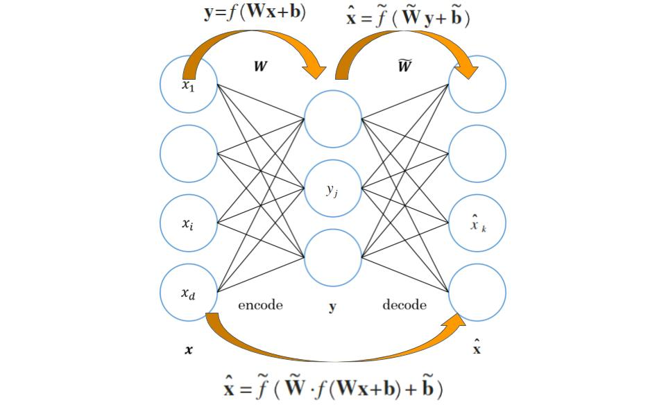
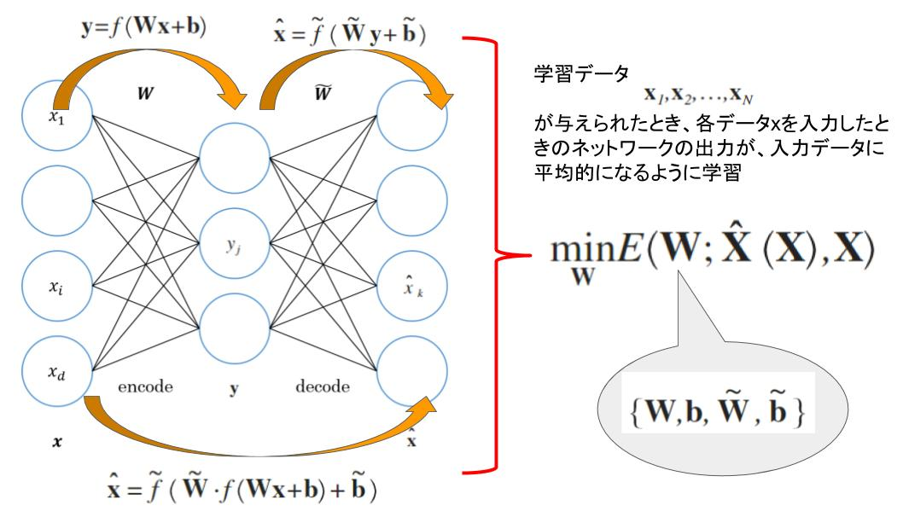
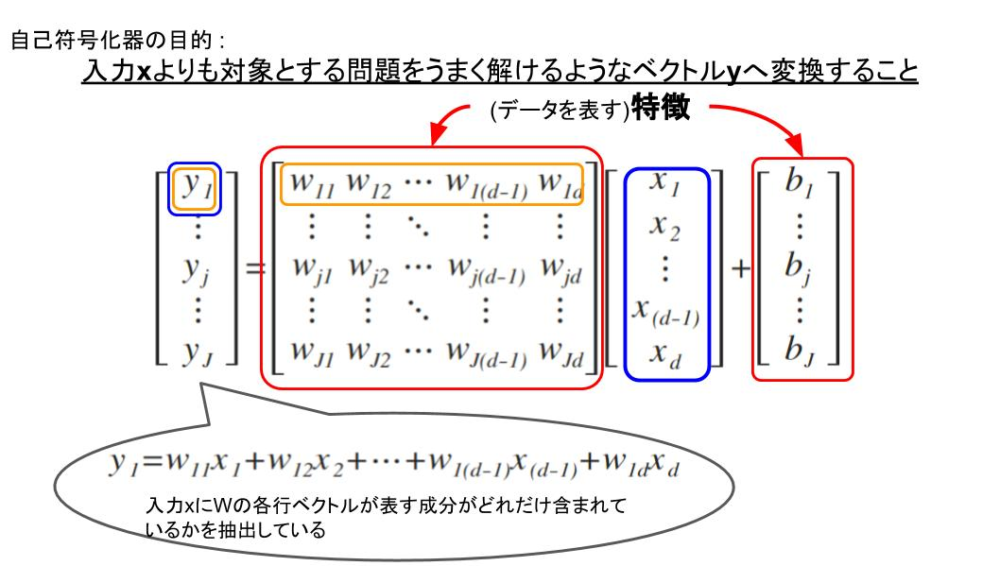

# 5 自己符号化器
> 自己符号化器とは、目標出力を伴わない、入力だけの学習データを使った教師なし学習により、データをよく表す特徴を獲得し、ひいてはデータのよい表現方法を獲得することを目標とするニューラルネットです。ディープネットの事前学習、すなわちその重みのよい初期値を得る目的にも利用される。

## 5.1 概要
以下のような順伝播型ネットワークを考える。

このネットワークは、最初の層では入力$\mathrm {x}$を$\mathrm {y}$に変換し、次の層ではこうして得た$\mathrm {y}$を入力$\mathrm {x}$と同じ空間に戻す変換を行なっている。

 - $\tilde {f}$ : 2層目の活性化関数だが、一般に最初の層の活性化関数$f$とは異なっていても構わない

以上の2層ネットワークの重みとバイアスをうまく調整して、入力$\mathrm {x}$に対する出力$\mathrm {\hat {x}}$が、元の入力$\mathrm {x}$になるべく近くなるようにすることを考える。

われわれの関心は、こうして学習したネットワークにある入力$\mathrm {x}$を与えたときの、中間層の出力$\mathrm {y}$にある。

 - **符号**(code) : $\mathrm {x}$に対して決まる$\mathrm {y}$のこと
 - **符号化**(encode) : 最初の変換$\mathrm {y} = f\left( \mathrm {W}\mathrm {x} + \mathrm {b} \right)$
 - **復号化**(decode) : 二番目の変換$\mathrm {\hat {x}} = f\left( \mathrm {W}\mathrm {x} + \mathrm {b} \right)$

**学習の狙い** : 入力を符号化し、続けて復号化したとき、元の入力がなるべく忠実に再現されるような**符号化の方法を定めること**

このような働きを持つネットワークのことを**自己符号化器**(autoencoder)と呼ぶ。

---
## 5.2 ネットワークの設計
### 5.2.1 出力層の活性化関数と誤差関数
自己符号化器の活性化関数には、中間層の$f$と出力層の$\widetilde { f } $がある。

 - 中間層の$f$ : 自由に決めることができ、通常、非線形の活性化関数を選ぶ
 - 出力層の$\widetilde {f}$ : その目標出力が入力した$\mathrm {x}$自身になるように入力データの種類に応じて選ぶ
 - 誤差関数 : 出力層の$\widetilde {f}$に応じて、$\mathrm {x}$と$\mathrm {\hat {x}}$の近さの尺度となるものを選ぶ

> **$\mathrm {x}$の各成分$x_{i}$が実数値をとる場合**($\infty > x_{i} > - \infty$) 
> 
> 活性化関数$\widetilde {f}$ : 恒等写像
> 誤差関数: 二乗誤差
> $$
E\left( \mathrm {W} \right) = \sum _{n = 1}^{N}{ {\left\| \mathrm {x}_{n} - \mathrm {\hat {x}}\left( \mathrm {x}_{n} \right) \right\| }^{2} }
$$

 

> **$\mathrm {x}$の各成分$x_{i}$が0と1をとる場合**($x_{i} \in \left\{ 0, 1 \right\}$) 
> 
> 活性化関数$\widetilde {f}$ : ロジスティック関数
> 誤差関数: 交差エントロピー
> $$
E\left( \mathrm {W} \right) = \sum _{n = 1}^{N}{ C\left( \mathrm {x}_{n}, \mathrm {\hat {x}}_{n} \right) }\\
C\left( \mathrm {x}_{n}, \mathrm {\hat {x}}_{n} \right) = - \sum _{i = 1}^{D}{ x_{i} \log {\hat {x}_{i}\left( \mathrm {x} \right)} + (1 - x_{i}) \log {\left\{ 1 - \hat {x}_{i}\left( \mathrm {x} \right) \right\}} }
$$

> $x_{i}$および$\hat {x}_{i}\left( \mathrm {x} \right)$は、それぞれ$\mathrm {x}$と$\mathrm {\hat {x}}\left( \mathrm {x} \right)$の$i$番目の成分を表す。

### 5.2.2 重み共有

 - 入力層のユニット数 : $D_{x}$
 - 中間層のユニット数 : $D_{y}$

重みの次元は以下になる。
$$
\mathrm {W}, \mathrm {\tilde {W}}\\
\left( D_{y} \times D_{x} \right), \left( D_{x} \times D_{y} \right)
$$

この二つの重み行列は異なるものであってもよいが、

$$
\mathrm {\tilde {W}} = \mathrm {W}^{T}
$$

のように共通することがある。これは、**重みの共有**(weight sharing)の一種であると見なせることもできる。

 - どのような場合に重みを共通にするべきか、逆にしてはいけないかについて知られた知見はない
 - 仮に$\mathrm {\tilde {W}}$と$\mathrm {W}$無関係にした場合でも、学習の結果得られた2つの重みが上の関係を近似的に満たすことがよくある

---
## 5.3 自己符号化器の働き

これまでの議論

 - 自己符号化器では、5.2.1節のような誤差関数を最小化することで、ネットワークの重みとバイアスを決定する
 - 通常、中間層の$( \mathrm {W}, \mathrm {b} )$と出力層$( \mathrm {\tilde {W}}, \mathrm {\tilde {b}} )$のうち、前者のみに関心がある

### データを表す特徴の学習

自己符号化器の目的は、特徴$(\mathrm {W}, \mathrm {b})$の学習を通じて、サンプル$\mathrm {x}$の別な「表現」である$\mathrm {y}$を得ること

ただし、何がよい表現であるかの明確な定義はない。直感的には、$\mathrm {x}$をそのまま使う代わりに変換した$\mathrm {y}$を用いると、対象とする問題がうまく解けるようなもの。

ex) 手書き数字の画像データを使って、自己符号化器を学習したときの例(上 : 学習前, 下 : 学習後)

### 5.3.2 主成分分析との関係
自己符号化器でどんな表現が学習できるかは、まずはネットワークの構造に依存する。主に中間層のユニットの数($\mathrm {y}$の成分数と一致)と、そこで用いる活性化関数である。

単純なネットワーク構造として以下のようなものを考え、このネットワークの中間層のユニット数を増減するとどんな影響があるかを考える。

$$
\hat {\mathrm {x}} = \mathrm {\tilde {W}}\left( \mathrm {W}\mathrm {x} + \mathrm {b} \right) + \mathrm {\tilde {b}}
$$

 - 入力層のユニット数 : $D_{x}$
 - 出力層のユニット数 : $D_{y}$

> #### $D_{y} \ge D_{x}$(中間層が入力層より大きい)の場合
>
> - $\mathrm {W}$の次元 : $D_{y} \times D_{x}$
> - $\mathrm {\tilde {W}}$の次元 : $D_{x} \times D_{y}$
>
> $\mathrm {W}$は$D_{y} \times D_{x}$行列、$\mathrm {\tilde {W}}$は$D_{x} \times D_{y}$行列でありともに最大ランクは$D_{x}$になる。これらの積$\mathrm {\tilde {W}} \mathrm {W}$はサイズが$D_{x} \times D_{x}$の正方行列、最大ランクは$D_{x}$は$D_{x}$となるので、$\mathrm {W}$と$\mathrm {\tilde {W}}$の成分をうまく選ぶと
>
> $$
\mathrm {\tilde {W}} \mathrm {W} = \mathrm {I}
$$
>
> とできる。さらに$\mathrm {b} = \mathrm {\tilde {b}} = 0$とすると
> $$
\hat {\mathrm {x}} = \mathrm {\tilde {W}}\left( \mathrm {W}\mathrm {x} + \mathrm {b} \right) + \mathrm {\tilde {b}}\\
= \mathrm {\tilde {W}} \mathrm {W} \mathrm {x} + \mathrm {\tilde {W}} \mathrm {b} + \mathrm {\tilde {b}}\\
= \mathrm {I} \mathrm {x} + \mathrm {0} + \mathrm {0}\\
= \mathrm {x}
$$
> となり、$\mathrm {x}$によらず常に、入力と出力が一致することになる。このとき、$E\left(\mathrm {w}\right)$はいつも0になるが、自己符号化器の目的を達成できていない。

上記を踏まえて、活性化関数が線形関数の場合、意味のある結果を得るためには、**中間層のユニット数が入力層よりも小さい($D_{y} \le D_{x}$)こと**が必要条件となる。

> #### $D_{y} \le D_{x}$(中間層が入力層より小さい)の場合
> 
> 

---
## 5.4 スパース正則化

---
## 5.5 データの白色化

---
## 5.6 ディープネットの事前学習

---
## 5.7 その他の自己符号化器

