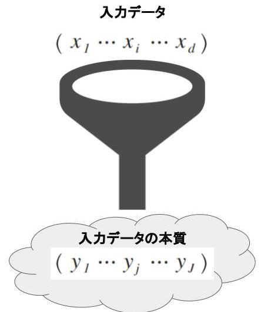
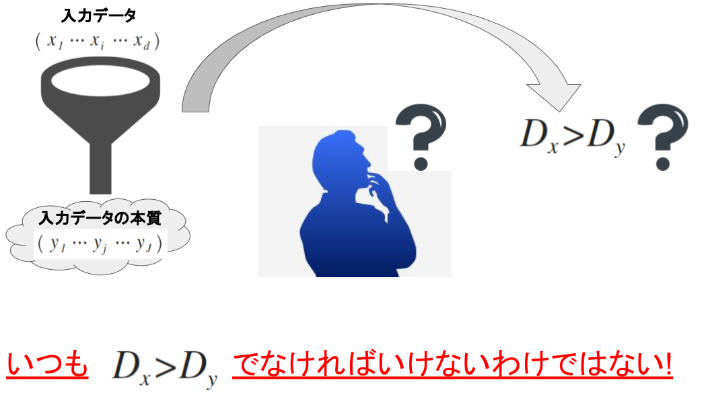
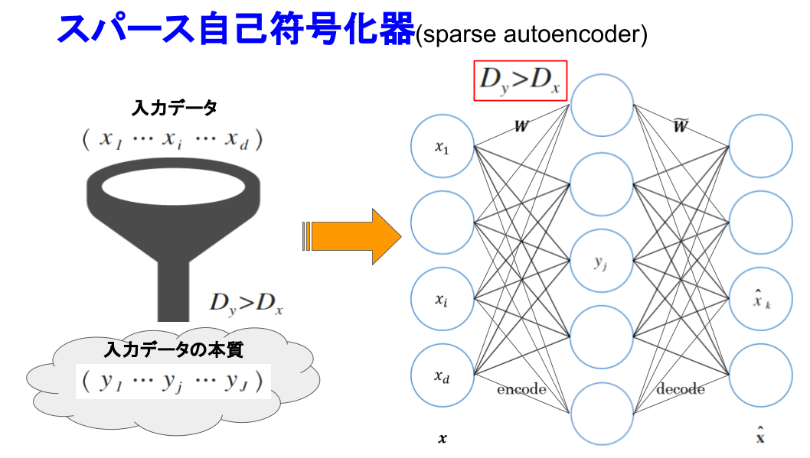
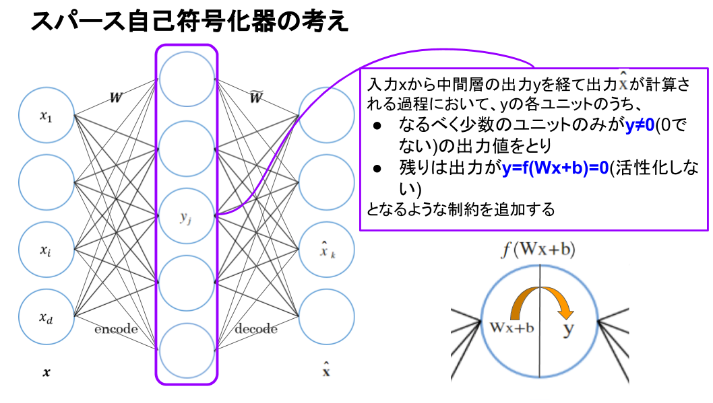
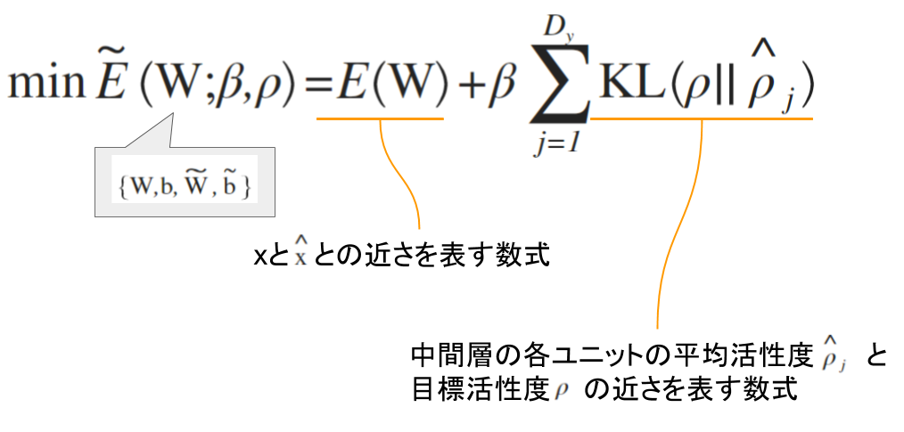
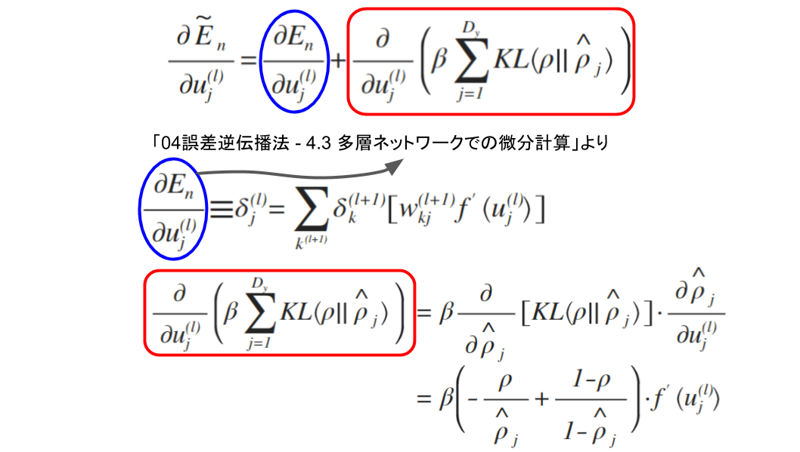
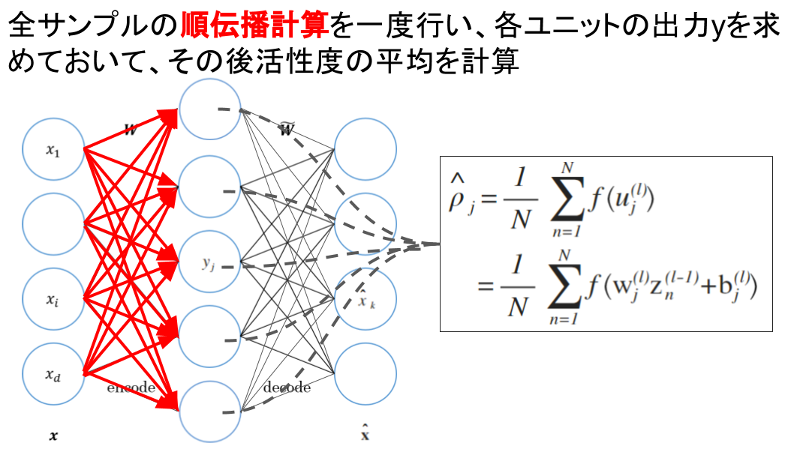

# 5 自己符号化器
> 自己符号化器とは、目標出力を伴わない、入力だけの学習データを使った教師なし学習により、データをよく表す特徴を獲得し、ひいてはデータのよい表現方法を獲得することを目標とするニューラルネットです。ディープネットの事前学習、すなわちその重みのよい初期値を得る目的にも利用される。

## 5.1 概要
以下のような順伝播型ネットワークを考える。

このネットワークは、最初の層では入力$\mathrm {x}$を$\mathrm {y}$に変換し、次の層ではこうして得た$\mathrm {y}$を入力$\mathrm {x}$と同じ空間に戻す変換を行なっている。

 - $\tilde {f}$ : 2層目の活性化関数だが、一般に最初の層の活性化関数$f$とは異なっていても構わない

以上の2層ネットワークの重みとバイアスをうまく調整して、入力$\mathrm {x}$に対する出力$\mathrm {\hat {x}}$が、元の入力$\mathrm {x}$になるべく近くなるようにすることを考える。

われわれの関心は、こうして学習したネットワークにある入力$\mathrm {x}$を与えたときの、中間層の出力$\mathrm {y}$にある。

 - **符号**(code) : $\mathrm {x}$に対して決まる$\mathrm {y}$のこと
 - **符号化**(encode) : 最初の変換$\mathrm {y} = f\left( \mathrm {W}\mathrm {x} + \mathrm {b} \right)$
 - **復号化**(decode) : 二番目の変換$\mathrm {\hat {x}} = f\left( \mathrm {W}\mathrm {x} + \mathrm {b} \right)$

**学習の狙い** : 入力を符号化し、続けて復号化したとき、元の入力がなるべく忠実に再現されるような**符号化の方法を定めること**

このような働きを持つネットワークのことを**自己符号化器**(autoencoder)と呼ぶ。

---
## 5.2 ネットワークの設計
### 5.2.1 出力層の活性化関数と誤差関数
自己符号化器の活性化関数には、中間層の$f$と出力層の$\widetilde { f } $がある。

 - 中間層の$f$ : 自由に決めることができ、通常、非線形の活性化関数を選ぶ
 - 出力層の$\widetilde {f}$ : その目標出力が入力した$\mathrm {x}$自身になるように入力データの種類に応じて選ぶ
 - 誤差関数 : 出力層の$\widetilde {f}$に応じて、$\mathrm {x}$と$\mathrm {\hat {x}}$の近さの尺度となるものを選ぶ

> **$\mathrm {x}$の各成分$x_{i}$が実数値をとる場合**($\infty > x_{i} > - \infty$) 
> 
> 活性化関数$\widetilde {f}$ : 恒等写像
> 誤差関数: 二乗誤差
> $$
E\left( \mathrm {W} \right) = \sum _{n = 1}^{N}{ {\left\| \mathrm {x}_{n} - \mathrm {\hat {x}}\left( \mathrm {x}_{n} \right) \right\| }^{2} }
$$

 

> **$\mathrm {x}$の各成分$x_{i}$が0と1をとる場合**($x_{i} \in \left\{ 0, 1 \right\}$) 
> 
> 活性化関数$\widetilde {f}$ : ロジスティック関数
> 誤差関数: 交差エントロピー
> $$
E\left( \mathrm {W} \right) = \sum _{n = 1}^{N}{ C\left( \mathrm {x}_{n}, \mathrm {\hat {x}}_{n} \right) }\\
C\left( \mathrm {x}_{n}, \mathrm {\hat {x}}_{n} \right) = - \sum _{i = 1}^{D}{ x_{i} \log {\hat {x}_{i}\left( \mathrm {x} \right)} + (1 - x_{i}) \log {\left\{ 1 - \hat {x}_{i}\left( \mathrm {x} \right) \right\}} }
$$

> $x_{i}$および$\hat {x}_{i}\left( \mathrm {x} \right)$は、それぞれ$\mathrm {x}$と$\mathrm {\hat {x}}\left( \mathrm {x} \right)$の$i$番目の成分を表す。

### 5.2.2 重み共有

 - 入力層のユニット数 : $D_{x}$
 - 中間層のユニット数 : $D_{y}$

重みの次元は以下になる。
$$
\mathrm {W}, \mathrm {\tilde {W}}\\
\left( D_{y} \times D_{x} \right), \left( D_{x} \times D_{y} \right)
$$

この二つの重み行列は異なるものであってもよいが、

$$
\mathrm {\tilde {W}} = \mathrm {W}^{T}
$$

のように共通することがある。これは、**重みの共有**(weight sharing)の一種であると見なせることもできる。

 - どのような場合に重みを共通にするべきか、逆にしてはいけないかについて知られた知見はない
 - 仮に$\mathrm {\tilde {W}}$と$\mathrm {W}$無関係にした場合でも、学習の結果得られた2つの重みが上の関係を近似的に満たすことがよくある

---
## 5.3 自己符号化器の働き

これまでの議論

 - 自己符号化器では、5.2.1節のような誤差関数を最小化することで、ネットワークの重みとバイアスを決定する
 - 通常、中間層の$( \mathrm {W}, \mathrm {b} )$と出力層$( \mathrm {\tilde {W}}, \mathrm {\tilde {b}} )$のうち、前者のみに関心がある

### データを表す特徴の学習

自己符号化器の目的は、特徴$(\mathrm {W}, \mathrm {b})$の学習を通じて、サンプル$\mathrm {x}$の別な「表現」である$\mathrm {y}$を得ること

ただし、何がよい表現であるかの明確な定義はない。直感的には、$\mathrm {x}$をそのまま使う代わりに変換した$\mathrm {y}$を用いると、対象とする問題がうまく解けるようなもの。

ex) 手書き数字の画像データを使って、自己符号化器を学習したときの例(上 : 学習前, 下 : 学習後)

### 5.3.2 主成分分析との関係
自己符号化器でどんな表現が学習できるかは、まずはネットワークの構造に依存する。主に中間層のユニットの数($\mathrm {y}$の成分数と一致)と、そこで用いる活性化関数である。

単純なネットワーク構造として以下のようなものを考え、このネットワークの中間層のユニット数を増減するとどんな影響があるかを考える。

$$
\hat {\mathrm {x}} = \mathrm {\tilde {W}}\left( \mathrm {W}\mathrm {x} + \mathrm {b} \right) + \mathrm {\tilde {b}}
$$

 - 入力層のユニット数 : $D_{x}$
 - 出力層のユニット数 : $D_{y}$

> #### $D_{y} \ge D_{x}$(中間層が入力層より大きい)の場合
>
> - $\mathrm {W}$の次元 : $D_{y} \times D_{x}$
> - $\mathrm {\tilde {W}}$の次元 : $D_{x} \times D_{y}$
>
> $\mathrm {W}$は$D_{y} \times D_{x}$行列、$\mathrm {\tilde {W}}$は$D_{x} \times D_{y}$行列でありともに最大ランクは$D_{x}$になる。これらの積$\mathrm {\tilde {W}} \mathrm {W}$はサイズが$D_{x} \times D_{x}$の正方行列、最大ランクは$D_{x}$は$D_{x}$となるので、$\mathrm {W}$と$\mathrm {\tilde {W}}$の成分をうまく選ぶと
>
> $$
\mathrm {\tilde {W}} \mathrm {W} = \mathrm {I}
$$
>
> とできる。さらに$\mathrm {b} = \mathrm {\tilde {b}} = 0$とすると
> $$
\hat {\mathrm {x}} = \mathrm {\tilde {W}}\left( \mathrm {W}\mathrm {x} + \mathrm {b} \right) + \mathrm {\tilde {b}}\\
= \mathrm {\tilde {W}} \mathrm {W} \mathrm {x} + \mathrm {\tilde {W}} \mathrm {b} + \mathrm {\tilde {b}}\\
= \mathrm {I} \mathrm {x} + \mathrm {0} + \mathrm {0}\\
= \mathrm {x}
$$
> となり、$\mathrm {x}$によらず常に、入力と出力が一致することになる。このとき、$E\left(\mathrm {w}\right)$はいつも0になるが、自己符号化器の目的を達成できていない。

上記を踏まえて、活性化関数が線形関数の場合、意味のある結果を得るためには、**中間層のユニット数が入力層よりも小さい($D_{y} \le D_{x}$)こと**が必要条件となる。

> #### $D_{y} \le D_{x}$(中間層が入力層より小さい)の場合
> 誤差関数$E\left( \mathrm {W} \right)$
> 
> この場合、誤差関数$E\left( \mathrm {W} \right)$を最小にする$\mathrm {W}$および$\mathrm {\widetilde { W } }$は、学習データ$\left\{ {\mathrm {x}}_{1}, \dots, \mathrm {x}_{n} \right\}$の**主成分分析(principal component analysis, PCA)で得られるものと実質的に同じ**である。
>
> 主成分分析では、データの$D_{x}$次元空間での広がりを最もよく表す固有ベクトルで表現する。
>
> 学習データ$\left\{ {\mathrm {x}}_{1}, \dots, \mathrm {x}_{n} \right\}$が標準偏差によって標準化されていれば、主成分分析の固有ベクトルを$D_{y}$個得たものが$\mathrm {W}$となる。
> $$
> R a = \lambda a \\
> R = \begin{bmatrix} 1 & { r }_{ { x }_{ 1 }{ x }_{ 2 } } & \cdots  & { r }_{ { x }_{ 1 }{ x }_{ d } } \\ { r }_{ { x }_{ 2 }{ x }_{ 1 } } & 1 & \cdots  & { r }_{ { x }_{ 2 }{ x }_{ d } } \\ \vdots  & \vdots  & \ddots  & \vdots  \\ { r }_{ { x }_{ d }{ x }_{ 1 } } & { r }_{ { x }_{ d }{ x }_{ 2 } } & \cdots  & 1 \end{bmatrix}\\
= \frac {1}{N} \sum _{n=1}^{N}{\left( \mathrm {x}_{n} - \overline {\mathrm {x}_{n}} \right)\left( \mathrm {x}_{n} - \overline {\mathrm {x}_{n}} \right)^{T}}
> $$
>
> - $R$ : 相関行列、共分散行列でもある
> - $a = \left( a_{1}, \dots, a_{D_{x}} \right)$ : 固有ベクトル
> - $\lambda$ : 固有値
> 
> 証明:
>
> 

> 
> 

> この固有値の降順に$\mathrm {R}$の固有ベクトルを$D_{y}$個を選び、これを行ベクトルとして格納した行列$U_{D_{y}}$ ($\mathrm {D}_{y} \times \mathrm {D}_{x}$)を定義する。この$U_{D_{y}}$および学習データの平均$\bar {\mathrm {x}}$は、今考えている自己符号化器の誤差関数と同じ最小化問題の解$\left( \mathrm { W } ,\mathrm {b} \right) =\left( \mathrm { U }_{ { D }_{ y } },\bar { \mathrm { x } }  \right) $になっている。

---
## 5.4 スパース正則化
### 5.4.1 データの過完備な表現

前節で述べたように、自己符号化器は入力データの特徴を学習するが、**一般によい特徴とは、入力データの不要な情報をそぎ落とし、その本質だけを取り出したもの**といえるだろう。

<table>
	<tr>
		<th>よい特徴とは？</th>
		<th>じゃあ$D_{x} > D_{y}$かな？</th>
	</tr>
	<tr>
		<td></td>
		<td></td>
	</tr>
</table>

そうであれば、入力データの成分数$D_{x}$よりも、それを符号化した符号が持つ成分数$D_{y}$はおのずと小さくなりそうですね。しかしながら、**いつもそうしなければいけないわけではない。**

以下で説明する**スパース正則化**を使うと、**余分な自由度$D_{x} < D_{y}$を持つ冗長な特徴でありながら入力データをうまく表現できるような特徴を得ることができます。**
これを**過完備な(overcomplete)**表現といいます。

しかし、

 - 前節で、<u>少なくとも中間層の活性化関数に**線形関数を**選んだときは</u>、中間層のユニット数$D_{y}$が入力層のユニット数$D_{x}$より多い場合に、**無意味な結果しか得られない($\mathrm {x} = \mathrm {\hat {x}}$)**ことを説明した
 - <u>中間層の活性化関数に**非線形関数**を選べば</u>、その議論はそのままでは成り立たないが、中間層の自由度が入力度の自由度を上回る($D_{y} \ge D_{x}$)ことに変わりなく、**つまらない解($\mathrm {x} \rightarrow \mathrm {\hat { x } }$が恒等写像となってしまう)**しか得られない可能性は十分にある

これに対し、以下に述べる**スパース正則化**の考え方を使えば、**中間層のユニット数の方が多い($D_{y} > D_{x}$)場合であっても、自己符号化器で意味のある表現を学習できるようになる。**これを**スパース自己符号化器(sparse autoencoder)**と呼ぶ。

#### スパース自己符号化器(sparse autoencoder)
基本となる考え: *個々の訓練サンプル$\mathrm {x}_{n}$をなるべく小さい数の中間層のユニットをつかって再現できるようにパラメータを決定すること*

具体的には、以下の誤差関数を最小化する。
$$
\min { \widetilde { E } \left( \mathrm {W} \right) =E\left( \mathrm {W} \right) + \beta \sum _{ j=1 }^{ { D }_{ y } }{ \mathrm {KL}\left( \rho \parallel { \widehat { \rho  }  }_{ j } \right)  }  } \qquad (5.2)
$$

 - $E\left( \mathrm {W} \right)$ : 元の誤差関数
 - $\widehat {\rho}_{j}$ : 中間層のユニット$j$の平均活性度の推定値
$\begin{eqnarray} \widehat { \rho  } _{ j } & = & \cfrac { 1 }{ N } \sum _{ n=1 }^{ N }{ { y }_{ j }\left( {\mathrm {x} }_{ n } \right)  }  \\  & = & \cfrac { 1 }{ N } \sum _{ n=1 }^{ N }{ f\left( \mathrm {W}{ \mathrm {x} }_{ n } + \mathrm {b} \right)  }  \end{eqnarray}$
 - $\rho$ : 中間層のユニット$j$の平均活性度の目標値となるパラメータ
 - $\mathrm {KL}\left( \rho \parallel { \widehat { \rho  }  }_{ j } \right)$ : ${ \widehat { \rho  }  }_{ j }$と$\rho$の近さを与える関数
 - $\beta$ : 誤差関数$E\left( \mathrm {W} \right)$と$\mathrm {KL}\left( \rho \parallel { \widehat { \rho  }  }_{ j } \right)$のバランスを変えるパラメータ

$\rho$に小さな値をセットし上式の誤差関数を最小化すると、**中間層の各ユニットの平均活性度が小さな$\rho$に近くなり、かつ入力の再現誤差$E\left( \mathrm {W} \right)$が小さくなるように、$\mathrm {W}$が決定される**。※$\beta$と$\rho$は一緒に指定されます。

	

こうすることで、各サンプルを表現するのに使われる中間層のユニットの数が少なくなるよう学習が行われる。このとき、あくまで**活性度の平均値を小さくするように制約を与えている**ので、<u>各サンプル$\mathrm {x}_{n}$ごとに、活性化するユニットは異なってよいことに注意します</u>(そうでなければ、どのサンプルに対しても常に同じユニットだけしか使われないことになり、そもそもユニット数を削減するのと変わりません)。

$\mathrm {KL}\left( \rho \parallel { \widehat { \rho  }  }_{ j } \right)$は、
$$
\mathrm {KL}\left( \rho \parallel { \widehat { \rho  }  }_{ j } \right) = \rho \log {\left( \frac {\rho}{\widehat {\rho}_{j}} \right)} + (1 - \rho) \log {\left( \frac {1 - \rho}{1 - \widehat {\rho}_{j}} \right)}
$$

のように定義され、平均値がそれぞれ$\rho$と${\widehat {\rho}}_{j}$である2つのベルヌーイ分布間のカルバック・ライブラー・ダイバージェンスを表す。つまり、**中間層のユニットが0か1かの2値の出力をとるとし、かつその出力が確率$\rho$で1、確率$1 - \rho$で0となる場合に、このユニットの出力の実現分布と理想の実現分布の間の近さを測っている**。なお中間層のユニットの出力が2値でなくても、活性化関数にロジスティック関数や正規化線形関数など、0以上の値を返すものを使っていれば、(理論的な意味は別として)式(5.2)スパース自己符号化器の誤差関数の正則化は有効に機能する。

カルバック・ライブラー・ダイバージェンスについては、[https://logics-of-blue.com/information-theory-basic/](https://logics-of-blue.com/information-theory-basic/)を参照。

### 5.4.2 最適化
式(5.2)の拡張された誤差関数$\widetilde { E }\left( \mathrm {W} \right)$も勾配降下法を使って最小化できる。ただし、追加したスパース正則化項は、ユニットの平均活性度${\widehat {\rho}}_{j}$を通じて$\mathrm {W}$に依存しているので、拡張された誤差関数の勾配を計算する際、これも考慮しなければならない。

以下では、ネットワークを多層($L > 2$)の場合に一般化する。

$$
\frac {\partial \widetilde { E }\left( \mathrm {W} \right)}{ \partial u_{ji}^{(l)} } = \sum _{n=1}^{N}{\frac { \partial \widetilde { E }_{n} }{ \partial {w}_{ji}^{(l)} }} \\
\frac { \partial \widetilde { E }_{n} }{ \partial {w}_{ji}^{(l)} } = \frac {\partial \widetilde {E}_{n}}{\partial u_{j}^{(l)}} \cdot \frac {\partial u_{j}^{(l)}}{\partial w_{ji}^{(l)}}
$$

$\frac {\partial u_{j}^{(l)}}{\partial w_{ji}^{(l)}}$は「04誤差逆伝播法」で示したように$\frac {\partial u_{j}^{(l)}}{\partial w_{ji}^{(l)}} = z_{i}^{(l - 1)}$なので、$\frac {\partial \widetilde {E}_{n}}{\partial u_{j}^{(l)}}$を考える。

※$\widehat {\rho}_{j} = \frac {1}{N}\sum _{n=1}^{N}{f\left( u_{j}^{(l)} \right)}$より、
$$
\frac {\partial \widehat {\rho}_{j} }{ \partial u_{j}^{(l)} } = \frac {1}{N} \sum _{n=1}^{N}{f^{\prime}\left( u_{j}^{(l)} \right)}\\
= \frac {1}{N} \cdot N f^{\prime}\left( u_{j}^{(l)} \right)\\
= f^{\prime}\left( u_{j}^{(l)} \right)
$$

以上をまとめると、デルタの計算は
$$
\widetilde { \delta _{ j }^{ (l) } } \equiv \frac { \partial \widetilde { E } _{ n } }{ \partial u_{ j }^{ (l) } } =\left\{ \left[ \sum _{ { k }^{ (l+1) } }{ { \delta  }_{ k }^{ (l+1) }{ w }_{ kj }^{ (l+1) } }  \right] +\beta \left( -\frac { \rho  }{ { \widehat { \rho  }  }_{ j } } +\frac { 1-\rho  }{ 1-{ \widehat { \rho  }  }_{ j } }  \right)  \right\} { f }^{ \prime  }\left( { u }_{ j }^{ (l) } \right) \qquad (5.4)
$$
となる。この修正されたデルタ$\widetilde {\delta}_{j}^{(l)}$の計算式に従って逆伝播の計算を行い、確定した各値を用いて
$$
\frac {\partial \widetilde {E}_{n}}{\partial w_{ji}^{(l)}} = \widetilde {\delta}_{j}^{(l)} \cdot z_{i}^{(l-1)}
$$
のように計算する。なお、出力層は正則化の対象外なのでデルタの計算に変更はない。

なお式(5.4)でデルタを計算する際、ユニットの平均活性度$\widehat {\rho}_{j}$の値が必要である。平均活性度は全サンプルについての平均なので、これを厳密に求めるには**全サンプルの順伝播計算を一度行い、各ユニットの出力を求めておいて、その後活性度の平均を計算することになる**。

全サンプルを使ってパラメータ更新を行うバッチ最適化では、このやり方が実行可能である。ただし**ミニバッチを使用して学習する場合、平均活性度の計算のためだけに全サンプルの順伝播計算を行ったのでは大変非効率である**。

そこでその場合は、ミニバッチが含むサンプル集合についてのみ平均活性度を求めることを繰り返し、ミニバッチ間で次のように加重平均をとった値を、全サンプルに対する値の近似値として使う。
$$
\widehat {\rho}_{j}^{(t)} = \lambda \widehat {\rho}_{j}^{(t-1)} + (1 - \lambda)\widehat {\rho}_{j}
$$

 - $\widehat {\rho}_{j}^{(t-1)}$ : 前ミニバッチで使用したユニット$j$の平均活性度
 - $\widehat {\rho}_{j}$ : 現在のミニバッチだけで新たに計算した平均活性度
 - $\lambda$ : 平均の重み(例えば$\lambda = 0.9$などを選ぶ)

### 5.4.3 スパース正則化の効果
上述したのと同じ自己符号化器にスパース正則化項を追加し、手書き数字を学習した結果を以下の図に示す。

	<h5>中間層の目標平均活性度を$\rho = 0.05$とし、$\beta$を$0.0 \sim 3.0$まで変化させたとき、各$\beta$に対し学習された特徴を示す</h5>
	

 - $\beta = 0.0$(スパース正則化を行わなかったとき) : 特徴は雑然としたパターンになる
 - $\beta = 0.1$ : 数字を分解した「ストローク」のようなものになっている。これらストロークの組合せで任意の数字が表現できることになり、直感的には、これらはよい特徴といえそうである。
 - $\beta = 3.0$ : 個別の数字がそのまま「特徴」として選ばれてしまっている。ただ１つの特徴で入力画像を表現しようとした結果です。明らかに、これでは数字の微妙な形状変化を捉えることはできないでしょう。

自己符号化器は、入力された各サンプルを中間層の各ユニットが「分担」して表現します。学習時のスパース正則化は、この分担のあり方を制御する働きがあるといえる。

 - $\beta = 0.0$(スパース正則化を行わないとき) : 中間層の各ユニットはそれぞれ勝手に入力を表現しようとする
 - $\beta = 0.1$ : 適度にスパース正則化が行われると、入力が持つ構造を効率よく表すように、中間層のユニットが協力して個々の入力を表現するようになる
 - $\beta = 3.0$ : スパース正則化が強すぎると、中間層のユニットは集合ではなく、なるべく単独で個々の入力を表現しようとする

---
## 5.5 データの白色化
> 訓練データにはしばしば偏りがあり、学習の妨げになる。学習前にデータに処理を施し、そのような偏りを除去することは一般的に大事である。3.6.1項では、最も基本となるデータの正規化について述べたが、本節ではより高度な**白色化**(whitening)を説明する。 
> 白色化は、自己符号化器がよい特徴を学習できるかどうかを大きく左右することがある。

白色化の狙いは、**訓練サンプルの成分間の相関をなくすこと**です。すなわち、**$D$次元空間にあるサンプル$\mathrm {x} = \left( x_{1} \cdots x_{D} \right)^{T}$の任意の2成分$x_{p}$と$x_{q}$間の相関がなくなるようにする**ことです。

> - 標準化($z = \frac {x - \bar {x}}{\sigma_{x}}$) : サンプルの成分単位での処理
> - 白色化 : 成分間の関係を修正する処理

以下では、各サンプルからあらかじめその平均を引いたものを$\mathrm {x}_{1}, \dots, \mathrm {x}_{n}$と書き、つまり、$\frac {1}{N}\sum _{n=1}^{N}{\mathrm {x}_{n}} = 0$であるとする。

復習:
$$
\sum _{n=1}^{N}{\left( x_{n} - \bar {x} \right)} = \sum _{n=1}^{N}{ x_{n} }  - N \bar {x} = N \bar {x} - N \bar {x} = 0
$$

訓練サンプルの成分間の相関は共分散行列によって表される。
$$
{ \Phi  }_{ X }\equiv \frac { 1 }{ N } \sum _{ n=1 }^{ N }{ \mathrm {x}_{ n }{ \mathrm { x }_{ n } }^{ T } }\\
=\frac { 1 }{ N } \sum _{ n=1 }^{ N }{ \left( \begin{matrix} { x }_{ n1 } \\ \vdots  \\ { x }_{ nD } \end{matrix} \right) { \left( \begin{matrix} { x }_{ n1 } & \cdots  & { x }_{ nD } \end{matrix} \right)  }^{ T } } \\ =\frac { 1 }{ N } \sum _{ n=1 }^{ N }{ \begin{pmatrix} { { x }_{ n1 } }^{ 2 } & \cdots  & { x }_{ n1 }{ x }_{ nD } \\ \vdots  & \ddots  & \vdots  \\ { x }_{ nD }{ x }_{ n1 } & \cdots  & { { x }_{ nD } }^{ 2 } \end{pmatrix} } \\
= \frac {1}{N}\mathrm {X} \mathrm {X}^{T}
$$

 - ${\Phi}_{X}$ : $D \times D$行列
 - $\mathrm {X} = \left[ {\mathrm {x}}_{1} \cdots {\mathrm {x}}_{N} \right]$
 - 相関係数の定義 : $r_{xy} = \frac {1}{N} \sum _{n=1}^{N}{\frac {(x_{n} - \bar {x})}{\sigma_{x}} \frac {(y_{n} - \bar {y})}{\sigma_{y}}}$

この共分散行列$\Phi$の$\left( p,q \right)$成分は、サンプル$\mathrm {x}$の$\left( p,q \right)$成分がどの程度同じように変化するかを示す。

仮に**成分ごとの分散を1に正規化($z = \frac {x - \bar {x}}{\sigma_{x}}$)した後でも、一般にサンプルの分布の広がりには成分間で相関があり、これは$\Phi$の非対角成分が0でないことと等価です(つまり、$r_{x_{p}x_{q}} \neq 0$)**。逆に共分散行列が対角行列であれば、分布の広がりは各軸で独立となる。

そこで、各サンプルに$D \times D$行列**$\mathrm {P}$**による線形変換
$$
\mathrm {u}_{n} = \mathrm {P}\mathrm {x}_{n} \qquad (n=1,\dots,N)
$$

 - $\mathrm {u}_{n}^{T} = \left( u_{n1}, \dots, u_{nD} \right)^{T}$
 - $\mathrm {x}_{n}^{T} = \left( x_{n1}, \dots, x_{nD} \right)^{T}$

を施したとき、**変換後の$\left\{ {\mathrm {u}}_{n} \right\}$の共分散行列が対角行列になるように$\mathrm {P}$を定める**。
$$
\mathrm {\Phi}_{\mathrm {U}} \equiv \frac {1}{N}\sum _{n=1}^{N}{\mathrm {u}_{n} {\mathrm {u}_{n}}^{T}}\\
=\frac { 1 }{ N } \sum _{ n=1 }^{ N }{ \left( \begin{matrix} { u }_{ n1 } \\ \vdots  \\ { u }_{ nD } \end{matrix} \right) { \left( \begin{matrix} { u }_{ n1 } & \cdots  & { u }_{ nD } \end{matrix} \right)  }^{ T } } \\ =\frac { 1 }{ N } \sum _{ n=1 }^{ N }{ \begin{pmatrix} { { u }_{ n1 } }^{ 2 } & \cdots  & { u }_{ n1 }{ u }_{ nD } \\ \vdots  & \ddots  & \vdots  \\ { u }_{ nD }{ u }_{ n1 } & \cdots  & { { u }_{ nD } }^{ 2 } \end{pmatrix} } \\
= \frac {1}{N} \mathrm {U} {\mathrm {U}}^{T}
$$

 - $\mathrm {U} = \left[ \mathrm {u}_{1} \cdots \mathrm {u}_{N} \right]$

目標とする対角行列に単位行列を選び、すなわち$\mathrm {\Phi}_{U} = \mathrm {I}$とすると、$\mathrm {P}$が満たすべき式は、$\mathrm {U} = \mathrm {P} \mathrm {X}$を代入すると

 - $\mathrm {P}$行列 : $D \times D$
 - $\mathrm {X} = \left[ {\mathrm {x}}_{1} \cdots {\mathrm {x}}_{N} \right]$

$$
\begin{eqnarray}
{\Phi}_{U} & = & \frac {1}{N} \mathrm {U} {\mathrm {U}}^{T}\\
& = & \frac {1}{N} \mathrm {P}\mathrm {X} {\mathrm {X}}^{T} {\mathrm {P}}^{T} \quad ((\mathrm {A}\mathrm {B})^{T} = \mathrm {B}^{T} \mathrm {A}^{T}より)\\
& = & \mathrm {P} {\mathrm {\Phi}}_{X} \mathrm {P}^{T} \quad (\mathrm {\Phi}_{\mathrm {X}} = \frac {1}{N}\mathrm {X} \mathrm {X}^{T})\\
{\Phi}_{U} \left( \mathrm {P}^{T} \right)^{-1} & = & \mathrm {P} {\mathrm {\Phi}}_{X}\\
\left( \mathrm {P}^{T} \right)^{-1} {\Phi}_{X}^{-1} & = & \mathrm {P} \quad \left( {\Phi}_{U} = \mathrm {I}より \right)\\
{\Phi}_{X}^{-1} & = & {\mathrm {P}}^{T} \mathrm {P} \qquad (5.5)
\end{eqnarray}
$$
となる。式(5.5)を満たす$\mathrm {P}$は、共分散行列${\mathrm {\Phi}}_{X}$の固有ベクトル$\mathrm {e}_{1}, \dots, \mathrm {e}_{D}$を使って表すことができる。

> **固有値問題**
> 
> $$
{\Phi}_{X} \boldsymbol {\mathrm {e}} = \lambda \boldsymbol {\mathrm {e}}
$$

> - $\boldsymbol {\mathrm {e}}^{T} = \left( e_{1}, e_{2}, \dots, e_{D} \right)^{T}$
> - $\left\{ {\boldsymbol {\mathrm {x}}}_{n} \right\}$の共分散行列(対称行列)の固有値 : $\lambda_{1}, \lambda_{2}, \dots , \lambda_{D}$
> - 固有値を対角要素に並べ、それ以外の要素をゼロとおいた行列 : $\boldsymbol {\mathrm {D}}$
$$
\boldsymbol {\mathrm {D}} = 
\begin{bmatrix} 
{ \lambda  }_{ 1 } & 0 & \cdots  & 0 \\ 
0 & { \lambda  }_{ 2 } & \cdots  & 0 \\ 
\vdots  & \vdots  & \ddots  & 0 \\ 
0 & 0 & \cdots  & { \lambda  }_{ D }
\end{bmatrix}
$$

固有値問題の解$D$個を次のようにまとめる。
$$
{\Phi}_{X} \boldsymbol {\mathrm {e}}_{1} = \lambda_{1} \boldsymbol {\mathrm {e}}_{1}, \quad 
{\Phi}_{X} \boldsymbol {\mathrm {e}}_{2} = \lambda_{2} \boldsymbol {\mathrm {e}}_{2}, \quad 
\dots, \quad
{\Phi}_{X} \boldsymbol {\mathrm {e}}_{D} = \lambda_{D} \boldsymbol {\mathrm {e}}_{D}, \quad
$$

$$
\Leftrightarrow {\Phi}_{X} \left[ \boldsymbol {\mathrm {e}}_{1}, \boldsymbol {\mathrm {e}}_{2}, \dots, \boldsymbol {\mathrm {e}}_{D} \right] = \left[ \boldsymbol {\mathrm {e}}_{1}, \boldsymbol {\mathrm {e}}_{2}, \dots, \boldsymbol {\mathrm {e}}_{D} \right] 
\begin{bmatrix} 
{ \lambda  }_{ 1 } & 0 & \cdots  & 0 \\ 
0 & { \lambda  }_{ 2 } & \cdots  & 0 \\ 
\vdots  & \vdots  & \ddots  & 0 \\ 
0 & 0 & \cdots  & { \lambda  }_{ D }
\end{bmatrix}
$$

$$
\begin{eqnarray}
\Leftrightarrow {\Phi}_{X} \boldsymbol {\mathrm {E}} & = & \boldsymbol {\mathrm {E}} \boldsymbol {\mathrm {D}}\\
\Leftrightarrow {\Phi}_{X} & = & \boldsymbol {\mathrm {E}} \boldsymbol {\mathrm {D}} \boldsymbol {\mathrm {E}}^{-1} \quad (\boldsymbol {\mathrm {E}}^{T} \boldsymbol {\mathrm {E}} & = & \boldsymbol {\mathrm {E}} \boldsymbol {\mathrm {E}}^{T} = \boldsymbol {\mathrm {I}} より )\\
\Leftrightarrow {\Phi}_{X} & = & \boldsymbol {\mathrm {E}} \boldsymbol {\mathrm {D}} \boldsymbol {\mathrm {E}}^{T} \quad (\boldsymbol {\mathrm {E}}^{T} = \boldsymbol {\mathrm {E}}^{-1} より)
\end{eqnarray}
$$

${\Phi}_{X}$の逆行列は、$\boldsymbol {\mathrm {E}}$が直交行列($\boldsymbol {\mathrm {E}}\boldsymbol {\mathrm {E}}^{T} = \boldsymbol {\mathrm {E}}^{T} \boldsymbol {\mathrm {E}} = \boldsymbol {\mathrm {I}}$)であることから、
$$
\begin{eqnarray}
{\Phi}_{X}^{-1} & = & \left( \boldsymbol {\mathrm {E}} \boldsymbol {\mathrm {D}} \boldsymbol {\mathrm {E}}^{T} \right)^{-1}\\
 & = & \left( \boldsymbol {\mathrm {E}}^{T} \right)^{-1} \boldsymbol {\mathrm {D}}^{-1} \boldsymbol {\mathrm {E}}^{-1} \quad \left[ (\boldsymbol {\mathrm {A}} \boldsymbol {\mathrm {B}} \boldsymbol {\mathrm {C}} )^{-1} = \boldsymbol {\mathrm {C}}^{-1} \boldsymbol {\mathrm {B}}^{-1} \boldsymbol {\mathrm {A}}^{-1} より \right]\\
  & = & \boldsymbol {\mathrm {E}} \boldsymbol {\mathrm {D}}^{-1} \boldsymbol {\mathrm {E}}^{-1} \quad \left[ \boldsymbol {\mathrm {E}}^{T} = \boldsymbol {\mathrm {E}}^{-1} より \right]\\
 {\Phi}_{X}^{-1} & = & \boldsymbol {\mathrm {E}} \boldsymbol {\mathrm {D}}^{-1} \boldsymbol {\mathrm {E}}^{T} \quad (\boldsymbol {\mathrm {E}}^{T} = \boldsymbol {\mathrm {E}}^{-1} より)
\end{eqnarray}
$$
式(5.5)のようにこれが$\boldsymbol {\mathrm {P}}^{T} \boldsymbol {\mathrm {P}}$に一致することから、求める$\boldsymbol {\mathrm {P}}$は
$$
\boldsymbol {\mathrm {P}} = \boldsymbol {\mathrm {Q}} \boldsymbol {\mathrm {D}}^{-1/2} \boldsymbol {\mathrm {E}}^{T}
$$
と表せる。

ただし、

 - $\boldsymbol {\mathrm {Q}}$ : $\boldsymbol {\mathrm {P}}$と同サイズの任意の直交行列($\boldsymbol {\mathrm {Q}}^{T} \boldsymbol {\mathrm {Q}} = \boldsymbol {\mathrm {Q}} \boldsymbol {\mathrm {Q}}^{T} = 1 $)
 - ${\boldsymbol {\mathrm {D}}}^{- 1/2}$ : $\boldsymbol {\mathrm {D}}$の対角成分を$- 1/2$乗した対角行列
 $$
 {\boldsymbol {\mathrm {D}}}^{- 1/2} = 
 \begin{bmatrix} 
 \frac { 1 }{ \sqrt { { \lambda  }_{ 1 } }  }  & 0 & \cdots  & 0 \\ 0 & \frac { 1 }{ \sqrt { { \lambda  }_{ 2 } }  }  & \cdots  & 0 \\ \vdots  & \vdots  & \ddots  & \vdots  \\ 0 & 0 & \cdots  & \frac { 1 }{ \sqrt { { \lambda  }_{ D } }  } 
 \end{bmatrix}
 $$

**$\boldsymbol {\mathrm {Q}}$の任意性の分だけ、$\boldsymbol {\mathrm {P}}$は無数に存在する**。例えば、$\boldsymbol {\mathrm {Q}} = \boldsymbol {\mathrm {I}}$のとき上の式が与える$\boldsymbol {\mathrm {P}}$は解の1つです。$\boldsymbol {\mathrm {Q}} = \boldsymbol {\mathrm {I}}$のとき、

$$
\begin{eqnarray}
\boldsymbol {\Phi}_{U} & = & \frac {1}{N} \boldsymbol {\mathrm {U}} \boldsymbol {\mathrm {U}}^{T}\\
& = & \frac {1}{N} \boldsymbol {\mathrm {D}}^{-1/2} \boldsymbol {\mathrm {E}}^{T} \boldsymbol {\mathrm {X}} \boldsymbol {\mathrm {X}}^{T} \boldsymbol {\mathrm {E}} \left( \boldsymbol {\mathrm {D}}^{-1/2} \right)^{T}\\
& = & \boldsymbol {\mathrm {D}}^{-1/2} \boldsymbol {\mathrm {E}}^{T} \boldsymbol {\mathrm {\Phi}}_{X} \boldsymbol {\mathrm {E}} \left( \boldsymbol {\mathrm {D}}^{-1/2} \right)^{T} \quad (\boldsymbol {\mathrm {\Phi}}_{X} = \frac {1}{N} \boldsymbol {\mathrm {X}} \boldsymbol {\mathrm {X}}^{T} )\\
& = & \boldsymbol {\mathrm {D}}^{-1/2} \boldsymbol {\mathrm {E}}^{T} \boldsymbol {\mathrm {E}} \boldsymbol {\mathrm {D}} \boldsymbol {\mathrm {E}}^{T} \boldsymbol {\mathrm {E}} \left( \boldsymbol {\mathrm {D}}^{-1/2} \right)^{T} \quad (\boldsymbol {\mathrm {\Phi}}_{X} = \boldsymbol {\mathrm {E}} \boldsymbol {\mathrm {D}} \boldsymbol {\mathrm {E}}^{T})\\
& = & \boldsymbol {\mathrm {D}}^{-1/2} \boldsymbol {\mathrm {D}} \boldsymbol {\mathrm {D}}^{-1/2} \quad [ \left(\boldsymbol {\mathrm {D}}^{-1/2}\right)^{T} = \boldsymbol {\mathrm {D}}^{-1/2}より ]\\
& = & \boldsymbol {\mathrm {I}}
\end{eqnarray}
$$

このように共分散行列$\boldsymbol {\mathrm {\Phi}}_{X}$の固有ベクトル$\boldsymbol {\mathrm {e}}_{1}, \dots, \boldsymbol {\mathrm {e}}_{D}$を利用することは、サンプル集合の**主成分分析(PCA)**を行うことに通じることから、この$\boldsymbol {\mathrm {P}}$を以下では**PCA白色化**と呼ぶことにする。

 - データ白色化に関する参考サイト : https://mathwords.net/musoukanka

#### ゼロ位相白色化

#### 特定の成分の分散がとても小さい場合の対処

---
## 5.6 ディープネットの事前学習

---
## 5.7 その他の自己符号化器

