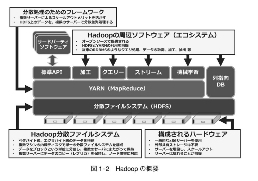
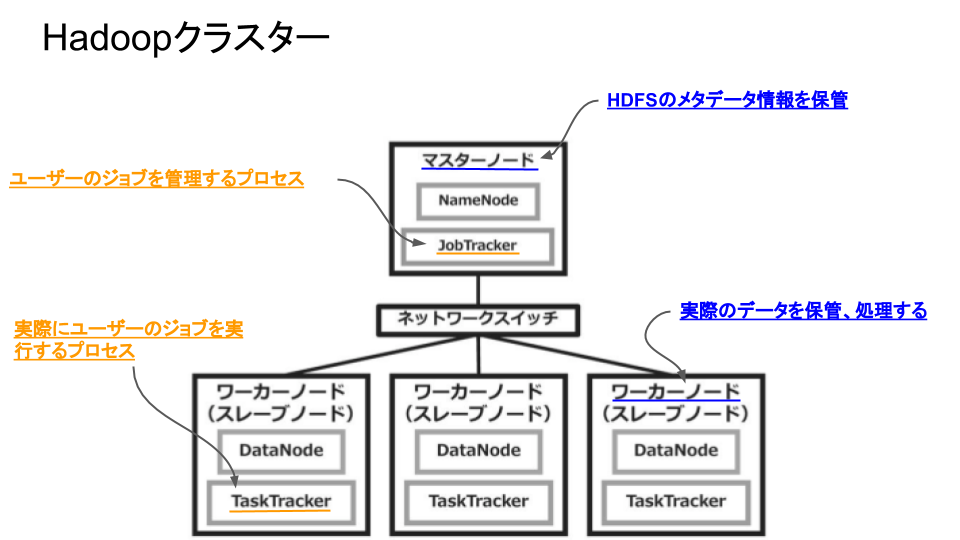

# Hadoopの概要

<!-- MarkdownTOC -->

- Hadoopとは
- 特徴
- 構成
    - 【構成】HDFS（Hadoop Distributed File System）
    - 【構成】YARN（Yet Another Resource Negotiator）
- Hadoopの種類
- Hadoopの沿革
    - 【Hadoopの沿革】Hadoop1とMapReduceバージョン1
    - 【Hadoopの沿革】Hadoop2とYARN
- Apache Hadoop 3

<!-- /MarkdownTOC -->

## Hadoopとは
> Hadoopとは、大規模データの蓄積・分析を分散処理技術によって実現するオープンソースのミドルウェアです。

## 特徴

 - システムの拡張が容易に行えるように設計されている
 - 並列化処理のアルゴリズム、高信頼、かつ、高性能なデータ処理の仕組みにより、エクサバイト級の大量のデータ処理が可能
 - データの整合性は保証されない

## 構成
> Apache Hadoopは、データ分析や分散処理のためのオープンソースのフレームワークであり、複数のx86サーバーでクラスターを構成し、大量のデータを格納して処理します。

### 【構成】HDFS（Hadoop Distributed File System）
HDFSは、分散ファイルシステムです。HDFSは、複数のサーバーで構成された、仮想的な1つのファイルシステムであり、データは、複数のサーバーにブロックという単位で分割して記録されます。

HDFSの詳しい説明：[https://oss.nttdata.com/hadoop/hadoop.html](https://oss.nttdata.com/hadoop/hadoop.html)

### 【構成】YARN（Yet Another Resource Negotiator）
YARNは、HDFS上にあるデータの分散処理を行う汎用の分散処理フレームワークです。

 - このYARNにより、HDFS上のデータを加工し高速に処理することができます。
 - Hadoopクラスターにおいて、アプリケーションの実行は、YARNを使って行いますが、その際、アプリケーションは、ジョブとして投入されます。
 - ジョブとして投入されるYARNを使った分散処理のアプリケーションは、YARNアプリケーションや、分散アプリケーションと呼ばれます。

YARNの詳しい説明：[https://oss.nttdata.com/hadoop/hadoop.html](https://oss.nttdata.com/hadoop/hadoop.html)

---
## Hadoopの種類

 - Apache Hadoop
 - MapR CDP(MapR Converged Data Platform)
 - CDH(Cloudera's Distribution including Apache Hadoop)
 - HDP(Hortonworks Data Platform)

<strong style="color: red;">なお、以降ではApache Hadoop 3とMapRの二つを取り上げます。</strong>

---
## Hadoopの沿革
> 本書で取り上げるApache Hadoopは、Hadoop3.0ですが、初めてHadoopに取り組む人のために、3.0に至るまでの、Hadoop1とHadoop2のアーキテクチャの変化について、ここで紹介しておきます。

### 【Hadoopの沿革】Hadoop1とMapReduceバージョン1

<strong>Hadoop1</strong> 

| 用語 | 説明 |
|:---:|:-----|
| マスターノード | クラスターのHDFSのメタデータ情報が保管されているノード |
| ワーカーノード | 実際のデータを保管、処理するノード |
| JobTracker | ユーザーのジョブを管理するプロセス |
| TaskTracker | ワーカーノード上で実際にユーザーのジョブを実行するプロセス |

Hadoopのバージョン1であるHadoop1では、<strong>マスターノードが単一障害点となる</strong>問題がありました。このため、Hadoop1において、マスターノードの可用性を確保するためには、サードパーティ製のHAクラスターソフトウェアなどを導入する必要がありました。

Hadoop1のJobTrackerは、ジョブのスケジューリングとユーザーアプリケーションのタスク管理、その両方を担っています。しかし、Hadoop1では、クラスターにおけるリソース管理とジョブのスケジューリングの両方を管理する<strong>JobTrackerの負荷が高くなる</strong>問題を抱えていました。Hadoop1自体は、当初の設計思想のとおり、スケールアウトメリットを活かすことが可能でしたが、<strong>約5000ノードまでしかスケールさせることができません</strong>でした。

<strong>MapReduce1</strong> 

 - MapReduceのAPIを使えば、開発者は、数千ノードに及ぶ大規模なHadoopクラスターに格納されたデータの並列処理が可能なプログラムを作成できます。
 - さらに、データ容量が増えても、計算ノードを追加すれば、リニアにスケールアウトする処理能力を有しています。

MapReduceは、一連のタスクを小さな単位のタスクに分割し、Map処理とReduce処理の二つのフェーズで構成されています。

| 用語 | 説明 |
|:---:|:-----|
| Mapper | Map処理を行うプログラム |
| Reducer | Reduce処理を行うプログラム |

具体的には、Map処理において、入力データをキー(Key)と値(Value)のペアのセットにマップする。

詳しくは、「ビッグデータ分析基盤の構築事例集 Hadoop クラスター構築実践ガイド」のP.22〜P.23を参照

### 【Hadoopの沿革】Hadoop2とYARN
> Hadoop2では、今までJobTrackerが担っていたリソース管理とジョブスケジューリングの二つの主要な機能を分離し、JobTrackerの代わりにクラスター全体のスケジューリングを行うResourceManager(マスターノードで稼働)とリソース管理を行うApplicationManagerが用意されました。また、TaskTrackerの代わりに、データ処理のタスクを実行するNodeManager(ワーカーノードで実行)が用意されました。

詳細：[https://oss.nttdata.com/hadoop/hadoop.html](https://oss.nttdata.com/hadoop/hadoop.html)

| 用語 | 説明 |
|:---:|:-----|
| ResourceManager(マスターノードで稼働) | クラスター全体のスケジューリングを行う |
| ApplicationManager | リソース管理を行う |
| NodeManager(ワーカーノードで実行) | データ処理のタスクを実行する&実際にワーカーノードで実行されるプロセスを監視する |

Hadoop2では、YARNが登場。

---
## Apache Hadoop 3
> Apache Hadoop3は、複数のサービスが連携して動作することで、クラスターを形成します。以下では、Apache Hadoop3を構成する２つのコンポーネントについて解説します。

 - **HDFS** : 分散ファイルシステム
    - 複数のサーバーで構成された、仮想的な1つのファイルシステム
    - データは、複数のサーバーにブロックという単位で分割して記録される
 - **YARN** : 分散処理フレームワーク
    - このYARNにより、HDFS上のデータを加工し高速に処理することが可能
    - Hadoopクラスターにおいて、アプリケーションの実行は、YARNを使って行いますが、その際、アプリケーションは、ジョブとして投入されます。
    - ジョブとして投入されるYARNを使った分散処理のアプリケーションは、YARNアプリケーションや、分散アプリケーションと呼ばれます。
