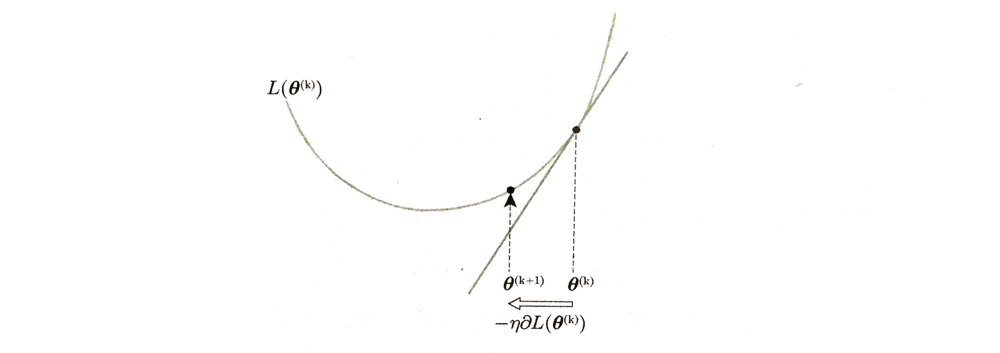
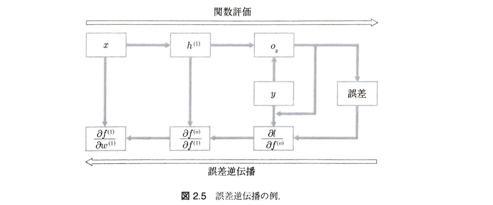
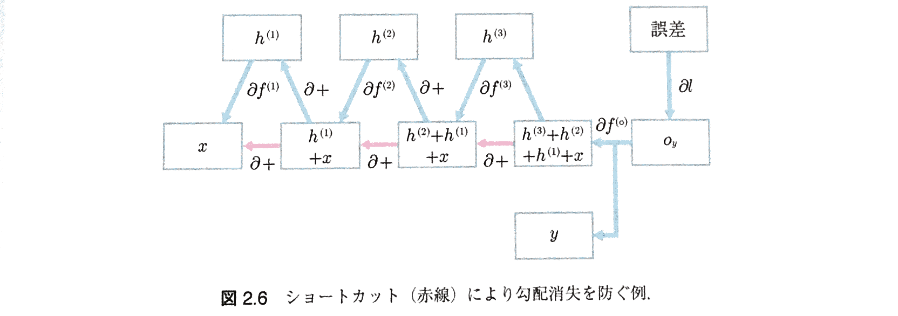

# ニューラルネットの基礎
---
## 教師あり学習
### 教師あり学習の定義

 - $\chi$: 学習データの定義域
 - $x \in \chi$: 入力変数(説明変数)ベクトル
 - $y$: 出力変数(目的変数)

ある$x$が与えられたときに$y$を予測するモデルを学習することを目的とする。

> #### 定義2.1 教師あり学習
> $\left| D \right|$ 個の学習事例を$D={ \left\{ \left( { x }^{ (i) },y^{ (i) } \right)  \right\}  }_{ i=1 }^{ \left| D \right|  }$ としたとき、学習データでの誤差(以下の目的関数)を最小化するモデルパラメータ**$\theta$**の値を求める手続きを教師あり学習と呼ぶ。
>$$
> L\left( \theta \right) = \frac {1}{\left| D \right|}\sum _{i=1}^{\left| D \right|}{{ \ell  }_{ \theta  }\left( { x }^{ (i) },{ y }^{ (i) } \right) } \qquad (2.1)
>$$

> ${\ell}_{\theta}\left(x,y\right) \ge 0$: 個々の事例データに対して定義する**損失関数**(loss function)

### 損失関数(loss function): $\ell\left(x^{(i)},y^{(i)}\right)$
自然言語処理では出力変数(目的変数)は単語のように離散集合であることが多く、分類問題として定式化できる。そのため、分類問題に対する典型的な損失関数である交差エントロピー損失関数、ヒンジ損失関数を紹介する。

#### 交差エントロピー損失(cross-entropy loss)関数
> $$
>{ \ell  }_{ \theta  }^{ cross-entropy }\left( { x }^{ (i) },{ y }^{ (i) } \right) =-\log { \frac { exp\left[ { f }_{ \theta  }\left( { x }^{ (i) },{ y }^{ (i) } \right)  \right]  }{ \sum _{ \widetilde { y } \in \Omega  }{ exp\left[ { f }_{ \theta  }\left( { x }^{ (i) },\widetilde { y }  \right)  \right]  }  }  }　\qquad (2.2)
> $$

> - $\Omega$: 出力変数$y$の定義域

#### (多クラス)ヒンジ損失(multiclass hinge loss)関数
> $$
> { \ell  }_{ \theta  }^{ hinge }\left( { x }^{ (i) },{ y }^{ (i) } \right) =\max { \left[ 0,1-{ f }_{ \theta  }\left( { x }^{ (i) },{ y }^{ (i) } \right) +\max _{ \widetilde { y } \in \Omega /\left\{ { y }^{ (i) } \right\}  }{ { f }_{ \theta  }\left( { x }^{ (i) },\widetilde { y }  \right)  }  \right]  } \qquad (2.3)
> $$

> - $\Omega /\left\{ { y }^{ (i) } \right\}$: $y^{(i)}$ を  $\Omega$ から除いた集合

式中の $f_{\theta}\left( x,y \right)$ はパラメータ $\theta$ で表現される**スコア関数**。本ドキュメントでは、スコア関数はニューラルネットを想定する。

---
## 順伝播型ニューラルネット
前節で導入した予測モデルとして利用可能なスコア関数 $f_{\theta}\left( x,y \right)$ として、もっとも簡単なネットワーク構造をもつ**順伝播型ニューラルネット**(feedforward neural networks; FFNN)について説明する。

### モデル
順伝播型ニューラルネットは、基本的には入力ベクトルに対してパラメータ行列をかけて非線形変換を行うことを何回か繰り返し、最後に出力候補$y$に対するスコアを出力する。

以下では、変換を$L$回繰り返すニューラルネットを想定する。

 - $\iota$ 回目の変換結果の出力ベクトル $h^{(\iota)} \in { R }^{ { N }^{ (\iota) } }$: **隠れ状態ベクトル**(hidden state vector)

計算の順番としては最後になる**出力層**(output layer)と呼ばれる出力候補$y$に対するスコアの計算は、次のように書く。
$$
o = W^{(o)}h^{(L)} + b^{(o)} \qquad (2.9)
$$

 

 - $w^{(o)}$: 出力用の $\left| \Omega \right| \times N^{(L)}$ のパラメータ行列

 - $b^{(o)}$: $\left| \Omega \right|$ のバイアスパラメータベクトル
 - $h^{(L)}$: 一番最後の$L$番目の隠れ状態ベクトル
 - $o$: $y$番目の要素が$y$に対応したスコア関数の出力 $f\left(x,y\right) = o_{y}$ を表す要素数 $\left| \Omega \right|$ のベクトル

次に、各 $\left\{ \iota | 1 \ge \iota \ge L \right\}$ 層の隠れ状態ベクトル $h^{(\iota)}$ の計算は以下のように行う。
$$
h^{(\iota)} = a^{(\iota)}\left( W^{(\iota)}h^{(\iota - 1)} + b^{(\iota)} \right) \qquad (2.10)
$$

 - $w^{(\iota)}$: 出力用の $N^{(\iota)} \times N^{(\iota - 1)}$ のパラメータ行列
 - $b^{(\iota)}$: $N^{(\iota)}$ のバイアスパラメータベクトル
 - $a^{(\iota)}$: 活性化関数

この演算では、要素数$N^{(\iota - 1)}$の隠れ状態ベクトルを要素数$N^{(\iota)}$の隠れ状態ベクトルに変換する。

なお、$\iota = 0$のときの隠れ状態ベクトルは$h^{(0)} = x$、つまり入力を使うものとします。
$$
h^{(1)} = a^{(1)}\left( W^{(1)}x + b^{(1)} \right) \qquad (2.11)\\
={ a }^{ (1) }\left( \begin{bmatrix} w_{ 11 } & { w }_{ 12 } & \cdots  & { w }_{ 1\left| \chi  \right|  } \\ { w }_{ 21 } & w_{ 22 } & \cdots  & { w }_{ 2\left| \chi  \right|  } \\ \cdots  & \cdots  & \cdots  & \cdots  \\ { w }_{ { N }^{ (1) }1 } & { w }_{ { N }^{ (1) }2 } & \cdots  & w_{ { N }^{ (1) }\left| \chi  \right|  } \end{bmatrix}\left[ \begin{matrix} { x }_{ 1 } \\ { x }_{ 2 } \\ \vdots  \\ { x }_{ \left| \chi  \right|  } \end{matrix} \right] +\left[ \begin{matrix} { b }_{ 1 } \\ { b }_{ 2 } \\ \vdots  \\ { b }_{ \left| \chi  \right|  } \end{matrix} \right]  \right) \\ ={ a }^{ (1) }\left( \left[ \begin{matrix} w_{ 11 }{ x }_{ 1 }+w_{ 12 }{ x }_{ 2 }+\cdots +{ w }_{ 1\left| \chi  \right|  }{ x }_{ \left| \chi  \right|  } \\ w_{ 21 }{ x }_{ 1 }+w_{ 22 }{ x }_{ 2 }+\cdots +{ w }_{ 2\left| \chi  \right|  }{ x }_{ \left| \chi  \right|  } \\ \vdots  \\ { w }_{ { N }^{ (1) }1 }{ x }_{ 1 }+{ w }_{ { N }^{ (1) }2 }{ x }_{ 2 }+\cdots +{ w }_{ { N }^{ (1) }\left| \chi  \right|  }{ x }_{ \left| \chi  \right|  } \end{matrix} \right] +\left[ \begin{matrix} { b }_{ 1 } \\ { b }_{ 2 } \\ \vdots  \\ { b }_{ \left| \chi  \right|  } \end{matrix} \right]  \right)
$$

 - $W^{(1)}$: $N^{(1)} \times \left| \chi \right|$の行列

 - $x$: $\left| \chi \right| \times 1$のベクトル
 - $h^{(1)}$: $N^{(1)} \times 1$の隠れ状態ベクトル

入力を受け取り、計算をするため、$h^{1}$を計算する層を**入力層**(input layer)と呼ぶ。順伝播型ニューラルネットで学習する必要のあるパラメータは
$$
\theta = \left\{ W^{(1)},b^{(1)}, \cdots, W^{(L)},b^{(L)}, W^{(o)},b^{(o)} \right\}
$$
になる。

深いニューラルネットは、入力データを細かく分類することができることから表現力が高いと言われている

---
## 活性化関数(activation function)
活性化関数には様々な非線形関数が適用されているが、代表的な物を3つ挙げる。

#### シグモイド(sigmoid)関数
$$
sigmoid\left(x\right) = \frac {1}{1 + exp\left(-x\right)} \in (0,1) \qquad (2.12)
$$

#### ハイパボリックタンジェント(hyperbolic tangent; 双曲線生接)関数
$$
tanh\left( x \right) = \frac {exp {\left(x\right)} - exp {\left(-x\right)}}{exp {\left(x\right)} + exp {\left(-x\right)}} \in (-1,1) \qquad (2.13)
$$

#### ReLU(rectified linear unit; ランプ関数)関数
$$
relu\left(x\right) = \max { \left( 0,x \right)  }  \in \left[0,\infty\right) \qquad (2.14)
$$

後述する勾配法と組み合わせるために活性化関数は微分可能な関数から選ばれることが多いが、活性化関数とタスクとの性能への関係は明確になっておらず、実験的な結果に基づき選ばれている。しかし、深いニューラルネットを有効活用するには非線形な活性化関数は欠かせない。

---
## 勾配法
### 勾配法による関数最小化
ニューラルネットは最適化が難しいことが知られている。そのため最適化アルゴリズムにはさまざまなものが試されてきましたが、2017年1月時点では**勾配法**(gradient method)がもっともよく使われている。

 - 勾配法はパラメータの調整が難しく使いづらい点があるのですが、調整がうまくいくと洗練されたアルゴリズムよりもよい性能を示すことがよくある
 - アルゴリズムが簡素なためメモリ使用量が少ないなどの利点があり、大規模な学習データを使って深層学習するのに適している

勾配法は、パラメータ $\theta$ のある値に対して目的関数(学習でいうとこの目的関数(2.1)のこと)を線形直線で近似して逐次的にパラメータを更新する。具体的には**学習率**(learning rate)を $\eta$ とすると、ステップ$k$におけるパラメータは目的関数の偏微分 $\partial L\left(\theta\right)$ を使って次式によって更新する.
$$
\theta^{(k+1)} = \theta^{(k)} - \eta\partial L\left( \theta^{(k)} \right) \qquad (2.17)
$$

式(2.17)の中にある目的関数の偏微分はパラメータ $\theta$ のある変数を微小に動かしたときの損失関数の変化を表す。勾配法は、 $\theta^{(k)}$ の周辺でもっとも目的関数が減る方向(最急降下方向)に $\eta$ 分パラメータを動かしていることになる。

※最急降下方向は局所的な性質なので**絶対的最小値となる臨界点**を見つけることが関数の形状によってはできないことがある。 
※$\eta$が大きすぎると目的関数の値は減らずに逆に増えてしまうこともあり、$\eta$の調整は容易ではない。

### ミニバッチ化による確率的勾配法
勾配法では目的関数の偏微分を用いてパラメータの更新を行うことを示したが、式(2.1)は個々の事例データの損失関数の和で定義されているので、その偏微分も個々の事例データの損失関数の偏微分の和に分解することができる。
$$
\partial L\left(\theta\right)^{batch} = \frac {1}{\left| D \right|} \sum _{i=1}^{\left| D \right|}{\partial {\ell}_{\theta}\left( x^{(i)}, y^{(i)} \right)} \qquad (2.18)
$$

 - **バッチ法**: 1回の更新に**全事例データ**を使う方法
    - 性質: この計算は**すべての事例データ**に関して偏微分の計算を行う
    - 問題: 大規模データを処理する場合は1回の評価に時間がかかりすぎる

最急降下方法は局所的な性質なので1回1回を正確に計算するよりは雑に速く計算することで、同じ時間内にパラメータを更新できる回数を増やしたほうが結果的に早くよい解に到達できる可能性も高まる。

そこで、学習事例データすべてを使わずにランダムに選んだ事例で近似した目的関数の偏微分を使って勾配法を実行する**確率的勾配法**がよく使われる。

一番極端な方法は、１事例データ分の損失関数の偏微分で代替する方法。
$$
\partial L\left( \theta \right)^{online} = \partial \ell_{\theta}\left( x^{(i)},y^{(i)} \right) \qquad (2.19)
$$

 - $i \in \left\{ 1,\dots, \left|D\right| \right\}$: ランダムに選んだ事例データの番号
 - 各事例データごとにパラメータを更新するので**オンライン学習**(online learning)と呼ばれる
 - オンライン学習法の問題:
    1. 1事例だけから計算した偏微分は分散が大きくなり停留点への収束が遅い
    2. 近年の計算資源は高い並列度をもつものが増えているが、１事例データ分の偏微分だけでは並列計算資源を活かしきれてない

↓
#### ミニバッチ法
> バッチ法とオンライン法の折衷案として複数の事例データを使って偏微分計算を行う方法
>$$
>\partial L\left( \theta  \right) ^{ mini-batch }=\frac { 1 }{ \left| B \right|  } \sum _{ j=1 }^{ \left| B \right|  }{ \partial { L }_{ \theta  }\left( { x }^{ (B[j]) },{ y }^{ (B[j]) } \right)  } \qquad (2.20)
>$$
>
> - $B\subset \left\{ 1,2,\dots ,\left| D \right|  \right\}$ : 無作為に選んだ全事例データの部分集合の番号集合
> - $\left| B \right|$: バッチサイズ

※一般的に$B$の大きさは固定値を使い計算資源の並列度とメモリ容量に合わせて調整する必要がある。 
※同じデータ数を学習する場合でもバッチサイズによってその更新回数は異なるため、学習事例データ全体のデータ数 $\left| D \right|$ に相当する更新回数 $\left| D \right|/\left| B \right|$ を一単位として**１エポック**(epoch)と呼ぶ。

---
## 誤差逆伝播法(back propagation; backprop; BP)
### ニューラルネットの微分
**誤差逆伝播法(back propagation; backprop; BP)**: 勾配法を使うためにニューラルネットの目的関数の偏微分を計算するためのアルゴリズム

ニューラルネットを合成関数と捉えると、その部分は合成関数の微分をすればよいことを以下で説明する。しかも、合成関数の微分はそれぞれの関数微分の積であることを使うと、どんなに階層の深いニューラルネットであっても機械的に微分を求めることができることを示す。例として、１変数を引数にとる２つの関数 $f^{(1)}\left(x\right) = wx = h^{(1)}$ と $f^{(2)}\left(h\right) =\max {\left(0,h\right)}= h^{(2)}$ の合成変数を考える。
$$
f^{(2)}\left( f^{(1)}\left(x\right) \right) = \max {\left(0, wx \right)} \qquad (2.21)
$$

 - $w \in R$: 学習する１変数パラメータ
 - $x \in R$: 入力変数

なお、通常のニューラルネットではパラメータは行列、入力はベクトルだが、簡単のためここではスカラーとする。 
連鎖律を使うと合成変数の微分は導関数の積で表せることを使って、式(2.21)の微分を示す。

 1. **$f^{(2)}\left(h\right) = \max {\left(0, h\right)}$ の微分**

> $$
> \frac { \partial f^{ (2) }\left( h \right)  }{ \partial h } =\begin{cases} 0\quad if\quad h\le 0 \\ 1\quad else \end{cases}\qquad (2.22)
> $$

 2. **$h^{(1)} = f^{(1)}\left(x\right) = wx$の微分**

> $$
> \frac {\partial f^{(1)}\left( x \right)}{\partial x} = w \qquad (2.23)
> $$

 3. **合成関数の微分を導関数の積で表す**

>$$
>\frac { \partial f^{ (2) } }{ \partial x } =\frac { \partial f^{ (2) } }{ \partial h } \cdot \frac { \partial h }{ \partial x } =\frac { \partial f^{ (2) } }{ \partial f^{ (1) } } \cdot \frac { \partial f^{ (1) } }{ \partial x } \\ \qquad \quad \quad =\begin{cases} 0\quad if\quad h\le 0 \\ w\quad else \end{cases}\qquad (2.24)
>$$

$f^{(1)}\left(x\right)$はまた$w$の関数であることに注意！
>$$
>\frac { \partial f^{ (2) } }{ \partial w } =\frac { \partial f^{ (2) } }{ \partial h } \cdot \frac { \partial h }{ \partial w } =\frac { \partial f^{ (2) } }{ \partial f^{ (1) } } \cdot \frac { \partial f^{ (1) } }{ \partial w } \\ \qquad \quad \quad =\begin{cases} 0\quad if\quad h\le 0 \\ x\quad else \end{cases}\qquad (2.25)
>$$

上記のことは,$f^{(3)}$をさらに合成した関数 $f^{(3)}\left( f^{(2)}\left( f^{(1)}\left( x \right) \right) \right)$ であっても、同様に導関数の積で機械的に微分できる。また、2つの関数$f^{(1)}\left( x \right) + f^{(2)}\left( x \right)$の和を引数にとるニューラルネット$f^{(3)}\left( f^{(1)}\left( x \right) + f^{(2)}\left( x \right) \right)$であっても微分を導出できる。

### 深いニューラルネットの難しさ
本節では上述の合成関数の微分の計算方法が誤差逆伝播法と呼ばれる所以と、何層にもなるニューラルネットの学習がなぜ難しいのかをまとめる。

勾配法を適用するためにはニューラルネットの目的関数のパラメータによる偏微分を計算する必要があった。合成変数としての目的関数の一番外側の関数は式(2.2)や式(2.3)のような誤差関数である。損失関数の引数をスコア関数$f_{\theta}$として次のように定義し直す。
$$
\ell\left( f_{\theta}\left(x,y\right) \right) \qquad (2.28)
$$
この損失関数を微分すると以下になる。
$$
\frac { \partial \ell  }{ \partial \theta  } =\frac { \partial \ell  }{ \partial f_{ \theta  } } \cdot \frac { \partial f_{ \theta  } }{ \partial \theta  } \qquad (2.29)
$$
ニューラルネットの目的関数をパラメータ$\theta$で微分するには、スコア関数$f$の微分と損失関数の微分の積を計算すればよい。

ex)*式(2.29)のスコア関数$f$として1層だけ隠れ層をもつ次のニューラルネットを考える*
$$
f\left( x,y \right) =f^{ (o) }\left( f^{ (1) }\left( x \right) ,y \right) ={ w }_{ y }^{ (o) }h^{ (1) }={ w }_{ y }^{ (o) }w^{ (1) }x \qquad (2.30)
$$

 - $f^{(1)}\left(x\right) = w^{(1)}x = h^{(1)}$: パラメータ$w^{(1)}$をかけてスカラーを出力する関数
 - $f^{(o)}\left(h,y\right) = w_{y}^{(o)}h = o_{}y$: ラベル$y$のスコアを計算する関数

損失関数を合わせて,$\ell \left( f^{ (o) }\left( f^{ (1) }\left( x,y \right)  \right)  \right) $を目的関数とすると,$f^{(1)}$のパラメータ$w^{(1)}$による微分は次式になる。
$$
\frac { \partial \ell  }{ \partial w^{ (1) } } =\frac { \partial \ell  }{ \partial f^{ (o) } } \cdot \frac { \partial f^{ (o) } }{ \partial f^{ (1) } } \cdot \frac { \partial f^{ (1) } }{ \partial w^{ (1) } } \\ \qquad \quad \quad =\frac { \partial \ell  }{ \partial f^{ (o) } } \cdot w_{ y }^{ (o) }\cdot x\qquad (2.30)
$$
つまり、あるスコア関数の値における損失関数の微分$\frac { \partial \ell  }{ \partial f^{ (o) } }$と、あるラベルに対するパラメータ$w_{y}^{(o)}$と入力$x$の積で表現される。

> 上図の計算グラフが示すように、関数評価とは逆方向に誤差(損失関数の入力による微分)がかけられていくことになる。誤差が関数評価とは逆方向に伝達されることになるので誤差逆伝播と呼ばれている。

**最後に、誤差逆伝播法から深いニューラルネットの学習がなぜ難しいのかを理解してみたいと思う** 
ex)*先の例の隠れ層だけを増やした例を考える*。$f^{(1)}$と同様に、パラメータ$w$をもつ$f^{(2)}\left(h\right) = w^{(2)}h = h^{(2)}$、$f^{(3)}\left(h\right) = w^{(3)}h = h^{(3)}$を考える。
$$
f\left( x,y \right) =f^{ (o) }\left( f^{ (3) }\left( f^{ (2) }\left( f^{ (1) }\left( x \right)  \right)  \right) ,y \right) ={ w }_{ y }^{ (o) }{ h }^{ (3) }\\ \qquad \qquad \qquad \qquad \qquad \qquad \qquad \quad \quad ={ w }_{ y }^{ (o) }{ w }^{ (3) }{ h }^{ (2) }\\ \qquad \qquad \qquad \qquad \qquad \qquad \qquad \quad \quad ={ w }_{ y }^{ (o) }{ w }^{ (3) }{ w }^{ (2) }{ h }^{ (1) }\\ \qquad \qquad \qquad \qquad \qquad \qquad \qquad \quad \quad ={ w }_{ y }^{ (o) }{ w }^{ (3) }{ w }^{ (2) }w^{ (1) }x\qquad (2.32)
$$
隠れ層を２つ増やした目的関数を一番最初の隠れ層を出力する関数のパラメータ$w^{(1)}$で微分すると次式になる。
$$
\frac { \partial \ell  }{ \partial w^{ (1) } } =\frac { \partial \ell  }{ \partial f^{ (o) } } \cdot \frac { \partial f^{ (o) } }{ \partial f^{ (3) } } \cdot \frac { \partial f^{ (3) } }{ \partial f^{ (2) } } \cdot \frac { \partial f^{ (2) } }{ \partial f^{ (1) } } \cdot \frac { \partial f^{ (1) } }{ \partial w^{ (1) } } \\ \qquad \quad \quad =\frac { \partial \ell  }{ \partial f^{ (o) } } \cdot { w }_{ y }^{ (o) }\cdot { w }^{ (3) }\cdot { w }^{ (2) }\cdot x \qquad (2.33)
$$

式(2.31)とは、**パラメータ$w^{(3)},w^{(2)}$**が微分係数に追加されている点だけが異なる！パラメータは学習中にどのような値をとるかわからない。例えば、

 - パラメータが比較的大きく$w_{y}^{(o)} = w^{(3)} = w^{(2)} = 100$の場合は、上記の微分の値は$\frac { \partial \ell  }{ \partial f^{ (o) } } \times 100^{3} \times x$と非常に大きな値になり、損失に対して非常に感度が高い状態となる
    - →この状態を**勾配爆発**(exploding gradients)と呼ぶ。
    - オーバーフローが起こりやすいなど計算機での計算が不安定な状態になる。
 - パラメータが比較的小さく$w_{y}^{(o)} = w^{(3)} = w^{(2)} = 0.01$の場合は、上記の微分の値は$\frac { \partial \ell  }{ \partial f^{ (o) } } \times 0.01^{3} \times x$と非常に小さい値になり、損失に対して非常に感度が低い状態となる
    - →この状態を**勾配消失**(vanishing gradients)と呼ぶ。
    - 損失の値が非常に小さい値としてしか伝わらないため先の勾配法を使って更新する場合には$f^{(1)}$のパラメータがなかなか更新されない、つまり学習が進まない問題が発生する

> このように隠れ層をもっと増やすことでより困難が増える。深層学習が広く使われるようになった背景には、これらの課題を克服するようなネットワーク構造が発明されたことも一因で、それらの手法の有効性は誤差逆伝播の仕組みで説明できる。

以下で深いニューラルネットにおける勾配消失を解消する方法を1つ紹介する。

先の例の$f^{(1)}$の簡単な拡張
$$f^{(\iota+)}\left(h\right) = f^{(\iota)}\left(h\right) + h
$$
、つまり関数$f^{(\iota)}$の出力と入力$h$そのものとの和を出力する関数を構成要素として考える。この新たしい関数の微分は以下のように$f^{(\iota)\left(h\right)}$の微分に1を足したものになり必ず微分係数が1以上になる。
$$
\frac {\partial f^{(\iota + )}}{\partial h} = \frac {\partial f^{(\iota)}}{\partial h} + \frac {\partial h}{\partial h} = w^{(\iota)} + 1 \qquad (2.34)
$$
この関数で先と同様の3つの隠れ層をもつニューラルネットでスコア関数を構成する
$$
f\left( x,y \right) =f^{ (o) }\left( f^{ (3+) }\left( f^{ (2+) }\left( f^{ (1+) }\left( x \right)  \right)  \right) ,y \right) \qquad (2.35)
$$
目的関数の$w^{(1)}$による微分は以下のようになる。
$$
\frac { \partial \ell  }{ \partial w^{ (1) } } =\frac { \partial \ell  }{ \partial { f }^{ (o) } } \cdot \frac { \partial { f }^{ (o) } }{ \partial { f }^{ (3+) } } \cdot \frac { \partial { f }^{ (3+) } }{ \partial { f }^{ (2+) } } \cdot \frac { \partial { f }^{ (2+) } }{ \partial { f }^{ (1+) } } \cdot \frac { \partial { f }^{ (1+) } }{ \partial w^{ (1) } } \\ \qquad \quad \quad =\frac { \partial \ell  }{ \partial { f }^{ (o) } } \cdot { w }_{ y }^{ (o) }\cdot \left( { w }^{ (3) }+1 \right) \cdot \left( { w }^{ (2) }+1 \right) \cdot x\qquad (2.36)
$$
$w^{(3)},w^{(2)}$の絶対値が小さかったとしても$w^{(\iota)} + 1$は$1$に近い値になるため、$f^{(\iota + 1)}\left(h\right)$に置き換わることで誤差が伝達されやすくなることがわかる。一方で、この方法では勾配爆発を防げないことも明らかだ。

