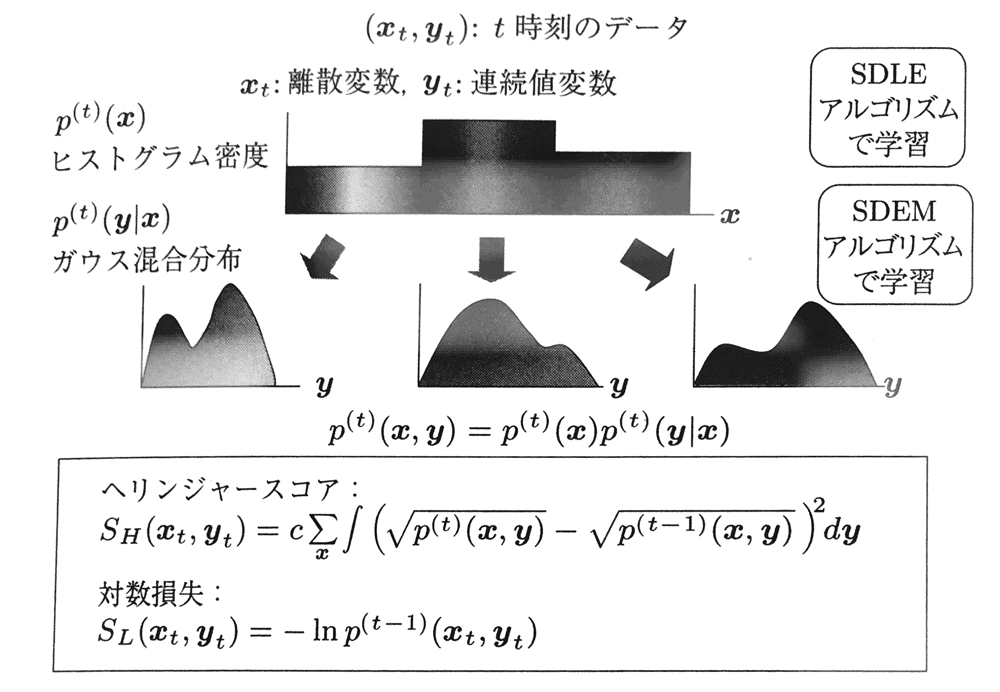
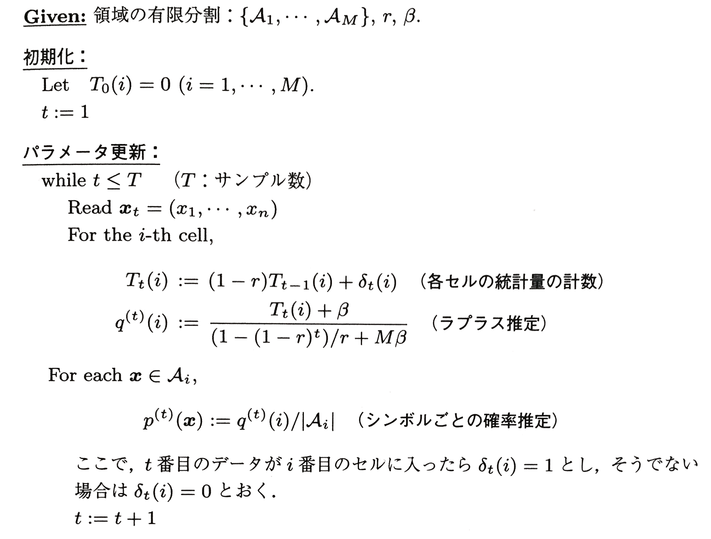
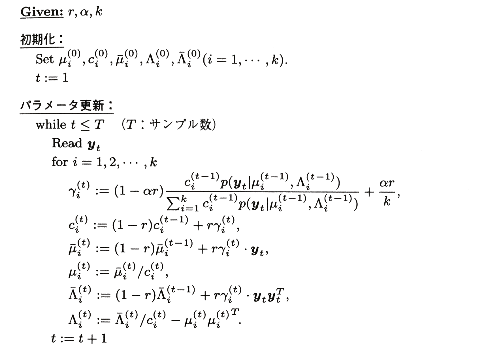
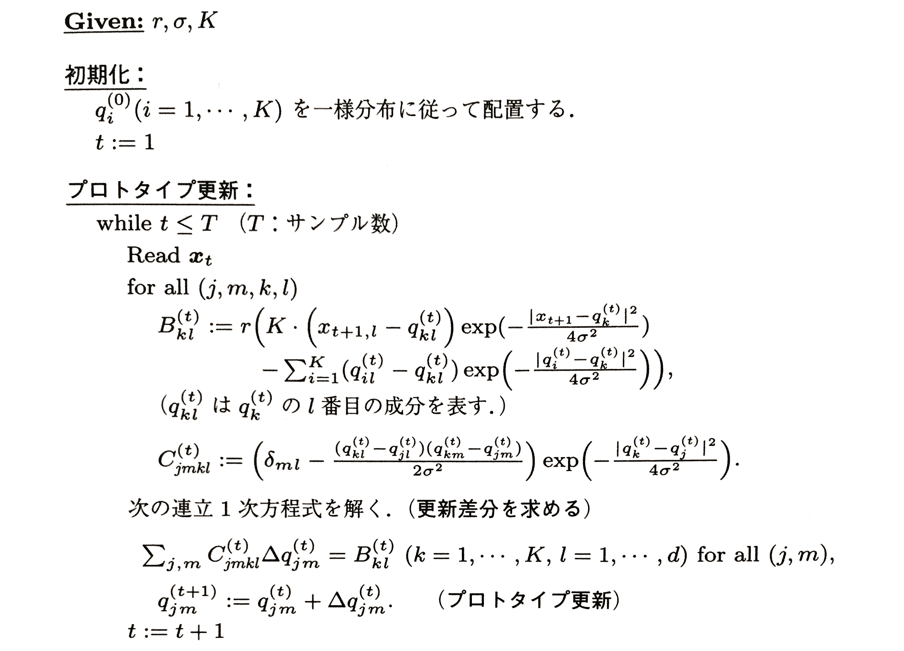

# 3 外れ値検出(outlier detection)

本節では、侵入検知を例にとって外れ値検出の方法を紹介する。

## 3.1 侵入検知と外れ値検出

---
## 3.2 マハラノビス距離に基づく外れ値検出
**教師なし学習(unsupervised learning)**により、データのパターンを学習し、これから著しく外れたデータを**外れ値(outlier)**として検出する方法。

外れ値の検出方法

 - Nearest Neighbor法に基づく方法
 - クラスタリングに基づく方法
 - One-class SVMに基づく方法
 - 確率密度推定に基づく方法
 - マハラノビス距離に基づく方法

ここでは、最も単純な統計的な外れ値検出方法である、**マハラノビス距離に基づく外れ値検出(Mahalanobis-distance based outlier detection)**についてまとめる。

 - データは$n$次元連続値ベクトルであるとする
 - これまで得られたデータ列を$x^{m} = x_{1}, \cdots , x_{m}$とし、$i$番目のデータは$x_{i} = {\left(x_{i,1}, \cdots, x_{i,n} \right)}^{T} $と記す
 - 平均ベクトル$\mu$,分散共分散行列$\Sigma$は以下で求められる
$$
\mu = \frac {1}{m}\sum _{i=1}^{m}{x_{i}}, \quad \Sigma = \frac {1}{m}\sum _{i=1}^{m}{ \left(x_{i} - \mu\right)\left(x_{i} - \mu\right)^{T} }
$$
 - そこで、$\theta$を閾値パラメータとして、新しいデータ$x$に対して、
 $$
 \left\{\left(x - \mu\right)^{T} {\Sigma}^{-1} \left(x - \mu\right)\right\}^{1/2} > \theta \quad (3.1)
 $$
 を満たすならば$x$は外れ値であると判定する。式(3.1)の左辺は$x$と$\mu$の**マハラノビス距離(Mahalanobis distance)**と呼ばれるものである。

以上の方法では、平均値と分散といった基本概念を通じて外れ値の概念を定式化している。しかし、平均値自身は外れ値の影響を大きく受けるため、むしろ**中央値(median)**の考え方を利用して外れ値検出を行う方法も考えられる。

---
## 3.3 外れ値検出エンジン SmartSifter
マハラノビス距離に基づく外れ値検出が有効に機能するためには、「データが定常的に同一の正規(ガウス)分布$N\left(\mu, \Sigma\right)$から発生する」ことを前提としている。しかし、実際には

 - データの発生分布は単峰の正規分布であるとは限らない
 - 時間とともに変化していく(非定常性)場合が多い

このような場合に対応してリアルタイムに外れ値検出を実現する方法**SmartSifter**が提案されている。

### 3.3.1 SmartSifterの基本原理
SmartSifterは、基本的にはデータの統計的パターンを学習し、そのパターンに基づいて各々のデータをスコアリングする。これをデータが入ってくるごとにオンラインで行う。その基本原理は以下の3点を特徴としている。

#### ⅰ) データの発生機構を階層的な確率モデルで表現する
SmartSifterはデータ生成機構の確率モデルとして以下のような階層的な構造をもつモデルを考える

 - $x$は離散値変数ベクトル、$y$は連続値変数ベクトルとし、データを$\left(x, y\right)$のように表すとする。

> ex) ネットワークアクセルログに関しては$x = \left(アクセス地点, サービス形態, \dots\right)$、$y = \left(接続開始時間, 接続時間, 通信量, \dots\right)$となる。
> $x$や$y$を構成する"接続時間"や"接続開始時間"のような要素を**属性(feature)**と呼ぶ。

 - $\left(x, y\right)$の同時分布を$p\left(x,y\right) = p\left(x\right)p\left({y}|{x}\right)$のようにかくとき、
    - $p\left(x\right)$は有限個の排反なcellをもつ**ヒストグラム型の確率密度関数(histogram density)**を用いて表す。
    - その各cellに対して、そこに入ったすべての$x$については、**ガウス混合モデル(Gaussian mixture model)**を用いて$y$の条件付き確率密度関数$p\left({y}|{x}\right)$を表す
    - (※ヒストグラムを構成するセルの数と同じ数だけガウス混合モデルが用意される)

#### ⅱ) 忘却型学習アルゴリズムで確率モデルを学習する
データが入力されるごとにSmartSifterは上記確率モデルを学習し、更新する。データ系列が$\left(x_{1}, y_{1}\right), \left(x_{2}, y_{2}\right), \cdots$のようにオンラインで与えられる場合

 1. $t$番目の入力データ$\left(x_{t}, y_{t}\right)$が与えられたときに、まず$x_{t}$が入るセルを同定し、**SDLE(Sequentially Discounting Laplace Estimation)アルゴリズム**を用いて$x$のヒストグラム型の確率密度関数を推定し、推定分布を$p^{(t)}\left(x\right)$とかく
 2. そのセルについて$y$の分布であるガウス混合分布を**SDEM(Sequentially Discounting Expectation and Maximizing)アルゴリズム**を用いて推定し、推定分布を$p^{(t)}\left({y}|{x}\right)$とかく。他のセルについては、$p^{(t)}\left({y}|{x}\right) = p^{(t-1)}\left({y}|{x}\right)$とおく。

SDLEアルゴリズムとSDEMアルゴリズムはいずれもデータを逐次的に取り込み、過去のデータを徐々に忘却しながら学習するという**オンライン忘却アルゴリズム(on-line discounting learning algorithm)**である。これによって、データの生成機構が時間とともに変化するような非定常的な情報源に対しても適応的に学習することができる。

#### ⅲ) 学習されたモデルを基にスコアを計算する
SmartSifterは各データに対して上で学習されたモデルに基づいてスコアをヘリンジャースコアまたは対数損失で計算する。

ここで$p^{(t)}\left({y}|{x}\right)$を$t$番目のデータから学習された確率分布とするとき、$t$番目のデータに対する**ヘリンジャースコア(Hellinger score)**を以下で定める。
$$
S_{H}\left(x_{t}, y_{t}\right) = \frac {1}{r^{2}}\sum _{x}{ \int { \left(\sqrt {p^{(t)}\left(y,x\right)} - \sqrt {p^{(t-1)}\left(y, x\right)}\right)^{2}dy } } \quad (3.2)
$$
また、**対数損失(logarithmic loss)**を以下で定める。
$$
S_{L}\left(x_{t}, y_{t}\right) = -\log {p^{(t-1)}\left(x_{t}, y_{t}\right)} \quad (3.3)
$$
ここで対数は自然対数を意味するとする。

直感的には、ヘリンジャースコアは分布$p^{(t)}$が$\left(x_{t}, y_{t}\right)$からの学習によって、$p^{(t-1)}$からどれくらい大きく動いたかを学習前後の確率分布のヘリンジャー距離で測るものである。したがって、高いスコアのデータは確率モデルの変化に大きく寄与したという意味で、外れ値である確率が高いとみなすことができる。一方、対数損失は過去のモデルに対するデータの意外性としての意味をもつ。この量は**シャノン情報量(Shannon information)**とも呼ばれている。

SmartSifterの使い方としては、与えられたデータセットに対して、各データに逐次的にスコアを与え、すべてのデータのスコアリグが終わった後、スコアに従ってデータをソートして、外れ値上位リストを出力するといった使い方が一般的である。また、閾値を設けて閾値以上のスコアが出たらアラームをあげるといった使い方もできる。その場合はオンラインで実行できる。

連続値のみをとる場合で、混合ガウスモデルにおいて成分数が1($k=1$)の場合、すなわち確率モデルが$\mu$を平均、$\Sigma$を分散共分散行列とする$d$次元ガウス分布
$$
\frac {1}{\left(2\pi\right)^{d/2}{\left| \Sigma \right|}^{1/2} }\exp {\left( -\frac {1}{2}\left(y-\mu\right)^{T}{\Sigma}^{-1}\left(y-\mu\right) \right)}
$$
である場合を考える。$\left| \Sigma \right|$: 行列$ \Sigma $の行列式を表す。このとき、$\mu$と$\Sigma$の$y^{t-1}$からの推定値をそれぞれ${\mu}^{(t-1)}$および${\Sigma}^{(t-1)}$とすると、$x_{t}$に対する対数損失は、
$$
\frac {1}{2}\left(y_{t}-{\mu}^{(t-1)}\right)^{T}\left({\Sigma}^{(t-1)}\right)^{-1}\left(y_{t} - {\mu}^{(t-1)}\right) + \log {\left(2\pi\right)^{d/2}}{\left| {\Sigma}^{(t-1)} \right|}^{1/2}
$$
のように求められる。これは$y_{t}$と$\mu^{(t-1)}$の間の式(3.1)のマハラノビス距離と定数倍および定数差の違いである。この意味で、マハラノビス距離は対数損失の特別な場合と考えることができる。

混合ガウス分布に対しては、ヘリンジャースコア$S_{H}\left(x_{t}, y_{t}\right)$を正確に計算するのは数値計算上難しく、効率的な近似計算法で計算する。
$$
S_{H}\left(x_{t}, y_{t}\right) = \frac {1}{r^{2}}\sum _{x}{ \int { \left(\sqrt {p^{(t)}\left(y,x\right)} - \sqrt {p^{(t-1)}\left(y, x\right)}\right)^{2}dy } }\\
=\frac { 1 }{ r^{ 2 } } \left( 2-2\sum _{ x }{ \sqrt { p^{ (t) }\left( x \right) p^{ (t-1) }\left( x \right)  } \int { \sqrt { p^{ (t) }\left( { y }|{ x } \right) p^{ (t-1) }\left( { y }|{ x } \right)  } dy }  }  \right) \\ =\frac { 1 }{ r^{ 2 } } \left( 2-2\sum _{ x }{ \sqrt { p^{ (t) }\left( x \right) p^{ (t-1) }\left( x \right)  } +\sum _{ x }{ \sqrt { p^{ (t) }\left( x \right) p^{ (t-1) }\left( x \right)  } { d }_{ h }\left( p^{ (t) },p^{ (t-1) } \right)  }  }  \right)
$$
ここで$d_{h}\left(p^{(t)}, p^{(t-1)}\right)$の部分が混合モデルに対しては計算が困難になっている。そこで$\left\| \theta-\theta^{\prime} \right\| $が小さいという条件のもとで次の近似式を用いる。
$$
{ d }_{ h }\left( p\left( { \cdot  }|{ \theta  } \right) ,p\left( { \cdot  }|{ \theta ^{ \prime  } } \right)  \right) \\ \sim \sum _{ i=1 }^{ k }{ \left( \sqrt { c_{ i } } -\sqrt { { c_{ i } }^{ \prime  } }  \right) ^{ 2 } } +\sum _{ i=1 }^{ k }{ \frac { c_{ i }+{ c_{ i } }^{ \prime  } }{ 2 } { d }_{ h }\left( p\left( { \cdot  }|{ { \mu  }_{ i },{ \Sigma  }_{ i } } \right) ,p\left( { \cdot  }|{ { { \mu  }_{ i } }^{ \prime  },{ { \Sigma  }_{ i } }^{ \prime  } } \right)  \right)  }
$$
ここに
$$
{ d }_{ h }\left( p\left( { \cdot  }|{ { \mu  }_{ i },{ \Sigma  }_{ i } } \right) ,p\left( { \cdot  }|{ { { \mu  }_{ i } }^{ \prime  },{ { \Sigma  }_{ i } }^{ \prime  } } \right)  \right) \\ =\int { { \left( \sqrt { p\left( { y }|{ { \mu  }_{ i } },{ \Sigma  }_{ i } \right)  } -\sqrt { p\left( { y }|{ { { \mu  }_{ i } }^{ \prime  } },{ { \Sigma  }_{ i } }^{ \prime  } \right)  }  \right)  }^{ 2 }dy } \\ =2-\frac { 2{ \left| \left( { { \Sigma  }_{ i } }^{ -1 }+{ { \Sigma  }_{ i } }^{ \prime -1 } \right) /2 \right|  }^{ -1/2 } }{ { \left| { \Sigma  }_{ i } \right|  }^{ 1/4 }{ \left| { { \Sigma  }_{ i } }^{ \prime  } \right|  }^{ 1/4 } } \\ \times exp\left[ (1/2){ \left( { { \Sigma  }_{ i } }^{ -1 }{ \mu  }_{ i }+{ { \Sigma  }_{ i } }^{ \prime -1 }{ { \mu  }_{ i } }^{ \prime  } \right)  }^{ T }{ \left( { { \Sigma  }_{ i } }^{ -1 }+{ { \Sigma  }_{ i } }^{ \prime -1 } \right)  }^{ -1 }\left( { { \Sigma  }_{ i } }^{ -1 }{ \mu  }_{ i }+{ { \Sigma  }_{ i } }^{ \prime -1 }{ { \mu  }_{ i } }^{ \prime  } \right)  \right] \\ \times exp\left[ -(1/2)\left( { { \mu  }_{ i } }^{ T }{ { \Sigma  }_{ i } }^{ -1 }{ \mu  }_{ i }+{ { \mu  }_{ i } }^{ \prime T }{ { \Sigma  }_{ i } }^{ \prime -1 }{ { \mu  }_{ i } }^{ \prime  } \right)  \right]
$$

### 3.3.2 SDLEアルゴリズム

 - $\chi$: 離散値変数の空間
 - $x$: $\chi$上の離散値変数ベクトル
 - $A_{1}, \dots, A_{M}$: $x$をいくつかにまとめた$\chi$上のセル集合
    - $A_{i} \cap A_{j} = \emptyset \quad (i \neq j)$
    - $\left\{A_{i}: i = 1,2,\cdots\right\}$: $\chi$上の排反で$\chi$を覆い尽くすセル集合

今、各セル上では一定の確率値をとるような$\chi$上の確率分布$p\left(x\right)$を学習する。

 - $T$: 全データ数
 - $T\left(i\right)$: $i$番目のセルに入ったデータ数
 - $\beta$: 正の定数

$i$番目のセル上の確率値を
$$
\frac {T\left(i\right) + \beta}{T + M\beta} \quad (3.4)
$$
として推定する方式を一般的に**ラプラス推定(Laplace estimation)**と呼ぶ。

SDLEアルゴリズムはラプラス推定方式をデータ入力ごとにオンラインで実現し、かつ、各セルの統計量を計算する際に、過去のデータによる効果を徐々に減らしていく忘却機能をもたせたアルゴリズムになっている。

 - $0 \le r < 1$: 忘却パラメータ(discounting parameter)
    - $r=0$とおいた場合には、通常のラプラス推定方式をオンライン的に実現したもの一致する。

### 3.3.3 SDEMアルゴリズム

### 3.3.4 SDPUアルゴリズム

