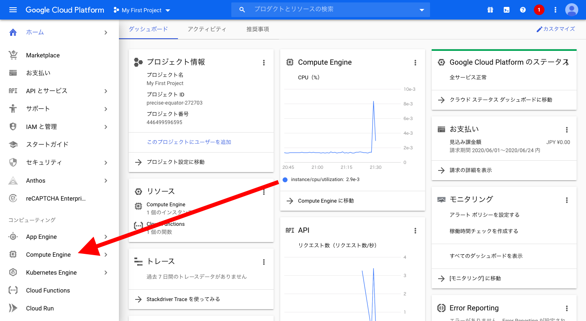
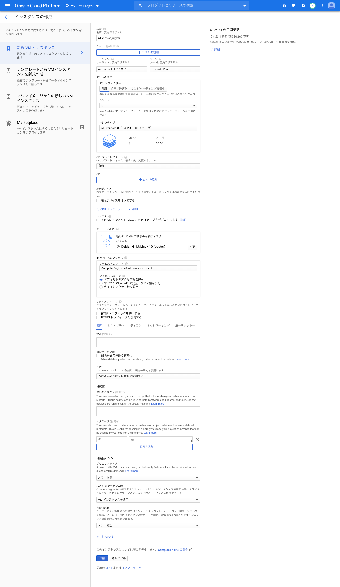
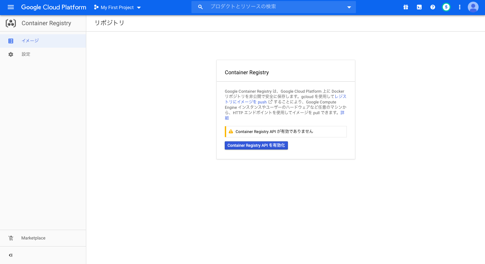

# jupyter環境の構築

 - [GCP + Docker + Jupyter Labで任意の機械学習環境をつくる - Qiita](https://qiita.com/kazuki_hayakawa/items/d14076fe07ae8b900930)
 - [GCPとDockerでKaggle用計算環境構築 - Qiita](https://qiita.com/lain21/items/a33a39d465cd08b662f1)
 - [入門記事：GCE (Google Compute Engine) で作るJupyter分析環境 - case-kの備忘録](https://www.case-k.jp/entry/2019/06/29/164802)

---
## Google Cloud SDKをインストール
[Cloud SDK: コマンドライン インターフェース  |  Google Cloud](https://cloud.google.com/sdk/)

```bash
$ brew cask install google-cloud-sdk
```

zshの場合は以下を実行する。`.zshrc`にも追加する。
```bash
source "/usr/local/Caskroom/google-cloud-sdk/latest/google-cloud-sdk/path.zsh.inc"
source "/usr/local/Caskroom/google-cloud-sdk/latest/google-cloud-sdk/completion.zsh.inc"
```

----
## Google Compute Engine(GCE)インスタンスの作成





```bash
$ gcloud auth login
$ gcloud config set project GCPのプロジェクトID
$ gcloud compute ssh --zone "ゾーン名" "インスタンス名" -- -L 8888:localhost:8888
```

---
## Dockerファイルの作成
[データ分析環境/Docker](https://github.com/gtaiyou24/ML/tree/master/%E3%83%87%E3%83%BC%E3%82%BF%E5%88%86%E6%9E%90%E7%92%B0%E5%A2%83/Docker) を参考にDockerファイルをbuildしてください。

---
## 作成したDockerファイルをGCRにpushする
参考資料

 - [[備忘] Container RegistryにDocker Imageをpushする - Qiita](https://qiita.com/Hyperion13fleet/items/b48560c961de40bf1ce9)

### GCRの設定
DockerファイルをGCRにpushするために、Container RepositoryのAPIを有効にします。




APIを有効にしたら、認証を行います。
```bash
# at local.
$ gcloud auth configure-docker
```

### push
前節「Dockerファイルの作成」でbuildされたイメージ名を*`gcp-jupyter:latest`*とします。
```bash
# at local.
$ docker tag gcp-jupyter:latest gcr.io/GCPのプロジェクトID/gcp-jupyter:latest
$ docker push gcr.io/GCPのプロジェクトID/gcp-jupyter:latest
```

imageの削除方法
```bash
$ gcloud container images delete gcr.io/{Project_name}/イメージ名:タグ名 --force-delete-tags
```

---
## GCEインスタンスでDockerコンテナを起動


