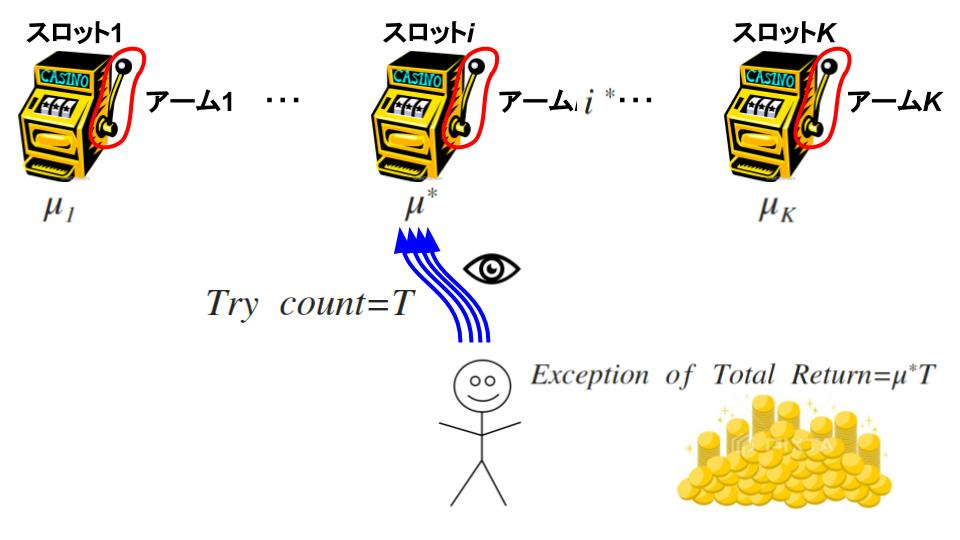
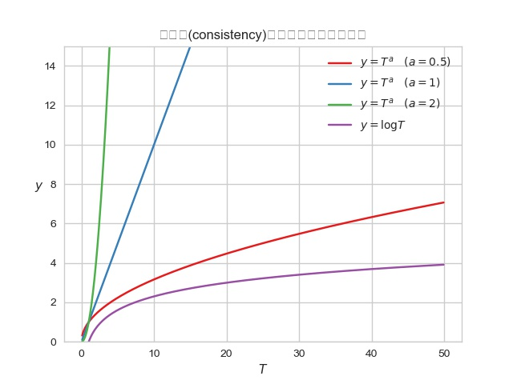

# 定式化

「$K$個のスロットマシンのアームを選んでお金を稼ごうとしているプレイヤーを考えます.」

> - アーム$i$を引いたときに得られる報酬の期待値を$\mu_{i}$とし、その報酬の確率分布を$P_{i} \in P$で表す
> - ここで報酬の確率分布は期待値と一対一に対応付けられているとし、$P_{i} = P\left( {x} ; {\mu_{i}} \right)$と表されるとします
>
> プレイヤーは各時刻$t=1,2,\dots$ごとにいずれかのアーム$i=i\left(t\right)$を引き、確率分布$P_{i}$に従う報酬$X_{i}\left(t\right)$を受け取ります。このとき、時刻$t$における各アームからの報酬$X_{1}\left( t \right), X_{2}\left( t \right), \dots, X_{K}\left( t \right)$のうちプレイヤーが観測できるのは選択したアームからの報酬$X_{i\left(t\right)}\left(t\right)$のみとなる。

ここでプレイヤーがそれぞれのアームの真の期待値$\mu_{i}$を知っていた場合を仮想敵に考えます。

このとき長期的にみて最適な方策はその最大期待値
$$
\mu^{\ast} = \max _{i \in \left\{ 1,2,\dots,K \right\}}{\mu_{i}}
$$
を達成するアーム$i^{\ast} = arg \max _{i \in \left\{ 1,2,\dots,K \right\}}{\mu_{i}}$を引き続けることで(以降では、表記を簡単にするために$i^{\ast}$は一意に定まると仮定する)、その場合の時刻$T$までの累積報酬の期待値は$\mu^{\ast} \times T$となる。

<table>
	<tr>
		<td></td>
		<td></td>
	</tr>
</table>

一方、実際の進行で時刻$t$にアーム$i\left(t\right)$を選択した場合、累積報酬の期待値の$\mu^{\ast} T$との差は
$$
\begin{eqnarray}
\mathrm {regret}\left( T \right) & = & \sum _{t=1}^{T}{\left[ \mu^{\ast} - \mu_{i\left( t \right)} \right]}\\
& = & \sum _{i:\mu_{i} < \mu^{\ast}}{\left( \mu^{\ast} - \mu_{i} \right)N_{i}\left( T + 1 \right)}\\
& = & \sum _{i:\mu_{i} < \mu^{\ast}}{ \Delta_{i} N_{i}\left( T + 1 \right)} \quad \left( \Delta_{i} = \mu^{\ast} - \mu_{i} \right)
\end{eqnarray}
$$
で表され、これを確率的バンディットでは**リグレット(regret)**と呼ぶ.

 - $N_{i}\left( t \right)$ : 時刻$t$の開始時点までにアーム$i$を引いた回数、つまり最初の$(t-1)$回のうちでアーム$i$を引いた回数

以降では、リグレット(3)の期待値
$$
\begin{eqnarray}
E\left[ \mathrm {regret}\left( t \right) \right] & = & \sum _{i:\mu_{i} < \mu^{\ast}}{ \Delta_{i} E\left[ N_{i}\left( T + 1 \right) \right] }
\end{eqnarray}
$$
の最小化を目指します.

> ※なお、期待リグレット$E\left[ \mathrm {regret}\left( T \right) \right]$は式(3)で敵対的バンディットの設定を含めて定義した擬リグレット$\overline {\mathrm {regret}}\left( T \right)$と一致するが、式(3)で定義したリグレットは確率的バンディットにおいてのみ用いられる.

---
# 理論限界

式(4)からわかるように、リグレットを小さくする問題は**期待値最大でないアーム$i$それぞれに対して選択数$N_{i}\left( T \right)$を小さくする問題**と同等になっている.

では、$N_{i}\left( T \right)$はどこまで小さくすることが可能でしょうか.

プレイヤーが何も考えずにいずれかのアームを引き続けるという決め打ちの方策ではない「真っ当な」方策のみを扱う.この場合、達成できる性能の限界はどの程度かを明らかにする.

「真っ当な」方策の条件として通常扱われるのが**一貫性**(consistency)とよばれる性質.

> ### [定義] 一貫性
> ある方策が一貫性をもつとは、任意の固定した$a > 0$と真の確率分布の組$\left\{ P_{i} \right\}_{ i=1 }^{ K } \in P^{K}$に対して、その方策のもとで
$$
E\left[ \mathrm {regret}\left( T \right) \right] = o\left( T^{a} \right)
$$
つまり
$$
\lim _{T \rightarrow \infty}{\left| \frac {E\left[ \mathrm {regret}\left( T \right) \right]}{T^{a}} \right|} = 0
$$
> が成り立つことをいう.

→方策が一貫性をもつとは、**リグレットが常にどんな多項式オーダーよりも小さくなる**ことを指している. 
以降で紹介する方策のほとんどは$E\left[ \mathrm {regret}\left( T \right) \right] = o\left( \log {T} \right)$(つまり、$\lim _{T \rightarrow \infty}{\left| {E\left[ \mathrm {regret}\left( T \right) \right]}/{\log {T}} \right|} = 0$)となり、そのため一貫性を満たすものとなる.

	
個人メモ

	<b>要するに試行回数$T$を限りなく多くしたとき、リグレットがゼロに収束=最適化されていくことを意味している</b>
	
	
分母$T^{1}, \log {T}$が単調増加していく中でリグレット$E\left[ \mathrm {regret}\left( T \right) \right]$の値がどんどん小さくなっている。 
	つまり、方策がどんどん最適化されていき累積報酬を最大化している.

 

> ### [定理3.2] 一貫性をもつ方策のリグレット下界
> KLダイバージェンス$D\left( \left( { P\left( x ; \mu^{\prime} \right) }\|{ P\left( x ; \mu \right) } \right) \right)$が$\mu > \mu^{\prime}$について単調増加かつ連続とする. 一貫性をもつアルゴリズムを用いたとき、任意の$i \neq i^{\ast}$と十分大きい$T$に対して
> $$
E\left[ N_{i}\left(T\right) \right] \ge \frac { \left(1 - o\left(1\right)\right) \log {T} }{D\left( { P\left(x;\mu_{i}\right) }\|{ P\left(x;\mu^{\ast}\right) } \right)}
$$
> が成り立つ. また、その結果として
$$
E\left[ \mathrm {regret}\left( T \right) \right] \ge \left( 1 - o\left(1\right)\right) \sum _{i:\mu_{i} < \mu^{\ast}}{ \frac { \Delta_{i} \log {T} }{D\left( { P\left(x;\mu_{i}\right) }\|{ P\left(x;\mu^{\ast}\right) } \right)} }
$$
> が成り立つ

この定理の厳密な証明は少々面倒ですが、「02確率的バンディット問題の基礎知識」で述べた大偏差原理の考え方を用いることで比較的容易に直感的な理解が得られる.（らしい...）

### [例] 理論限界の例
定理3.2で与えられる下界の具体的な形は考える確率分布モデル$P$に依存するが、その例としては次のようなものがある.

> #### i) ベルヌーイ分布
> $$
P\left(x;p\right) = p^{x}\left(1 - p\right)^{1-x} \quad x=\begin{cases} 0 \\ 1 \end{cases}
$$
> 各アームからの報酬が広告やニュース記事のクリックの有無に対応する場合、その分布はクリック率$\mu_{i}$のベルヌーイ分布とみなすことができる. したがって、クリック率$\mu_{i}$の報酬ベルヌーイ分布と最大クリック率$\mu^{\ast}$の報酬ベルヌーイ分布間のKLダイバージェンス$d\left( \mu_{i}, \mu^{\ast} \right)$を用いると、期待値最大でないアーム$i$の選択数の下界は
$$
E\left[N_{i}\left(T\right)\right] \ge \frac { \left( 1 - o\left(1\right) \right) \log {T} }{d\left( \mu_{i}, \mu^{\ast} \right)} = \frac { \left( 1 - o\left(1\right) \right) \log {T} }{ \mu_{i} \log {\cfrac { \mu_{i} }{ \mu^{\ast} }} + (1 - \mu_{i}) \log { \cfrac { \left( 1-{ \mu  }_{ i } \right)  }{ \left( 1-{ \mu  }^{ \ast  } \right)}} }
$$
> と表される.

 

> #### ii) 正規分布
> 通販サイトのデザイン例が$K$通りあり、その売上の最大化を目指す場合を考えます. ここで一定期間内での売上額$x$は各商品の価格および売上数といった多くの要素に依存しており、全体としては近似的に期待値$\mu_{i}$の正規分布$N\left( x ; \mu_{i}, \sigma^{2} \right)$に従うとみなすことができます. ここで分散$\sigma^{2}$が既知とすると正規分布間のKLダイバージェンスは$D\left( {N\left( x;\mu ,{ \sigma  }^{ 2 } \right) } \| {N\left( x;{ \mu  }^{ \prime  },{ \sigma  }^{ 2 } \right) } \right) = \frac {\left( \mu - \mu^{\prime} \right)^{2}}{2 \sigma^{2}}$であることから、アーム$i \neq i^{\ast}$の選択数の下界は
> $$
E\left[N_{i}\left( T \right)\right] \ge \frac { 2\left( 1-o\left( 1 \right)  \right) { \sigma  }^{ 2 }\log { T }  }{ { \left( { \mu  }^{ \ast  }-{ \mu  }_{ i } \right)  }^{ 2 } } =\frac { 2\left( 1-o\left( 1 \right)  \right) { \sigma  }^{ 2 }\log { T }  }{ { \Delta  }_{ i }^{ 2 } } 
$$
> と表され、リグレット下界は
> $$
E\left[ \mathrm {regret}\left(T\right) \right] \ge \left( 1 - o\left(1\right)\right)\left( \sum _{i:\mu_{i} < \mu^{\ast}}{\frac {2\sigma^{2}}{\Delta_{i}}} \right) \log {T}
$$
> となる.
> 
> この例のように、多くのモデルではアーム$i \neq i^{\ast}$が期待値最大でないことを確認するために$\Omega \left( {1}/{\Delta_{i}^{2}} \right)$程度のサンプル数が必要となる. したがって、$\Delta_{i}$が小さい場合、選択1回あたりのリグレットが小さくなることを差し引いても全体としては大きなリグレットが生じることになる.

 

> #### iii) 指数分布
> ある用途のための製品が$K$種類あり、その寿命、すなわち故障までに使える時間の累計和を最大化したいとします. このとき、各製品$i$の寿命$X_{i}$は期待値$\mu_{i}$の指数分布$\mathrm {Exp}\left( x;\mu_{i} \right)$に従うとみなすことができ、その確率密度は$\cfrac {1}{\mu_{i}}\mathrm {exp}\left(-x/\mu_{i}\right)$(ただし、$x \ge 0$)で与えられます. 指数分布間のKLダイバージェンスが$D\left( {\mathrm {Exp}\left( x;\mu_{i} \right)} \| {\mathrm {Exp}\left( x;\mu^{\ast} \right)} \right) = \log {\cfrac {\mu^{\ast}}{\mu_{i}}} + \cfrac {\mu_{i}}{\mu^{\ast}} - 1$で与えられることから、リグレット下界は
$$
E\left[\mathrm {regret}\left(T\right)\right] \ge \left( 1 - o\left(1\right) \right) \sum _{i:\mu_{i} < \mu^{\ast}}{ \cfrac { \left( { \mu  }^{ \ast  }-{ \mu  }_{ i } \right) \log { T }  }{ \log { \cfrac { \mu ^{ \ast  } }{ \mu _{ i } }  } +\cfrac { \mu _{ i } }{ \mu ^{ \ast  } } -1 }  }
$$
> となります.

 

> #### iii')
> あるタスク処理に用いるツールや人材が$K$通りあり、その処理に要した時間の累計和を今度は最小化したいとします. ここで処理時間$X_{i}^{\prime}$の和の最小化は負の処理時間$X_{i} = - X_{i}^{\prime}$の最大化と同等であり、この$X_{i}$を報酬とみなすことで通常のバンディット問題と同等になります. ここで処理時間$X_{i}^{\prime}$が期待値$\mu_{i}$の指数分布に従うとき、例iii)とまったく同様にリグレット下界
$$
E\left[\mathrm {regret}\left(T\right)\right] \ge \left( 1 - o\left(1\right) \right) \sum _{i:\mu_{i} < \mu_{\ast}}{ \cfrac { \left( { \mu  }_{ \ast  }-{ \mu  }_{ i } \right) \log { T }  }{ \log { \cfrac { \mu_{ \ast  } }{ \mu _{ i } }  } +\cfrac { \mu _{ i } }{ \mu_{ \ast  } } -1 }  }
$$
> が得られます. ただし、$\mu_{\ast} = \min _{i \in \left\{ 1,2,\dots,K \right\}}{ \mu_{i} }$としました.

これらの理論限界では、それが実際に達成可能であるかは特に議論しておらず、以降ではこれらの理論限界を達成する具体的な方策の構成を考えます.
