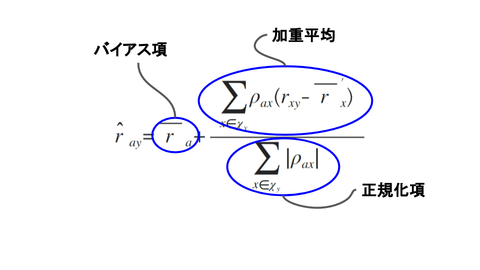

# メモリベース法（*memory-based mehtod*）
利用者DBを直接利用して、活動利用者の嗜好を推定する方法

<!-- MarkdownTOC -->

- 利用者型メモリベース法（*user-user memory-based method*）
    - GroupLensの手法
    - 利用者間型メモリベース法の改良
- アイテム間型メモリベース法（*item-item memory-based method*）

<!-- /MarkdownTOC -->

---
## 利用者型メモリベース法（*user-user memory-based method*）
> 活動利用者と嗜好パターンが似ている利用者をまず見つけ、彼らが好むものを推薦する

### GroupLensの手法

> 1. <strong>類似度の計算</strong> : 利用者DB中の各標本利用者と活動利用者の嗜好の類似度を求める。類似度とは、嗜好パターンがどれくらい似ているかを定量化したものである
> 2. <strong>嗜好の予測</strong> : 活動利用者は知らないアイテムについて、それらのアイテムへの標本利用者の好みと、その標本利用者との間の類似度に基づいて、活動利用者がどれくらいそのアイテムを好むかを予測する

<strong>1.類似度の計算</strong>

 - $\boldsymbol {\chi} = \left\{1,\dots,n\right\}$ : $n$人の全利用者の集合
 - $\boldsymbol {y} = \left\{ 1,\dots,m \right\}$ : $m$種類の全アイテムの集合
 - 評価値行列$\boldsymbol {\mathrm {R}}$ : 利用者$x \in \boldsymbol {\chi}$のアイテム$y \in \boldsymbol {y}$への評価値$r_{xy}$を要素とする行列
    - $r_{xy}$は、評価済みなら評価値の定義域$\boldsymbol {R}$のいずれかの値をとり、未評価なら欠損値$\bot$をとる
    - ex) 5段階のスコアを用いた採点法の場合は$\boldsymbol {R} = \left\{ 1,\dots,5 \right\}$
 - $r_{ay}$ : 活動利用者$a$のアイテム$y$への評価値
 - $\boldsymbol {y}_{x} = \left\{ {y}|{y \in \boldsymbol {y}, r_{xy} \neq \bot} \right\}$ : 利用者$x$が評価済みのアイテムの集合

活動利用者と標本利用者$x$の類似度は、共通に評価しているアイテムについてのPearson相関で測る。

$$
\rho_{ax} = \frac { \sum _{y \in \boldsymbol {y}_{ax}}{ \left( r_{ay} - {\bar {r}_{a}}^{\prime} \right) \left( r_{xy} - {\bar {r}_{x}}^{\prime} \right) } }{ \sqrt {\sum _{ y \in \boldsymbol {y}_{ax} }{ \left( r_{ay} - {\bar {r}_{a}}^{\prime} \right)  } } \sqrt {\sum _{ y \in \boldsymbol {y}_{ax} }{ \left( r_{xy} - {\bar {r}_{x}}^{\prime} \right)  } } } \qquad (9.1)
$$

 - $\boldsymbol {y}_{ax}$ : 利用者$a$と$x$が共通に評価したアイテムの集合。すなわち,$\boldsymbol {y}_{ax} = \boldsymbol {y}_{a} \cap \boldsymbol {y}_{x}$
 - ${\bar {r}}^{\prime}_{x} = \sum _{y \in \boldsymbol {y}_{ax}}{ r_{xy} } / \left| \boldsymbol {y}_{ax} \right|$。なお、$\left| \boldsymbol {y}_{ax} \right| \le 1$、すなわち、活動利用者$a$と標本利用者$x$が共通に評価したアイテムが一つ以下ならば、Pearson相関は計算できないので$\rho_{ax} = 0$とする

<strong>2.嗜好の予測</strong>

アイテム$y \notin \boldsymbol {y}_{a}$の評価値は、式(9.1)の類似度で重み付けした、各標本利用者のアイテム$y$への評価値の加重平均で予測する。

$$
\hat {r}_{ay} = \bar {r}_{a} + \frac { \sum _{x \in \boldsymbol {\chi}_{y}}{\rho_{ax}\left( r_{xy} - {\bar {r}}^{\prime}_{x} \right)} }{ \sum _{x \in \boldsymbol {\chi}_{y}}{ \left| \rho_{ax} \right| } } \qquad (1)
$$
もしくは${\bar {r}}^{\prime}_{x}$を${\bar {r}}_{x}$に置き換えた数式を用いる。
$$
\hat {r}_{ay} = \bar {r}_{a} + \frac { \sum _{x \in \boldsymbol {\chi}_{y}}{\rho_{ax}\left( r_{xy} - {\bar {r}}_{x} \right)} }{ \sum _{x \in \boldsymbol {\chi}_{y}}{ \left| \rho_{ax} \right| } } \qquad (2)
$$

ただし

 - $\boldsymbol {\chi}_{y}$ : アイテム$y$を評価済みの利用者の集合
 - $\bar {r}_{x}$ : 利用者$x$の全評価アイテムに対する平均評価値$\bar {r}_{x} = \sum _{y \in \boldsymbol {y}_{x}}{ r_{xy} } / \left| \boldsymbol {y}_{x} \right|$

なお、活動利用者がアイテム$y$を評価済みである$a \in \boldsymbol {\chi}_{y}$である状況では、そもそも$\hat {r}_{ay}$の推定が不要になるので想定しなくてよい

    

### 利用者間型メモリベース法の改良

---
## アイテム間型メモリベース法（*item-item memory-based method*）
> 活動利用者が好むアイテムと類似したアイテムを推薦する
