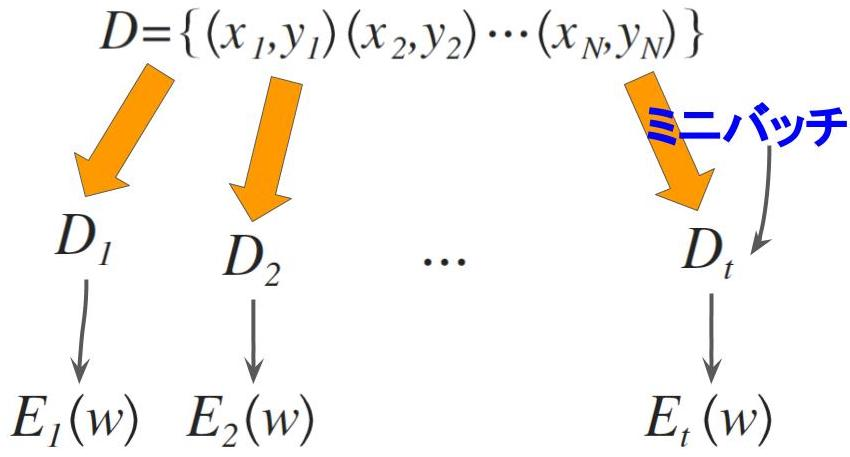
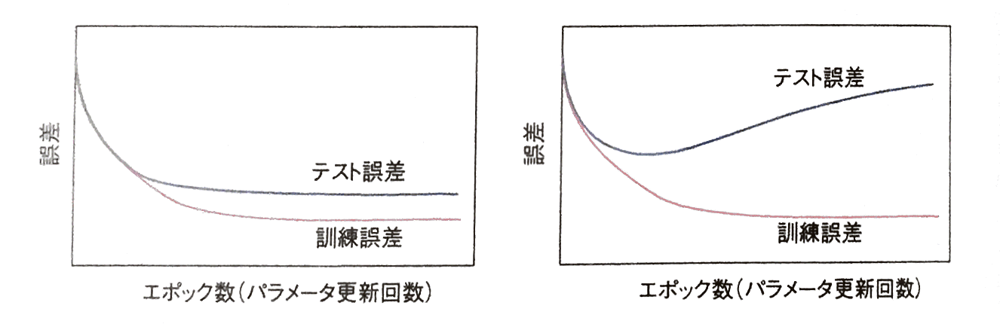
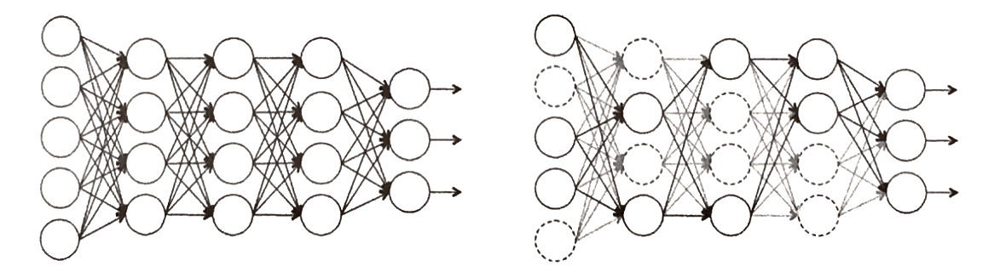

# 3 確率的勾配降下法
## 3.1 (バッチ)勾配降下法(gradient descent)

学習のゴール: 選んだ誤差関数(Error Function) $E\left(w\right)$ に対し、最小値を与える $w = arg\min _{ w }{ E\left( w \right)  } $を求めること

 - しかし、$E\left(w\right)$ は一般的な凸関数ではないので、絶対的(大域的)な極小点 $w$ を求めることは通常不可能
 - そのため, $E\left(w\right)$ の局所的な極小点 $w$ を求めることを考える

極小解は、何らかの初期値を出発点に $w$ を繰り返し更新する反復計算によって求める。そうする方法はいくつかあるが、中でも最も簡単な方法が**<font color="blue">勾配降下法</font>**(gradient descent method)。

勾配(gradient)が与えられたとき
$$
\nabla E\equiv \frac { \partial E }{ \partial w } =\left( \frac { \partial E }{ \partial { w }_{ 1 } } ,\cdots ,\frac { \partial E }{ \partial { w }_{ M } }  \right) ^{ T } \qquad (3.1)
$$

$$
w^{(t+1)} = w^{(t)} - \epsilon \nabla E \qquad (3.2)
$$

 - $M$ : $w$の成分数
 - $\epsilon$ : **学習係数**(learning rate)

のように$w$を負の勾配方向($- \nabla E$)に少し動かし、これを繰り返し更新する。

> **学習係数の決定方法**
>
> $\mathrm {w}^{(t)}$は、
>
> - $\epsilon$が十分小さければ、$t$の増加に伴って$E\left( \mathrm {w}^{(t)} \right)$を確実に減少させる。したがって、$t$を大きくすれば(何度も更新を繰り返せば)、いつかは極小点に到達できる
>     - ただし、$E\left(\mathrm {w}\right)$の形状と$\epsilon$の大きさによっては、$E\left(\mathrm {w}\right)$が増大してしまうこともある
> - $\epsilon$が小さすぎると、$\mathrm {w}$の1回の更新量が小さくなってしまうので、反復回数が増加し学習にかかる時間が大きくなる
>
> というように学習係数$\epsilon$の決定に依存する。そのため、学習係数の決定は大変重要な問題で、学習がうまく行えるかどうかの鍵の1つを握っている

非線形関数の最小化手法には、勾配降下法のほかにニュートン法やその派生方法もある。勾配降下法は、「望む極小解への収束が遅い」「学習係数の決定に学習が大きく左右される」ことから、ニュートン法などの手法が適用できる場合に、わざわざ勾配降下法を使うことはない。ただし、目的関数の2次微分の計算が難しい場合には勾配降下法は数少ない有効な方法である。ディープネットの学習はまさにその場合にあたる。

---
## 3.2 確率的勾配降下法(stochastic gradient descent)
回帰やクラス分類のいずれであっても、損失関数は各訓練データに対しての損失関数の和として定義される。

$$
E\left( \mathrm {w} \right) = \sum _{i=1}^{N}{E_{i}\left( \mathrm {w} \right)}
$$

$w$の更新式(3.2)では、この$E\left( \mathrm{w} \right)$の勾配を用いる。このように全ての訓練データを用いてパラメータ$\mathrm {w}$の更新を行う学習を**バッチ学習**(**batch learning**)と呼ぶ。

これに対して、**一部の訓練データ**(究極には1つだけの訓練データ)だけを使ってパラメータ更新を行う方法を**確率的勾配降下法**(SGD : **stochastic gradient descent**)と呼ぶ。この方法では、$\mathrm {w}$の更新は1つの訓練データ$i$について計算される損失関数$E_{i}\left( \mathrm {w} \right)$の勾配$\nabla E_{i}$を計算し、

$$
\mathrm {w}^{(t + 1)} = \mathrm {w}^{(t)} - \epsilon \nabla E_{i}
$$

のように$\mathrm {w}$を更新する。次の$\mathrm {w}^{(t + 1)}$の更新の際は、別の訓練データ$i^{\prime}$を取り出し、これを使って同様に勾配$\nabla E_{i^{\prime}}\left(\mathrm {w}\right)$を評価し、更新する。

$$
\mathrm {w}^{(t + 2)} = \mathrm {w}^{(t + 1)} - \epsilon \nabla E_{i^{\prime}}
$$

このように訓練データを毎回取り替え、$\mathrm {w}$を更新していく。

 - ランダムに1つの訓練データ$i$を用いてパラメータを更新
 - 収束するまで、$N$個のデータ全体に対してランダムに訓練データを抽出し、繰り返し学習を行う

```python
for epoch in range(epochs):
    shuffle(data)   # エポック(反復)ごとにデータをシャッフル
    for datum in data:    # データ1個ずつでパラメータを更新
        params_grad = evaluate_gradient(error_function, params, dataum)
        params -= learning_rate * params_grad
```


> **確率的勾配降下法の利点** : バッチ学習の勾配降下法に対し、確率的勾配降下法にはいくつかの長所があることから、ディープネットの学習ではより一般的である。
>
> - 訓練データに冗長性(じょうちょうせい)がある場合、計算効率が向上し学習が速く実行できる
>     - 極端な例) 手元の訓練データをそっくり複製し、データ数を2倍に「水増し」したとする。この水増しされたデータで学習しても学習の良し悪しに影響はないものの勾配降下法では計算コストが2倍になる。一方、確率的勾配降下法では学習内容・計算量ともに変化なし。
> - 反復計算が望まない(損失関数の値が相対的にそれほど小さくない)局所的な極小解にトラップされてしまうリクスを低減できる
> - パラメータの更新が小刻みに行われるので学習の途中経過をより細かく監視できることから、オンラインでの学習すなわち、訓練データの収集と最適化の計算を同時並行で行える

---
## 3.3 ミニバッチ勾配降下法(minibatch gradient descent) :「ミニバッチ」の利用

規模が大きいニューラルネットの学習は大きな計算コストを要するため、数値計算を効率化するには、計算機が持つ並列計算資源の利用が不可欠である。そのため、重みの更新を訓練データ1つ単位で行うのではなく、少数の訓練データの集合をひとまとめにし、その単位で重みを更新する。

 - ひとまとめにしたサンプル集合は**ミニバッチ**(**minibatch**)と呼ぶ。



具体的には次のように計算する。

 - $D_{t}$ : 1つのミニバッチ。少数の訓練データの集合を指し、添字は$t$回目の更新ごとにその訓練データ集合が変わることを表す
 - $N_{t} = \left| D_{t} \right|$ : ミニバッチ$t$が含む訓練データ数

$D_{t}$の含む全訓練データに対する誤差

$$
E_{t}\left( w \right) = \frac {1}{N_{t}} \sum _{i \in D_{t}}{E_{i}\left( w \right)}
$$

を計算し、その勾配の方向にパラメータを更新する。なお、**<font color="red">このように$E_{t}\left( w \right)$を$N_{t}$で正規化すると、ミニバッチのサイズ(訓練データ数)を変えたとき、それに合わせて学習係数を調整しなければなら煩わしさを避けることができる</font>**。

> - ミニバッチの作成 : ミニバッチ$D_{t}(t=1,2,\dots)$は学習開始前に作成し、固定する。
> - ミニバッチ$D_{t}$のサイズ : ミニバッチのサイズを決める系統的なやり方はないが、確率的勾配降下法のメリットと並列計算資源の有効利用を天秤にかけ、大体**10~100**サンプル前後とすることが多い
>     - 多クラス分類問題の場合 : ミニバッチ間の重みの更新のばらつきを平準化するために、ミニバッチそれぞれに各クラスから1つ以上のサンプルを入れるのが理想
> 	       - クラス数が10~100程度 & 各クラスの出現頻度が等しい場合 : 分類すべきクラス数と同サイズのミニバッチを作るのが良い
> 	       - クラス数が100以上ある場合 : 訓練データをランダムにシャッフルした後、ミニバッチに分割する

```python
for epoch in range(epochs):
    shuffle(data)
    batches = get_batches(data, batch_size=M)
    for batch in batches:    # ミニバッチごとにパラメータを更新
        params_grad = evaluate_gradient(error_function, params, batch)
        params -= learning_rate * params_grad
```

ミニバッチのサイズをあまり大きくすることは、確率的勾配降下法のよさを損なうことになり、あまり良くない。サイズを大きくすると、ミニバッチ間で計算される勾配のばらつきが小さくなり、$\mathrm {w}$の更新量が安定するので、学習係数$\epsilon$を大きくでき、それだけ学習が速く進む効果がある。しかし一般に、ミニバッチのサイズを$N$倍しても、$\epsilon$を$N$倍にまで大きくすることはできないので、トータルの計算速度は逆に低下する。

---
## 3.4 汎化性能と過適合
ここまでは、訓練データに対する誤差(誤差関数の値)を最小化することを考えてきた。学習の本当の目的は、与えらた訓練データではなくて、これから与えられるはずの未知のデータ$\mathrm {x}$に対して正しい推定を行えるようにすることである。

 - **訓練誤差**(**training error**) : 訓練データに対する誤差
 - **汎化誤差**(**generalization error**) : サンプルの母集団に対する誤差の期待値

より正確にいうと、学習は汎化誤差を小さくすることが目標だが、汎化誤差は統計的な期待値であり、訓練誤差のように実際に計算することができない。そこで、訓練データとは別のデータ集合、テストデータを準備し、これに対して訓練誤差と同じ方法で計算される誤差を汎化誤差の目安とする。この誤差を**テスト誤差**(**test error**)という。

 - **テスト誤差**(**test error**) : テストデータに対する誤差

学習によるパラメータの更新に伴って、訓練誤差およびテスト誤差がどのように変化するかのイメージ図を示す。これらの曲線のことを**学習曲線**(**learning curve**)と呼ぶ。



上図のように学習が進むほど訓練誤差は単調減少するが、テスト誤差はそうなるとは限らない。このように訓練誤差と汎化誤差が乖離した状態のことを、**過適合**(**overfitting**)または**過剰適合**、**過学習**(**overlearning**)と呼ぶ。

テスト誤差が汎化誤差をよく近似できているとすると、テスト誤差が最小となる状態が理想である。上述のようにパラメータの更新に伴ってテスト誤差が増加するようならそれ以降の学習はむしろ有害なので、その時点で学習を終了する。これは**早期終了**(**early stopping**)あるいは**早期打ち切り**と呼ばれ、昔からニューラルネット の学習テクニックの1つである。

いかにこのような過学習を起こすことなく、**<font color="blue">よりテスト誤差($ \risingdotseq $汎化誤差)を小さくできるかがニューラルネットの学習の鍵である</font>**。そのためには以下のようなことを行い、その実現を目指す。

 - ネットワークの層数やユニット数などの構造、あるいは学習係数などのハイパーパラメータをうまく調整する
 - 正則化の方法や学習のためのトリックを利用する

---
## 3.5 過適合の緩和
### 3.5.1 正則化

過学習は、**学習時に誤差関数の浅い局所解にトラップされた状況である**と解釈できる。

 - ネットワークの自由度(主に重みの数)が高いほど、そうなる可能性が大きくなるといえる
 - ただし、ネットワークの自由度はその表現能力に直結するため、過学習の解決策として単純にネットワークの自由度を減らすことは、問題の複雑さと比べ過大な自由度を持つ場合を除き、あまり望ましくない

→学習時に重みの自由度を制約する**<font color="blue">正則化</font>**(**regularization**)によって、以上の問題を緩和しようとする方法が提案されている。

### 3.5.2 重みの制約
正則化には、以下のような制約する方法がある。

#### 重み減衰(weight decay)
誤差関数に重みの二乗和(二乗ノルム)を加算し、これを最小化する。最終項の追加により、学習時により小さい重みが選好されるようになる。

$$
E_{t}\left( \mathrm {w} \right) = \frac { 1 }{ N_{t} } \sum _{i \in D_{t}}{ E_{i}\left( \mathrm {w} \right) } + \frac {\lambda}{2} {\left\| \mathrm {w} \right\| }^{2}
$$

 - $\lambda$ : **正則化の強さを制御するパラメータ**。一般に$\lambda = 0.01 \sim 0.00001$程度の範囲から選ぶ。

勾配降下法の更新式は

$$
\mathrm {w}^{(t + 1)} = \mathrm {w}^{(t)} - \epsilon \left( \frac {1}{N_{t}} \sum _{i \in D_{t}}{\nabla E_{i}} + \lambda \mathrm {w}^{(t)} \right)
$$

となり、重みは自身の大きさに比例した速さで常に減衰するように修正される。

 - 重み減衰は、ネットワークの重み$\mathrm {W}^{(l)}$だけに適用し、バイアス$\mathrm {b}^{(l)}$には適用しない。バイアスは総数が小さいので過学習が起こしにくく、ときに大きな値をとる必要があるからである。

#### 重み上限
重みの大きさの上限を制約する方法であり、各ユニットの入力側結合の、重みの二乗和の上限を制約する方法である。すなわち、$l$層のユニット$j$について考えると、これが$l - 1$層のユニット$i = 1, \dots, I$からの出力を受け取るとすると、その間の結合重み$w_{ji}$が

$$
\sum _{i}{w_{ji}^{2}} < c
$$

を満たすように重みを制約する。それには、この不等式が満たされていない場合は$w_{j1}, \dots, w_{jI}$に1以下の定数を掛け、満たされるようにする。

これは比較的最近提案された方法で、重み減衰を上回る効果があり、後述するドロップアウトとともに用いると特に高い効果があることが報告されている。


### 3.5.3 ドロップアウト
**<font color="blue">ドロップアウト</font>** : 多層ネットワークのユニットを確率的に選別して学習する方法

 - 多くの場面で大変よい結果が得られるため、現在広く使われている。

ドロップアウトは、ネットワークの学習過程と学習後の推論過程を、それぞれ以下のように修正する。

> #### 学習時
> 中間層の各層と入力層のユニットを決まった割合$p$でランダムに選出し、それら以外を無効化、つまりそもそも存在しないかのように扱う(つまりこれらの層のユニットは確率$p$で存在する)。
>

>
> そして、選出したユニットのみからなる「仮の姿」のネットワークを最適化する。すなわち、訓練データをネットワークに入力する順伝播計算を行い、誤差を求めた後、逆伝搬計算を行って誤差の勾配を計算し、重みを更新する。
> $$
E \rightarrow \nabla E \rightarrow \mathrm {W}^{(t+1)}
$$
> 

 - ユニットの選出は重み$\mathrm {w}$の更新のたびにランダムに行う
 - ミニバッチを使っている場合は、ミニバッチ単位でユニットを選び直すことになる
 - ユニットの選出確率$p$の値は各層で変わっても構わない

<br>

> #### 学習終了後の推論時
> すべてのユニットを使って順伝播計算を行う。ただし、ドロップアウトで無効化の対象とした層のユニットはすべて一律にその出力を$p$倍する。


> これは、これらの層では推論時のユニット数が学習時と比べて$1/p$倍に増えていることを補償している。


#### ドロップアウトの狙い

 - 学習時にネットワークの自由度を強制的に小さくし、過適合を避けること
 - また、こうすることはドロップアウト時の(ユニットをランダムに無効化した)ネットワークを多数独立に学習し、推論時にそれらの結果を平均するのと同じ効果(3.6.3項)があると考えられている
 	- 複数のネットワークの平均をとると推論の精度が一般に向上することが知られており、ドロップアウトはこれと同じ効果をより小さな計算コストで得ていると解釈できる

ドロップアウトのほかにもネットワークの一部を学習時にランダムに無効化する類似手法として、

 - ドロップコネクト
 - 確率的最大プーリング

がある。

---
## 3.6 学習のトリック

以下に紹介する方法は、モデルの汎化性能を向上させたり、高速な学習を可能にするものである。その多くは厳密な理論を伴わないノウハウのようなものがあるが、実際に効果が認められていることが多く、古くから利用されている。

### 3.6.1 データの正規化

 - 使用シーン : 学習データが偏りを含む場合
 - 注意 : テストデータおよび推論時の各データにも同じ前処理(変換)を施す必要がある

各成分の平均値が0、分散が1となる標準化変量に変換する。

$$
s_{ji} = \frac {x_{ji} - \bar {x}_{i}}{\sigma_{i}}\\
\bar {x}_{i} = \frac {1}{N} \sum _{j=1}^{N}{x_{ji}}\\
\sigma _{ i }=\sqrt { \frac { 1 }{ N } \sum _{ j=1 }^{ N }{ { \left( { x }_{ ji }-{ \bar { x }  }_{ i } \right)  }^{ 2 } }  } 
$$

ただし、成分の値が0か1のダミー変数の場合は、そのままにしたほうがよい場合もある。

### 3.6.2 データ拡張

 - **データ拡張**(data augmentation)とは : 手持ちのサンプルデータに何らかの加工を施し、量を「水増し」すること
 - 使用シーン : 学習データの量が足りないとき。(学習データの量が不足していることは過学習を起こす最大の原因)
 - 注意 : データのばらつき方が予想できる場合、とくに有効

### 3.6.3 複数ネットの平均

複数の異なるニューラルネットを組み合わせると、一般に推定精度を向上できる。

具体的には、同じ入力を複数のニューラルネットに与え、そうして得られる複数の出力の平均を答えとする。

 - 各ニューラルネットは同じ問題を解くために訓練されたもので、入力層と出力層の構成は当然ながら同じとする
 - この方法は**<font color="blue">モデル平均</font>**(model averaging)と呼ばれ、機械学習全般において有効な考え方である

組み合わせるニューラルネットは、

 - 構造が異なるネットワークを同じ学習データを用いて訓練したもの
 - 同じ構造のネットワークであっても、学習開始時の初期値を変えて同じ学習データで学習したもの
 - 入力に複数の変換を施しておいて、それぞれを異なる決まったネットワークに入力し、その結果を平均したもの

などがある。いずれの場合も**<font color="blue">学習時、各ニューラルネットは互いに独立して学習される</font>**。

この方法の欠点として、複数のネットワークを使うので、**<font color="red">学習およびテスト時の計算量が増加してしまうこと</font>**です。なお、3.5.3項のドロップアウトは、単一のネットワークを使って、実質的に複数のネットワークのモデル平均を実行する効果があると考えられている。


### 3.6.4 学習係数$\epsilon$の決め方
勾配降下法では、パラメータの更新量の大きさは学習係数によって変わる。この学習係数をどう決めるかは学習の成否を左右し、極めて重要である。

学習係数の決め方は

 - 自動
 - 手動

方法があるが、**今でも手動で(試行錯誤的に)値を選ぶことが一般的であるといえる。**

#### 手動
手動で学習係数を決める際、定番といえる考え方が2つある。

> **1.学習の初期ほど大きな値を選び、学習の進捗とともに学習係数を小さくする**
>
> 例えば、
>
> - 学習係数をパラメータの更新数に比例して小さくなるように($\epsilon_{t} = \epsilon_{0} - \alpha t$)制御する。
> - 最初に定数$\epsilon = \epsilon_{0}$をセットし、ある程度学習が進んだ(と判断された)時点でその値を1/10にして($\epsilon = \epsilon_{0} / 10$)パラメータの更新を継続し、場合によってこれを数回繰り返す。

<br>

> **2.**ネットワークのすべての層で同じ学習係数を用いるのではなく、**層ごとに異なる値を使う**
>
> 各層の重みの更新速度がなるべく揃うよう、各層の重みを設定するのがよいといわれている。これは、ロジスティック関数のように**<font color="blue">値域が制約された活性化関数を用いる場合、特に大事!!</font>**
> 
> ネットワークの構造によっても変わるので一概にはいえないが、例えば、出力に近い浅い層では学習係数を小さく、入力に近い深い層では大きくすることがある。

#### 自動
学習係数を自動的に定める(変化させる)方法はいくつかあるが、その中で**AdaGrad**は最もよく使われている。

誤差関数の勾配を$\nabla {E}_{t} \equiv \mathrm {g}_{t}$と書くと、

$$
\nabla { E }_{ t }=\left( \frac { \partial E }{ \partial { w }_{ 1 } } ,\cdots ,\frac { \partial E }{ \partial { w }_{ M } }  \right) ^{ T }\\ \equiv \mathrm { g }_{ t }={ \left( { g }_{ t,1 },\cdots ,{ g }_{ t,i },\cdots ,{ g }_{ t,M } \right)  }^{ T }
$$

普通の勾配降下法では更新量の$i$成分は$- \epsilon g_{t,i}$だが、AdaGrandではこれを

$$
-\frac { \epsilon  }{ \sqrt { \sum _{ { t }^{ \prime  }=1 }^{ t }{ { g }_{ { t }^{ \prime  },i }^{ 2 } }  }  } { g }_{ t,i }
$$

とする。直感的には、**<font color="blue">頻出する勾配の成分よりもまれに現れる成分をより重視しつつ、パラメータを更新することになる</font>**。その有効性から、この方法は一般的になりつつある。

補足 : AdaGradは、偏導関数の値が小さいときに大きな学習係数になる。

### 3.6.5 モメンタム
**勾配降下法の収束性能を向上させる方法**の1つに、**モメンタム**(momentum)という**重みの修正量に前回の重みの修正量のいくばくかを加算する**方法がある。

> ミニバッチ$t - 1$に対する重みの修正量を
> $$
\Delta \mathrm {w}^{(t - 1)} = \mathrm {w} - \mathrm {w}^{(t - 1)}
$$
> と書くと、ミニバッチ$t$に対する更新を
> $$
\mathrm {w}^{(t + 1)} = \mathrm {w}^{(t)} - \epsilon \nabla E_{t} + \mu \Delta \mathrm {w}^{(t - 1)} \qquad (3.3)
$$
> と定める。
>
> - $\mu$ : 加算の割合を制御するハイパーパラメータ。通常、$\mu =$ 0.5 ~ 0.9程度の範囲から選ぶ。

#### 用いるシーン
誤差関数が深い谷状の形状を持ち、かつその谷底にあまり高低差がないときには、勾配降下法は非常に効率が悪くなることが知られている。


谷が深いので、谷底を少しでも外れた点では谷と直交する方向に大きな勾配が生じる。その結果、重みは毎度、谷と直交する方向に修正され、その経路はジグザグになり谷底を効率よく探索することができない。

 - TODO : イメージが浮かばないのでスライド画像等で表示
 - TODO : 用いるときに"誤差関数が深い谷状の形状を持ち"とあるがそもそも誤差関数の形状はわかるものなのか?
 	- わかる → どのようにして確認する?
 	- わからない → では、実務で用いるシーンとしてはどのような場面?


### 3.6.6 重みの初期化
**<font color="red">学習開始時に重みの初期値を決める必要がある</font>**が、最も一般的な方法は**<font color="blue">ガウス分布から生成したランダム値を初期値とする方法</font>**($w_{ji} \sim N\left( 0, \sigma^{2} \right)$)である。このガウス分布の標準偏差$\sigma$をどう選ぶかは、一般的に学習結果に影響を与える。

 - 標準偏差を大きくし重みのばらつきを大きくすると、初期の学習は速く進むものの誤差関数の減少が早く停止してしまう傾向がある
 - バイアスの初期値は0とするのが普通

ユニットの活性化関数にロジスティック関数など**値域に上下限のある関数を用いる場合、そのユニットへの入力の重みを初期化する$\sigma$の範囲は、必然的に制約される**。

 - $\sigma$が小さすぎる : 等しく0を初期値とするのと変わらなくなってしまう
 - $\sigma$が大きすぎる : ユニットへの入力の総和$u_{j} = \sum _{i}{w_{ji}x_{i}}$のばらつき$V\left( u_{j} \right)$が過大となり、このユニットの出力は値域の上下限いずれかの値をとることが多くなる。そうなると誤差関数の$w_{ji}$による微分は、(04で説明するように、このユニットの活性化関数の1階微分$\partial f\left( u_{j} \right) / \partial u_{j}$に依存するので)0に近い値しかとらなくなってしまい、学習がうまく進まない

→ユニットへの総入力$u_{j} = \sum _{i}{w_{ji}x_{i}}$がちょうどよい分散を持つように$\sigma$を決めるのがよいと言える!!

重みを定数とみなし、またユニットへの各入力$x_{i}$が互いに独立だと仮定すると、$u_{j}$の分散は
$$
V\left( u_{j} \right) = \sum _{i=1}^{M}{ w_{ji}^{2}V\left( x_{i} \right) }
$$
となる。

 - $M$ : このユニットの入力側結合の数

入力$x_{i}$の変動を正規化してあり($V\left( x_{i} \right) = 1$)、総入力の分散を$V\left( u_{j} \right) = \sigma_{u}^{2}$にしたいとすると

$$
\sigma = \sigma_{u} / M^{1/2}
$$

とすればよいことになる。

 - 活性化関数に原点での対称性を持つもの(ex:tanh関数)を用いるときは、上記の方法で学習データの正規化を、すべての中間層の出力についても成り立つように重みの初期値を決定できる

以上のほかにも事前学習により初期値を決める方法があり、ディープネットでは一般的である。(→5.6)

### 3.6.7 サンプルの順序
> - 行いたいこと : 大規模ネットワークと大量の学習データを効率的にさばきたい

確率的勾配降下法を使う場合、学習データをどの順で取り出すかには自由度がある。ミニバッチを使う場合

 - どんなデータを組み合わせてミニバッチを作るか
 - 作ったミニバッチの提示順をどうするか

に任意性がある。

→一般的には**<font color="blue">ネットワークが「見慣れない」データを先に提示すると学習が最も効率的に進む</font>**!<br>
→誤差が大きいデータ(いまだによく学習されていないデータ)から順に提示する。(Y.LeCun, L. Bootou, G. Orr, and K. Muller. Efficient backprop. In *Neural Networks: Tricks of the trade*. Springer, 1998)

この方法は

 - クラスごとにデータ数が偏りのあるクラス分類問題でよい結果につながる
 - しかし、学習データに外れ値が含まれる場合は逆効果になる!

といった特徴がある。

ディープネットを対象とする最近のケースでは、

 - クラスが偏らないようにシャッフルしたデータを機械的に組み合わせてミニバッチを作り
 - 作ったミニバッチを決まった順番で

繰り返しネットワークに与えることが多い。
