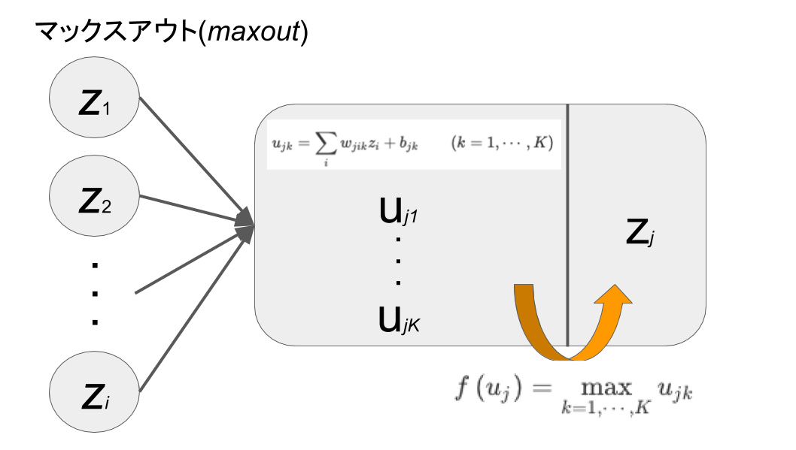
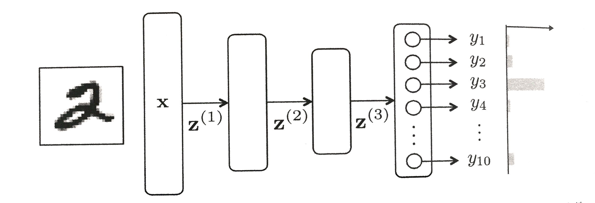

# 2 順伝播型ネットワーク
順伝播型ネットワークは最も基本的かつ最もよく使われているニューラルネットである。

## 2.1 ユニットの出力
**順伝播型(ニューラル)ネットワーク**(feedforward neural network): 層状に並べたユニットが隣接層間でのみ結合した構造を持ち、情報が入力層から出力層に一方的にのみ伝播するニューラルネットワーク。または、**多層パーセプトロン**(multi-layer perceptron)とも呼ばれる。

各ユニットは、複数の入力を受け取り、１つの出力を計算する。

 - ユニットが受け取る総入力: $u = w_{1}x_{1} + w_{2}x_{2} + w_{3}x_{3} + w_{4}x_{4} + b$
 - ユニットの出力: $z = f\left(u\right)$
    - $f\left(u\right)$: **活性化関数**(activation function)

順伝播型ネットワークでは、各ユニットが層状に並べられ、層間でのみそれらは結合を持つ。

右の層の3つのユニットが受け取る総入力
$$
{ u }_{ 1 }={ w }_{ 11 }{ x }_{ 1 }+{ w }_{ 12 }{ x }_{ 2 }+{ w }_{ 13 }{ x }_{ 3 }+{ w }_{ 14 }{ x }_{ 4 }+{ b }_{ 1 }\qquad (2.1a)\\ { u }_{ 2 }={ w }_{ 21 }{ x }_{ 1 }+{ w }_{ 22 }{ x }_{ 2 }+{ w }_{ 23 }{ x }_{ 3 }+{ w }_{ 24 }{ x }_{ 4 }+{ b }_{ 2 }\qquad (2.1b)\\ { u }_{ 3 }={ w }_{ 31 }{ x }_{ 1 }+{ w }_{ 32 }{ x }_{ 2 }+{ w }_{ 33 }{ x }_{ 3 }+{ w }_{ 34 }{ x }_{ 4 }+{ b }_{ 3 }\qquad (2.1c)
$$

それぞれの総入力$u_{j} \quad (j=1,2,3)$に活性化関数を適用したものが出力$z_{j} \quad (j=1,2,3)$となる。
$$
z_{j} = f\left(u_{j}\right) \quad (j=1,2,3) \qquad (2.2)
$$

一般化すると以下のようになる。第1層のユニットを$i=1,\cdots,I$、第2層のユニットを$j=1,\cdots,J$で表すと、第1層のユニットの出力から第2層のユニットの出力が決まるまでの計算は
$$
u_{j} = \sum _{i=1}^{I}{w_{ji}x_{i}} + b_{j}\\
z_{j} = f\left(u_{j}\right)
$$

行列とベクトルを用いて表記すると
$$
\left[ \begin{matrix} { u }_{ 1 } \\ { u }_{ 2 } \\ \vdots  \\ { u }_{ J } \end{matrix} \right] =\begin{bmatrix} { w }_{ 11 } & { w }_{ 12 } & \cdots  & { w }_{ 1I } \\ { w }_{ 21 } & { w }_{ 22 } & \cdots  & { w }_{ 22 } \\ \vdots  & \vdots  & \ddots  & \vdots  \\ { w }_{ J1 } & { w }_{ J2 } & \cdots  & { w }_{ JI } \end{bmatrix}\left[ \begin{matrix} { x }_{ 1 } \\ { x }_{ 2 } \\ \vdots  \\ x_{ I } \end{matrix} \right] +\left[ \begin{matrix} b_{ 1 } \\ { b }_{ 2 } \\ \vdots  \\ { b }_{ J } \end{matrix} \right] \\ \left[ \begin{matrix} z_{ 1 } \\ { z }_{ 2 } \\ \vdots  \\ { z }_{ J } \end{matrix} \right] =\left[ \begin{matrix} f\left( { u }_{ 1 } \right)  \\ f\left( { u }_{ 2 } \right)  \\ \vdots  \\ f\left( { u }_{ J } \right)  \end{matrix} \right]
$$

---
## 2.2 活性化関数
ユニットが持つ活性化関数には通常、単調増加する非線形関数が用いられる。

### ロジスティックシグモイド関数(logistic sigmoid function)
あるいは、**ロジスティック関数**

$$
f\left(u\right) = \frac {1}{1+e^{-u}}
$$

 - 定義域: $(-\infty, \infty)$
 - 値域: $(0,1)$

### 双曲線正接関数

$$
f\left(u\right) = tanh\left(u\right) = \frac { (e^{u} - e^{-u}) }{ (e^{u} + e^{-u}) }
$$

 - 値域: $(-1, 1)$

> 上の2つの関数も、
>
> - 入力の絶対値が大きな値をとると出力が飽和し一定値となること
> - その間の入力に対して出力が徐々にかつ滑らかに変化すること
>
> が特徴であり、一般に**シグモイド関数**(sigmoid function)と総称される。

### 正規化線形関数(rectified linear function)

$$
f\left(u\right) = \max { \left(u,0\right) }
$$

 - $z=u$の線形関数のうち$u<0$の部分を$u=0$で置き換えただけの単純な関数
 - 単純で計算量が小さい
 - 上述の2つの関数よりも学習がより速く進み、最終的にもよりよい結果が得られることが多い
 - この関数を持つユニットのことを**ReLU**(Rectified Linear Unit)と略記することがある

### 線形写像・恒等写像
ニューラルネットでは、各ユニットの活性化関数が非線形性を持つことが本質的に重要だが、部分的に線形写像を使う場合がある。

$$
f\left(u\right) = u \qquad (2.4)
$$

 - 回帰問題のためのネットワークでは、出力層に恒等写像を用いる

### ロジスティック関数を区分的に直線で近似した関数
$$
f\left( u \right) =\begin{cases} -1\qquad u<-1 \\ u\qquad -1\le u<1 \\ 1\qquad u\ge 1 \end{cases}
$$

### マックスアウト(maxout)

この活性化関数を持つユニット1つは、$K$個の異なるユニットをまとめて1つにしたような構造を持つ。それら$K$個の1つ1つが異なる重みとバイアスを持ち、それぞれの総入力を$u_{j1}, \cdots, u_{jK}$と別々に計算した後、それらの最大値をこのユニットの出力とする。
$$
u_{jk} = \sum _{i}{ w_{jik}z_{i} } + b_{jk} \qquad (k=1,\cdots, K)\\
f\left(u_{j}\right) = \max _{ k=1,\cdots,K }{ u_{jk} }
$$
各ユニットがこの活性化関数を持つネットワークは、各種ベンチマークテストで、正規化線形関数を使ったネットワークを凌ぐ結果を残している。

---
## 2.3 多層ネットワーク

ニューラルネットでは、情報は以下の図のように左から右へと一方向に伝わり、この順に各層を$l = 1, 2, 3$で表す。

なお、$l = 1$の層を**入力層**( **input layer** )、$l = 2$を**中間層**( **internal layer** )あるいは**隠れ層**( **hidden layer** )、$l = 3$を**出力層**( **output layer** )と呼ぶ。

 - 各層のユニットの入出力を区別するために、各変数の右肩に層の番号($l = 1, 2, 3$)を付け、$\mathrm {u}^{(l)}$や$\mathrm {z}^{(l)}$のように書くことにする

以下では一般化して、任意の層数$L$のネットワークの入出力を表記する。層$l + 1$のユニットの出力$\mathrm {z}^{(l + 1)}$は、1つ下の層$l$のユニットの出力$\mathrm {z}^{(l)}$から

$$
\mathrm {u}^{(l + 1)} = \mathrm {W}^{(l + 1)} \mathrm {z}^{(l)} + \mathrm {b}^{(l + 1)} \qquad (2.5a)\\
\mathrm {z}^{(l + 1)} = f\left( \mathrm {u}^{(l + 1)} \right) \qquad (2.5b)
$$

のように計算される。したがって、ネットワークに対する入力$\mathrm {x}$が与えられたとき(層$l = 1$のユニットの出力を$\mathrm {z}^{(1)} = \mathrm {x}$とし)、式(2.5a)、式(2.5b)を$l = 1, 2, 3, \dots, L - 1$の順に実行していくことで、各層の出力$\mathrm {z}^{(2)}, \mathrm {z}^{(3)}, \dots, \mathrm {z}^{(L)}$をこの順に決定していくことができます。

以下では、ネットワークの最終的な出力を

$$
\mathrm {y} \equiv \mathrm {z}^{(L)}
$$

と表記することにする。**なお上では、表記の簡素化のため単一の活性化関数$f$を使うように表記したが、各層で異なるものを選んでも構わない。特に出力層のユニットの活性化関数は、問題に応じて一般に中間層とは異なるものを選ぶ。**

> #### まとめ
> このように順伝播型ネットワークでは、与えられた入力$\mathrm {x}$に対し、入力層側から出力層側へ、上の計算を繰り返すことで情報を伝搬させ、出力$\mathrm {y}$を計算する。

> - この関係は、$\mathrm {y} = f\left( \mathrm {x} \right)$として表現できる
> - この関数のパラメータは$\mathrm {W}^{(l)}$と$\mathrm {b}^{(l)}$である
> - 活性化関数のパラメータを$f\left( \mathrm {x} ; \mathrm {W}, \mathrm {b} \right)$と表す

---
## 2.4 出力層の設計と誤差関数
### 2.4.1 学習の枠組み
ある$x$が与えられたときに$d$を予測するモデルを学習することを目的とする。

> $N$ 個の訓練データを$D={ \left\{ \left( { x }_{i},y_{i} \right)  \right\}  }_{ i=1 }^{ N }$ としたとき、学習データでの誤差(以下の目的関数)を最小化するモデルパラメータ**$\theta$**の値を求める手続きを教師あり学習と呼ぶ。
>$$
> L\left( \theta \right) = \frac {1}{\left| D \right|} \sum _{i=1}^{\left| D \right|}{{ \ell  }_{ \theta  }\left( { x }^{ (i) },{ y }^{ (i) } \right) }
>$$

> ${\ell}_{\theta}\left(x,y\right) \ge 0$: 個々の事例データに対して定義する**誤差関数**(error function) 
> ※機械学習ではむしろ損失関数(loss function)が一般的な名称だが、本レポートでは他の名称とも整合性を考えてこのように呼ぶ

以下の表は、主にニューラルネットで用いられる誤差関数である。

| 問題の種別 | 出力層の活性化関数 | 誤差関数 |
|:---------|:----------------|:--------|
| 回帰 | 恒等写像 $f\left(u\right) = u$ | 二乗誤差　式(2.6) |
| 二値分類 | ロジスティック関数 $f\left(u\right) = \frac {1}{1+e^{-u}}$ | 式(2.8) |
| 多クラス分類 | ソフトマックス関数 | 交差エントロピー 式(2.11) |

### 2.4.2 回帰(regression)
ニューラルネットを用いた回帰(regression)では、他の機械学習アルゴリズムと同じで連続値を出力する。ただし、ネットワークの出力層の活性化関数に、その値域が目標とする関数のそれと一致するようなものを選ぶ必要がある。

| 値域 | 活性化関数 |
|:---:|:---------:|
| $\left[ -1 : 1 \right]$ | 双曲線正接関数 |
| $\left(- \infty, \infty \right)$ | 恒等写像 |
| $\dots$ | $\dots$ |

回帰モデルの学習によく使われるニューラルネットのアルゴリズムは以下のような誤差関数がある。しかし、実際には学習データの出力$y$が持つ統計的な性質に応じて選ぶのが理想である。$y$がその真の値にガウス分布に従うノイズが加算されたものと考えられる場合、以下の最小二乗誤差を選ぶのが最適である。

> #### 最小二乗法
> $$
E\left( w \right) = \frac {1}{2} \sum _{i=1}^{N}{ \left[ y_{i} - f\left( x_{i} ; w \right) \right]^{2} }
$$
> (1/2倍するのは、微分すると2乗の2と相殺されるからである。)

[機械学習で抑えておくべき損失関数（回帰編） - HELLO CYBERNETICS](http://s0sem0y.hatenablog.com/entry/2017/06/19/084210)
http://s0sem0y.hatenablog.com/entry/2017/06/19/084210

### 2.4.3 二値分類
　入力$\mathrm {x}$を内容に応じて2種類に分類する問題を考える。この問題を定式化する方法はいくつかあるが、ここでは$\mathrm {x}$を指定したとき、$y = 1$となる事後確率 $p\left( {y = 1}|{x} \right)$ をモデル化する方法を考える。与えられた$\mathrm {x}$に対する$y$の推定は、このモデルを使って事後確率を計算し、

$$
y=\begin{cases} 1\quad p\left( { y=1 }|{ { x } } \right) \ge 0.5 \\ 0\quad \mathrm {else} \end{cases}
$$

と判断することとする。

この事後確率$p\left({y = 1}|{\mathrm {x}}\right)$をモデル化するのにニューラルネットを使う。このニューラルネットは、出力層にユニットを1つだけ持ち、その活性化関数はロジスティック関数 $y = 1/\left(1 + \mathrm {exp}\left(-u\right)\right)$とする。このネットワーク全体の入出力関係$f\left(\mathrm {x};w\right)$を事後確率のモデル

$$
p\left({y = 1}|{\mathrm {x}}\right) \approx f\left(\mathrm {x};w\right)
$$

とする。

パラメータ$w$は、訓練データ$ \left\{ {\left( {\mathrm {x}}_{i}, y_{i} \right)} | {i = 1, \cdots, N} \right\} $を用いて、モデルが与える事後分布$p\left( {y}|{\mathrm {x}} ; w \right)$が、データが与える分布と最もよく整合するように決める。具体的には、**最尤推定**(**maximum likelihood estimation**)を行うことを考える。最尤推定は、このモデルの下で$w$のデータに対する**尤度**(**likelihood**)を求め、それを最大化するような$w$を選ぶ。

$$
L\left(w\right) = \prod _{i = 1}^{ N }{ p\left( {y_{i}}|{\mathrm {x}_{i}} ; w \right) } = \prod _{ i=1 }^{ N }{ { \left\{ f\left( \mathrm {x}_{i} ; w \right)  \right\}  }^{ { y }_{ i } }{ \left\{ 1-f\left( {\mathrm {x}}_{i} ; w  \right)  \right\}  }^{ 1-{ y }_{ i } } }
$$

上記の尤度関数の対数をとり、さらに(最大化の代わりに最小化を考えて)符号を反転した

$$
E\left(w\right) = - \sum _{ i = 1 }^{ N }{\left\{ y_{i} \log {f\left(\mathrm {x}_{i}; w\right)} + (1 - y_{i}) \log {\left[ 1 - f\left( \mathrm {x}_{i} ; w \right) \right]} \right\}}
$$

を損失関数とする。

[機械学習で抑えておくべき損失関数（分類編） - HELLO CYBERNETICS](https://www.hellocybernetics.tech/entry/2017/06/20/135402)
https://www.hellocybernetics.tech/entry/2017/06/20/135402

### 2.4.4 多クラス分類
　クラス分類とは、入力$\mathrm {x}$を内容に応じて有限個のクラスに分類する問題である。多クラス分類を対象とする場合、ネットワークの出力層に分類したいクラス数$K$と同数のユニットを並べ、この層の活性化関数を次のように並べる。

(多クラス問題の例。手書き数字の認識。入力画像$\mathrm {x}$が、0~9までの数字のどれかを判定する。)

出力層$l = L$の各ユニット$k (= 1, \dots, K)$の総入力は、1つ下の層$l = L - 1$の出力を元に$u_{k}^{(L)} = \mathrm {W}^{(L)} \mathrm {z}^{(L - 1)} \mathrm {b}^{(L)}$と与えられる。これを元に、出力層の$k$番目のユニットの出力を

$$
y_{k} \equiv z_{k}^{(L)} = \frac {\mathrm {exp} \left( u_{k}^{(L)} \right)}{ \sum _{j=1}^{K}{\mathrm {exp}\left( u_{j}^{(L)} \right)} }
$$

とする。この関数は**ソフトマックス関数**(**softmax function**)と呼ばれている。

 - 出力$y_{1}, \dots, y_{K}$は、総和がいつも1になる($\sum _{k=1}^{K}{y_{k}} = 1$)ことに注意
 - ソフトマックス関数も活性化関数の1つに数えられるが、他の活性化関数の場合、ユニット$k$の出力$z_{k}$は同ユニットへの総入力$u_{k}$のみから決定されるのに対し、ソフトマックス関数では、ユニット$k$の出力はこの層の全ユニットへの総入力$u_{1}, \dots, u_{K}$を元に決まる点で特殊である

今考えているクラスを$C_{1}, \dots, C_{K}$と表すとき、上のように選んだ出力層のユニット$k$の出力$y_{k}(= z_{k}^{(L)})$は、与えられた入力$\mathrm {x}$がクラス$C_{k}$に属する確率を表すものと解釈する。

$$
p\left( {C_{k}} | {\mathrm {x}} \right) = y_{k} = z_{k}^{(L)} \qquad (2.10)
$$

そして、入力$\mathrm {x}$をこの確率が最大になるクラスに分類することにする。

多クラス分類でも二値分類同様に、ネットワークが実現する関数が各クラスの事後確率のモデルであると見なし、そのような確率モデルの下で、訓練データに対するネットワークパラメータの尤度を評価し、これを最大化する。

訓練データ :
$$
y_{ i }=\left( \begin{matrix} { y }_{ i1 } & { y }_{ i2 } & \dots  & { y }_{ iK-1 } & { y }_{ iK } \end{matrix} \right) ^{ T }
$$
$$
y_{ i }=\left( \begin{matrix} 0 & 0 & \dots  & 1 & 0 \end{matrix} \right) ^{ T }
$$

事後分布を以下のように表す。
$$
p\left({y}|{\mathrm {x}}\right) = \prod _{k=1}^{K}{p\left({C_{k}}|{\mathrm {x}}\right)^{y_{k}}}
$$

この事後確率の表記に式(2.10)を組み合わせると、訓練データ$\left\{ \left(\mathrm {x}_{i}, y_{i}\right) \right\} \quad (i = 1, \dots, N)$に対する$w$の尤度を以下のように導出できる。

$$
L\left( w \right) =\prod _{ i=1 }^{ N }{ p\left( { y_{ i } }|{ { x }_{ i } };w \right)  } =\prod _{ i=1 }^{ N }{ \prod _{ k=1 }^{ K }{ { p\left( { C_{ k } }|{ { { x }_{ i } } } \right)  }^{ { y }_{ ik } } }  } =\prod _{ i=1 }^{ N }{ \prod _{ k=1 }^{ K }{ { ({ y }_{ k }\left( { x };w \right) ) }^{ { y }_{ ik } } }  }
$$

この尤度の対数をとり符号を反転した次を、損失関数とする。

$$
\\ E\left( w \right) =-\sum _{ i=1 }^{ N }{ \sum _{ k=1 }^{ K }{ { y }_{ ik }\log { { y }_{ k }\left( { x }_{ i };w \right)  }  }  }
$$

この関数は、**交差エントロピー**(**cross entropy**)と呼ばれる。
