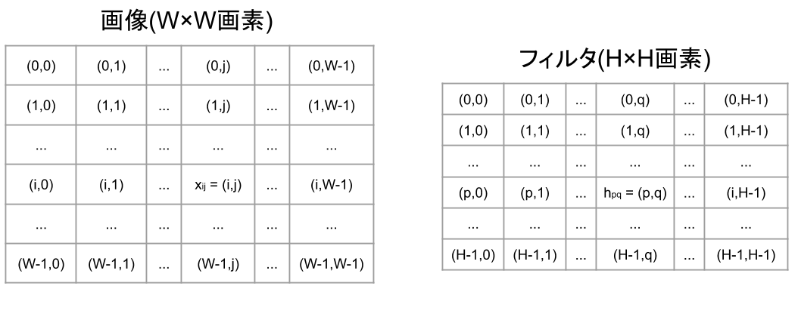
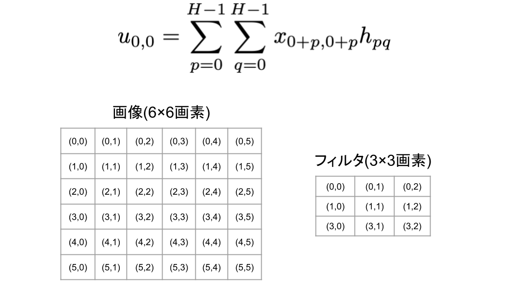
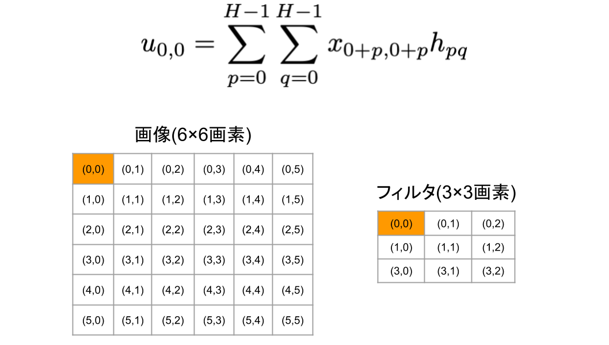
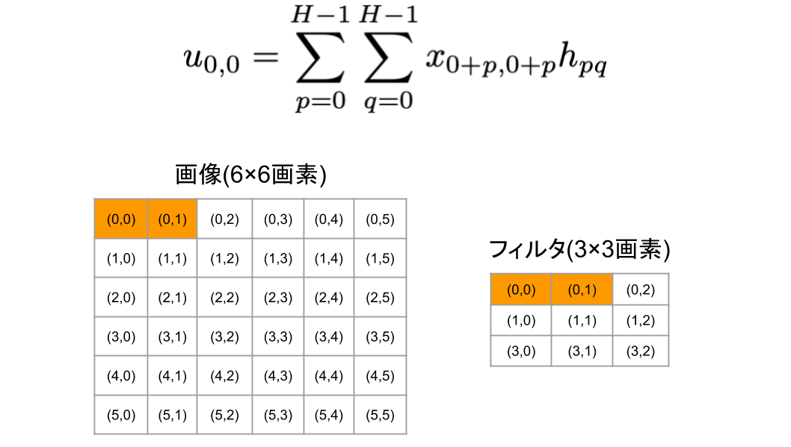
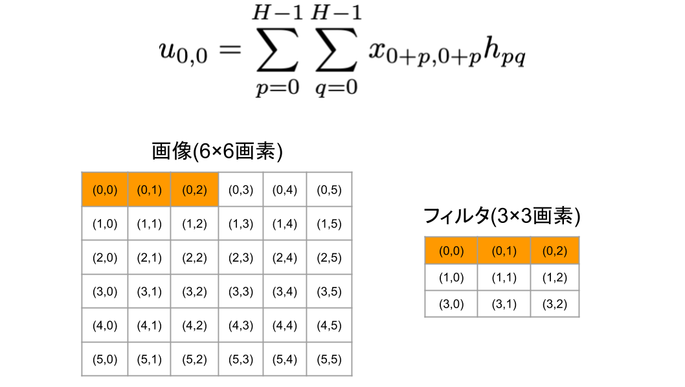
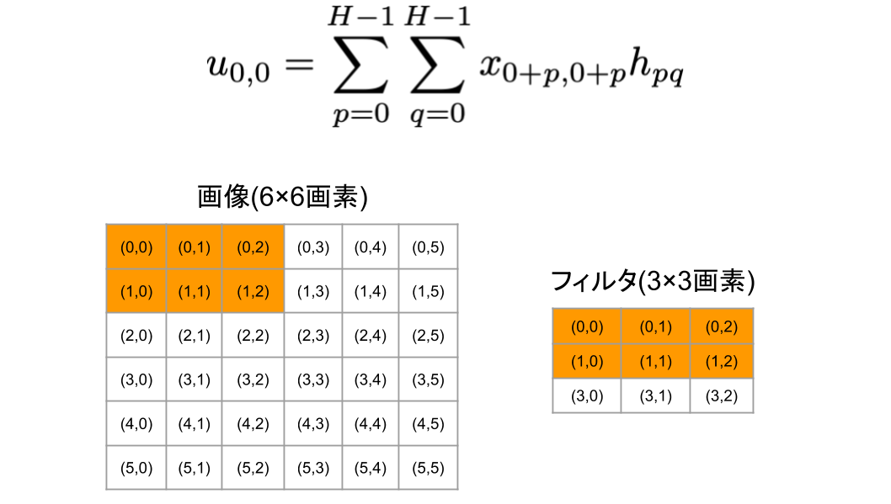
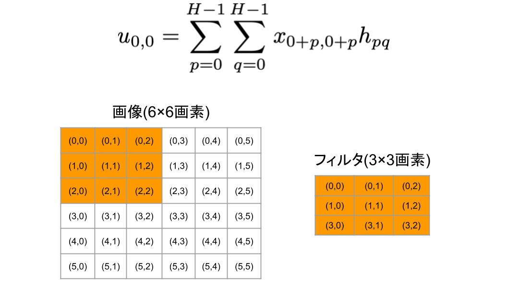
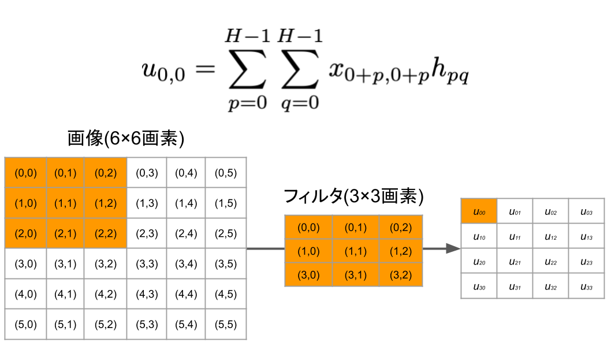

# 6 畳込みニューラルネット
## 6.1 単純型細胞と複雑型細胞

---
## 6.2 全体の構造

---
## 6.3 畳込み
### 6.3.1 定義
濃淡値を各画素に格納したグレースケールの画像を考えます。

 - 画像サイズを$W \times W$画素
 - 画素をインデックス$\left(i,j\right)$ $(i = 0,\dots,W-1, j = 0, \dots, W - 1)$
 - 画素$\left(i,j\right)$の画素値を$x_{ij}$($- \infty \le x_{ij} \le + \infty$)

<b>フィルタ(filter)</b>と呼ぶサイズの小さい画像を考え、そのサイズを$H \times H$画素とします。

 - フィルタの画素をインデックス$\left( p, q \right)$ $(p=0, \dots, H-1, q = 0, \dots, H-1)$
 - フィルタの画素値を$h_{pq}$
 - フィルタの画素値は任意の実数値

画像の畳込みとは、画像とフィルタ間で定義される次の積和計算です。

$$
u_{ij} = \sum _{p=0}^{H-1}{ \sum _{q=0}^{H-1}{ x_{i+p, j+p} h_{pq} } } \qquad (6.1)
$$

計算例:

|       →         |        →        |        ↩︎        |
| :-------------: | :-------------: | :-------------: |
|  |  |  |
|  |  |  |
|  |  |

### 6.3.2 畳込みの働き

### 6.3.3 パディング

### 6.3.4 ストライド

---
## 6.4 畳込み層

---
## 6.5 プーリング層

---
## 6.6 正規化層
### 6.6.1 局所コントラスト正規化

### 6.6.2 単一チャンネル画像の正規化

### 6.6.3 多チャンネル画像の正規化

---
## 6.7 勾配の計算
