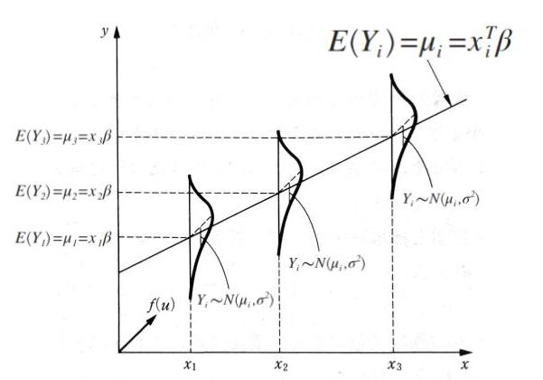
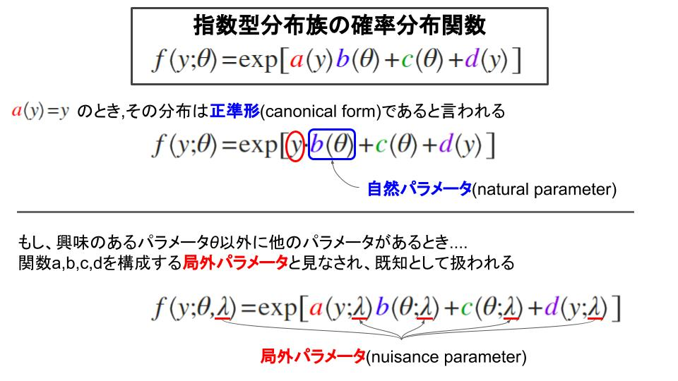
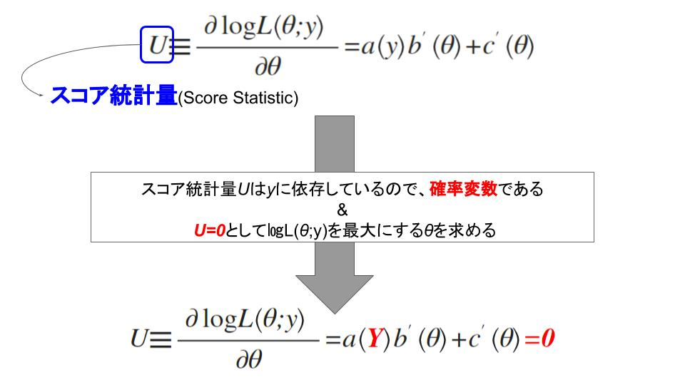

# 3章 指数型分布族と一般化線形モデル

> **目次**
>
> - 「3.1 はじめに」
> - 「3.2 指数型分布族」
>     - 「ポアソン分布」
>     - 「正規分布」
>     - 「二項分布」
> - 「3.3 指数型分布族の性質 - 期待値と分散の導出」
>     - 「期待値の導出」
>     - 「分散の導出」
>     - 「指数型分布族の対数尤度関数」
>         - 「期待値の導出」
>         - 「分散の導出」
>         - 「スコア統計量$U$の性質」
> - 「3.4 一般化線形モデル」
> - 「3.5 例題」
>     - 「3.5.1 正規線形モデル」
>     - 「3.5.2 二項分布モデル」
>     - 「3.5.3 ポアソン分布モデル」

## 3.1 はじめに
独立な確率変数$Y_{i}$に対する
$$
E\left(Y_{i}\right) = {\mu}_{i} = {{\mathrm {x}}_{i}}^{T} \beta\\
 Y_{i} \sim N\left( {\mu}_{i}, {\sigma}^{2} \right)
$$
の形の線形モデルは、連続データの多くの分析において最も基本となるものである。

	

しかし、統計理論やコンピュータソフトウェアの進歩により、線形モデルに対して開発された方法と類似の方法が、以下のようなもっと一般的な状況で利用できるようになった。

> 1. 反応変数が、正規分布以外の分布に従っている場合. (それらは、連続変数の場合だけではなく質的変数の場合でもよい)
> 2. 反応変数と説明変数との関の関係が、上式のような簡単な線形式の形である必要はない.

1番目は、**指数型分布族**(exponential family of distributions)と呼ばれるより広いクラスの分布が扱えるようになったことによる。2番目については、パラメータ$\beta$を推定する数値的方法が、線形モデルだけでなく、$E\left(Y_{i}\right) = {\mu}_{i}$と線形成分${\mathrm {x}}_{i}^{T} \beta$が非線形関数により関連付けられる
$$
g\left(u_{i}\right) = \boldsymbol {\mathrm {x}}_{i}^{T} \boldsymbol {\beta}
$$
のような場合にも利用できるようになったことによる。関数$g$は、**連結関数**(link function)と呼ばれる。

---
## 3.2 指数型分布族
　単一のパラメータ$\theta$を持つ確率分布に従う1つの確率変数$Y$について考える。その確率分布が以下の式により記述されるなら、その分布は指数型分布族に属するという。
$$
f\left( y;\theta \right) = s\left( y \right)t\left( \theta \right) \mathrm {exp}\left[ a\left( y \right) b\left( \theta \right) \right]
$$

 - $\theta$ : 単一のパラメータ.
 - $a,b,s,t$ : これらは既知の関数とする.

上式は次のようにも書き換えることができる。関数$s\left( y \right), t\left( \theta \right)$をそれぞれ
$$
d\left( y \right) = \log {s\left( y \right)}\\
c\left( \theta \right) = \log {t\left( \theta \right)}
$$
と定義すると
$$
\begin{eqnarray}
f\left( y;\theta \right) & = & \mathrm {exp} \left[ a\left( y \right) b\left( \theta \right) + \log {t\left( \theta \right)} + \log {s\left( y \right)} \right]\\
& = & \mathrm {exp} \left[ a\left( y \right) b\left( \theta \right) + c\left( \theta \right) + d\left( y \right) \right]
\end{eqnarray}
$$
と変形できる。

	

> #### ポアソン分布
> $$
f\left( y ; \theta \right) = \frac { {\theta}^{y} \mathrm {e}^{-\theta} }{y!}
$$
>
> - $y$ : 離散的な値($0,1,2,\dots$)
>
>$$
\begin{eqnarray}
f\left( y ; \theta \right) & = & \frac {1}{y!} {\theta}^{y} \mathrm {exp}\left[ - \theta \right]\\
& = & \mathrm {exp}\left[ - \log {y!} \right] \mathrm {exp}\left[ y \log {\theta} \right] \mathrm {exp}\left[ - \theta \right]\\
& = & \mathrm {exp}\left[ y \log {\theta} - \theta - \log {y!} \right]
\end{eqnarray}
$$
> $a\left( y \right) = y$であるから、**正準形**である。また、自然パラメータは$\log {\theta}$となる。

 

> #### 正規分布
> ここで、$\mu$が関心のあるパラメータであり、$\sigma$は局外パラメータと見なされる。
> $$
\begin{eqnarray}
f\left( y ; \mu, \sigma \right) & = & \frac {1}{\sqrt {2 \pi} \sigma} \mathrm {exp}\left[ - \frac {1}{2 \sigma^{2}}\left( y - \mu \right)^{2} \right]\\
& = & \mathrm {exp}\left\{ - \left[ \frac {1}{2} \log {(2 \pi)} + \log {\sigma} \right] \right\} \mathrm {exp}\left[ - \frac {1}{2 \sigma^{2}}\left( y - \mu \right)^{2} \right]\\
& = & \mathrm {exp} \left\{ -\cfrac { 1 }{ 2{ \sigma  }^{ 2 } } \left( { y }^{ 2 }-2y\mu +{ \mu  }^{ 2 } \right) -\left[ \cfrac { 1 }{ 2 } \log { \left( 2\pi  \right)  } +\log { \sigma  }  \right] \right\}\\
& = & \mathrm {exp}\left\{ - \cfrac {y^{2}}{2 \sigma^{2}} + \cfrac {y \mu}{\sigma^{2}} - \cfrac {\mu^{2}}{2 \sigma^{2}} - \left[ \cfrac { 1 }{ 2 } \log { \left( 2\pi  \right)  } +\log { \sigma  }  \right] \right\}\\
& = & \mathrm {exp}\left\{ y \cdot \cfrac {\mu}{\sigma^{2}} - \cfrac {\mu^{2}}{2\sigma^{2}} - \left[ \cfrac { 1 }{ 2 } \log { \left( 2\pi  \right)  } +\log { \sigma  }  \right] - \cfrac {y^{2}}{2 \sigma^{2}} \right\}
\end{eqnarray}
$$
>
> - $a\left( y \right) = y$
> - $b\left( \mu ; \sigma \right) = \cfrac {\mu}{\sigma^{2}}$
> - $c\left( \mu ; \sigma \right) = - \cfrac {\mu^{2}}{2\sigma^{2}} - \left[ \cfrac { 1 }{ 2 } \log { \left( 2\pi  \right)  } +\log { \sigma  }  \right]$
> - $d\left( y ; \sigma \right) = - \cfrac {y^{2}}{2 \sigma^{2}}$

 

> #### 2項分布
> $$
\begin{eqnarray}
f\left( y ; \rho \right) & = & { _{ n }{ C }_{ y } } { \rho }^{ y } \left( 1 - \rho \right)^{ n - y }\\
& = & \mathrm {exp} \left[ \left( n - y \right) \log {\left( 1 - \rho \right)} + y \log {\rho} + \log {{ _{ n }{ C }_{ y } }} \right]\\
& = & \mathrm {exp} \left[ n \log {\left( 1 - \rho \right)} - y \log {\left( 1 - \rho \right)} + y \log {\rho} + \log {{ _{ n }{ C }_{ y } }} \right]\\
& = & \mathrm {exp} \left\{ y \left[ \log {\rho} - \log {\left( 1 - \rho \right)} \right] + n \log {\left( 1 - \rho \right)} + \log {{ _{ n }{ C }_{ y } }} \right\}
\end{eqnarray}
$$
>
> - $a\left( y \right) = y$
> - $b\left( \rho \right) = \left[ \log {\rho} - \log {\left( 1 - \rho \right)} \right]$
> - $c\left( \rho \right) = n \log {\left( 1 - \rho \right)}$
> - $d\left( \rho \right) = \log {{ _{ n }{ C }_{ y } }}$

---
## 3.3 指数型分布族の性質 - 期待値と分散の導出
**$a\left( Y \right)$の期待値と分散を求める**。<u>積分と微分の順序を入れ替えることができる</u>という条件のもとで、任意の確率密度関数に対して成り立つ次の結果を用いる。

> 確率密度関数の定義から、その曲線の下にある領域の面積は1である。
> $$
\begin{eqnarray}
\int {f\left( y;\theta \right)dy} & = & 1 \quad (確率変数Yが連続値) \qquad (3.4)\\
\sum {f\left( y ; \theta \right)} & = & 1 \quad (確率変数Yが離散値)
\end{eqnarray}
$$
> ただし、積分の範囲は、$y$の取りうる値の全体である。

 

> $\theta$に関して式(3.4)の両辺を微分する
>$$
\frac {d}{d \theta} \int {f\left( y ; \theta \right)dy} = \frac {d}{d \theta} 1 = 0 \qquad (3.5)
$$

 

> 式(3.5)の第1項の微分と積分の順序を入れ替えると、次のようになる.(<u>積分と微分の順序を入れ替えることができる</u>という条件を思い出す.)
> $$
\int {\frac {d f\left( y ; \theta \right)}{d \theta} dy} = 0 \qquad (3.6)
$$

 

> 式(3.4)を$\theta$に関して2回微分し、積分と微分の順序を入れ替える。
> $$
\int {\frac { d^{2} f\left( y ; \theta \right) }{ {d \theta}^{2} } dy} = 0
$$

これらの結果を指数型分布族に属する分布に適用する。

### 期待値の導出
$E\left[ a\left( Y \right) \right]$を導出する。指数型分布族の確率分布関数の定義より
$$
\begin{eqnarray}
f\left( y ; \theta \right) & = & \mathrm {exp} \left[ a\left( y \right) b\left( \theta \right) + c\left( \theta \right) + d\left( y \right) \right]\\
\frac {d f\left( y ; \theta \right)}{d \theta} & = & \left[ a\left( y \right) b^{\prime}\left( \theta \right) + c^{\prime}\left( \theta \right) \right] f\left( y ; \theta \right)
\end{eqnarray}
$$
となり、式(3.6)より
$$
\begin{eqnarray} 
\int { \frac { df\left( y;\theta  \right)  }{ d\theta  } dy }  & = & 0 \\ 
\int { \left[ a\left( y \right) b^{ \prime  }\left( \theta  \right) +c^{ \prime  }\left( \theta  \right)  \right] f\left( y;\theta  \right) dy }  & = & 0 \\ 
b^{ \prime  }\left( \theta  \right) \int { a\left( y \right) f\left( y;\theta  \right) dy } + \int { c^{ \prime  }\left( \theta  \right) f\left( y;\theta  \right) dy }  & = & 0 
\end{eqnarray}
$$

	

上式を整理すると、次の式が得られる。
$$
E\left[ a\left( Y \right) \right] = - \frac {c^{\prime}\left( \theta \right)}{b^{\prime}\left( \theta \right)} \quad (3.9)
$$

### 分散の導出
$Var\left[ a\left( Y \right) \right]$を導出する。

$$
\frac { d^{2} f\left( y ; \theta \right) }{ {d \theta}^{2} } = \left[ a\left( y \right) b^{ \prime \prime  }\left( x \right) +c^{ \prime \prime  }\left( x \right)  \right] f\left( y ; \theta \right) + \left[ a\left( y \right) b^{ \prime  }\left( x \right) +c^{ \prime  }\left( x \right)  \right]^{2} f\left( y ; \theta \right) \qquad (3.10)
$$

	
	

### 指数型分布族の対数尤度関数
対数尤度関数の導関数の期待値と分散を求める。

$$
f\left( y ; \theta \right) = \mathrm {exp}\left[ a\left( y \right) b\left( \theta \right) + c\left( \theta \right) + d\left( y \right) \right]
$$

#### 期待値の導出
指数型分布族に属する分布の対数尤度関数の期待値を導出する。

※以下の尤度関数では、標本数が**1($n=1$)**のみとする。

$$
L\left( \theta ; y \right) = \prod _{ i=1 }^{ n }{ f\left( y ; \theta \right) }
$$
両辺に対数をとり、対数尤度関数にする
$$
\begin{eqnarray}
\log {L\left( \theta ; y \right)} & = & \sum _{i=1}^{n}{\log {f\left( y_{i} ; \theta \right)}}\\
& = & \sum _{i=1}^{n}{\left[ a\left( y_{i} \right) b\left( \theta \right) + c\left( \theta \right) + d\left( y \right) \right]}\\
& = & a\left( y \right) b\left( \theta \right) + c\left( \theta \right) + d\left( y \right) \qquad (n=1より)
\end{eqnarray}
$$
$\log {L\left( \theta ; y \right)}$を最大にする$\theta$を求める。

そのスコア統計量の期待値は
$$
\begin{eqnarray}
E\left( U \right) & = & b^{\prime}\left( \theta \right)E\left[ a\left( Y \right) \right] + c^{\prime}\left( \theta \right) & = & 0\\
& = & b^{\prime}\left( \theta \right) \left[ - \frac {c^{\prime}\left( \theta \right)}{b^{\prime}\left( \theta \right)} \right] + c^{\prime}\left( \theta \right) & = & 0 \quad (3.9)より
\end{eqnarray}
$$
となる。

#### 分散の導出
$U \equiv \partial \log {L\left( \theta ; y \right)} / \partial \theta$の分散(情報量)
$$
U = a\left( Y \right) b^{\prime}\left( \theta \right) + c^{\prime}\left( \theta \right)
$$
確率変数の線型変換の値の分散を計算する公式を用いると以下の式が得られる。
$$
\begin{eqnarray}
\Im \equiv Var\left( U \right) & = & \left[ b^{\prime}\left( \theta \right) \right]^{2} Var\left[ a\left( Y \right) \right]\\
& = & \frac {b^{\prime \prime}\left( \theta \right) c^{\prime}\left( \theta \right) }{b^{\prime}\left( \theta \right)} - c^{\prime \prime}\left( \theta \right)
\end{eqnarray}
$$

#### スコア統計量$U$の性質
$U$の他の性質として次の関係がある。
$$
Var\left( U \right) = E\left( U^{2} \right) = - E\left( U^{\prime} \right)
$$

	

---
## 3.4 一般化線形モデル
一般化線形モデルは、<u>指数型分布族に属する分布に従い、かつ以下に示す性質をもつ独立な確率変数$Y_{1}, \dots, Y_{N}$の集合</u>に対して定義される。

> 1. 各確率変数$Y_{i}$の分布は、**正準形**を持っており、**1つのパラメータ$\theta_{i}$(その$\theta_{i}$はすべて同じである必要はない)に依存している**。
$$
f\left( y_{i} ; \theta_{i} \right) = \mathrm {exp}\left[ y_{i} b_{i}\left( \theta_{i} \right) + c_{i}\left( \theta_{i} \right) + d_{i}\left( y_{i} \right) \right]
$$
>
> 

>
> 2. すべての確率変数$Y_{i}$の分布は**全て同じ型**(すべて正規分布、あるいはすべてポアソン分布など)であり、$b,c,d$の下の添字は不要である。
>$$
f\left( y_{i} ; \theta_{i} \right) = \mathrm {exp}\left[ y_{i} b\left( \theta_{i} \right) + c\left( \theta_{i} \right) + d\left( y_{i} \right) \right]
$$

このとき、確率変数$Y_{1}, \cdots, Y_{N}$の同時確率密度関数は以下のように表される。
$$
\begin{eqnarray}
f\left( y_{1}, \dots, y_{N} ; \theta_{1}, \dots, \theta_{N} \right) & = & \prod _{i=1}^{N}{\mathrm {exp}\left[ y_{i} b\left(\theta_{i}\right) + c\left( \theta_{i} \right) + d\left(y_{i}\right) \right]}\\
& = & \mathrm {exp}\left[ \sum _{i=1}^{N}{y_{i}b\left( \theta_{i} \right)} + \sum _{i=1}^{N}{c\left( \theta_{i} \right)} + \sum _{i=1}^{N}{d\left( y_{i} \right)}\right]
\end{eqnarray}
$$

 - パラメータ$\theta_{i}$には直接関心はない(なぜならば、それぞれの観測値に対して1つずつ存在しているかもしれないから)
 - モデルの設定にあたっては、通常$\beta_{1}, \dots, \beta_{p}$$(p < N)$というもっとも少数のパラメータに関心がある
 - **$E\left( Y_{i} \right) = \mu_{i}$と定義される$\mu_{i}$は$\beta_{1}, \cdots, \beta_{p}$の関数として表されると仮定しよう**

一般化線形モデルにおいては、$\mu_{i}$の関数$g\left( \mu_{i} \right)$に対して
$$
\begin{eqnarray}
g\left( \mu_{i} \right) & = & \left[ \begin{matrix} { x }_{ i1 } & \cdots  & { x }_{ ip } \end{matrix} \right] \left[ \begin{matrix} { \beta  }_{ 1 } \\ \vdots  \\ { \beta  }_{ p } \end{matrix} \right] \\
& = & \boldsymbol {\mathrm {x}}_{i}^{T} \boldsymbol {\mathrm {\beta}}
\end{eqnarray}
$$
のモデルを想定する。

 - $g$は単調、かつ微分可能な関数であり、**連結関数(link function)**と呼ばれる
 - $\boldsymbol {\mathrm {x}}_{i}$は説明変数の$p \times 1$ベクトル(特徴量)である

**一般化線形モデルの3要素** : 一般化線形は以下の3つの成分から成る。

 1. (**指数型分布族**)指数型分布族に属する同一の分布に従うと仮定される反応変数$Y_{1}, \cdots, Y_{N}$
 2. (**線形予測子**)パラメータベクトル$\boldsymbol {\mathrm {\beta}}$の集合と説明変数の行列 
 $\boldsymbol {\mathrm {X}} = \left[ \begin{matrix} \boldsymbol { \mathrm {x} }_{ 1 }^{ T } \\ \vdots  \\ \boldsymbol { \mathrm {x} }_{ N }^{ T } \end{matrix} \right] =\left[ \begin{matrix} { x }_{ 11 } & \cdots  & { x }_{ 1p } \\ \vdots  & \ddots  & \vdots  \\ { x }_{ N1 } & \cdots  & { x }_{ Np } \end{matrix} \right] $
 3. (**連結関数**)単調な連結関数$g$.ただし、$g\left( \mu_{i} \right)$, $\mu_{i} = E\left( Y_{i} \right)$は次の関係を満たす 
 $$
 g\left( \mu_{i} \right) = \boldsymbol {\mathrm {x}}_{i}^{T} \boldsymbol {\mathrm {\beta}} = \eta_{i}
 $$
 もしくは
 $$
 \mu_{i} = h\left( \eta_{i} \right) = h\left( \boldsymbol {\mathrm {x}}_{i}^{T} \boldsymbol {\mathrm {\beta}} \right)
 $$

---
## 3.5 例題
### 3.5.1 正規線形モデル

### 3.5.2 二項分布モデル

### 3.5.3 ポアソン分布モデル

