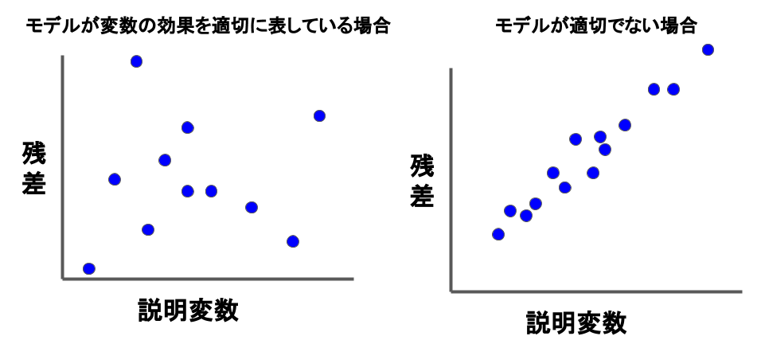
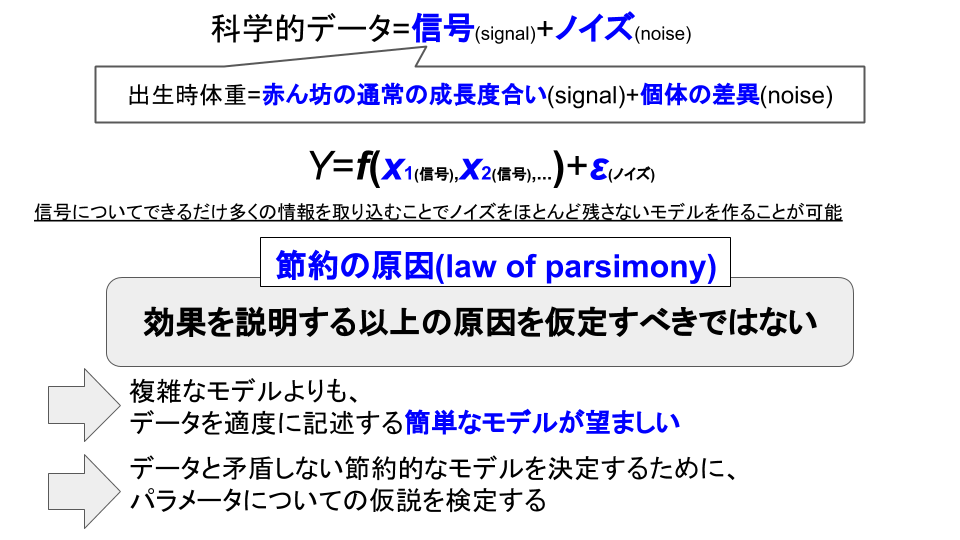

# 2章 モデルの当てはめ

**目次**
<!-- MarkdownTOC -->

- 2.1 はじめに
- 2.2 例
- 2.3 統計モデル構築のいくつかの原理
    - 2.3.1 ①探索的データ解析
    - 2.3.2 ②モデルの定式化
    - 2.3.3 ③パラメータの推定
    - 2.3.4 ④残差とモデルのチェック
        - 正規分布を仮定したモデルの残差
        - ポアソン分布を仮定したモデルの残差
        - 他の分布を仮定したモデルの残差
        - 残差を用いたモデルの仮定のチェック
        - 標準化残差と説明変数のプロット
    - 2.3.5 ⑥推測と解釈

<!-- /MarkdownTOC -->

# 2.1 はじめに
モデルの当てはめのプロセスは次の4つのステップからなる。

> **1. モデルの特定**: ①反応変数と説明変数を連結する<b>関係式</b>および②反応変数の<b>確率分布</b>の2つの部分を指定することによりモデルを特定する
>
> **2. モデルのパラメータの推定**
>
> **3. モデルの妥当性のチェック**: モデルはどのくらいよくデータに当てはまり、データを要約しているか
>
> **4. 推測**: モデルのパラメータに関する仮説検定と信頼区間の計算および結果の解釈

---
# 2.2 例

---
# 2.3 統計モデル構築のいくつかの原理
### 2.3.1 ①探索的データ解析
統計的データ解析は、まず1つずつ変数を別々に考慮することから始め、データの質を点検して、例えば、異常な値が混ざっていないかを検討したり、モデルの定式化に利用したいする。

 - **測定の尺度**は何か?: 量的か、質的か?質的であれば、いくつかのカテゴリーがあり、それらは名義尺度か、順序尺度か?
 - **分布**はどんな形か?: このことは、度数分布表、点プロット、ヒストグラム、その他のグラフィカルな方法を用いて調べられる。
 - 他の変数と**どんな関連性があるのか?**: 質的な変数の関連性にはクロス集計表、連続変数の関連性には散布図、質的な変数と量的な変数の関連性には質的変数(因子)の各水準に対する量的変数の並列箱ひげ図、などのデータの視覚化が、関連性のパターンを調べるのに役立つ。例えば、散布図は線形、非線形のどちらの関係を示唆するか?グループの平均値は、グループを定義づける順序尺度に対応して単調に増加あるいは減少しているか?

### 2.3.2 ②モデルの定式化
モデルの定式化には、問題意識や変数間の理論的な関係などのデータが得られた分野の実質科学的知識や、研究計画と探索的なデータ解析の結果が役に立つ。モデルは2つの成分を持つ:

> - $Y$の**確率分布**
> - $Y$の期待値と説明変数の線形結合を連結する**関係式**

※一般化線形モデルにおいては、確率分布はすべて**指数型分布族**に属する。それには正規分布、2項分布、ポアソン分布など多くの分布が含まれる。

モデルの関係式は次の一般的な形式
$$
g\left[E\left(Y\right)\right] = \beta_{0} + \beta_{1}x_{1} + \cdots + \beta_{m}x_{m}
$$
を持ち、$\beta_{0} + \beta_{1}x_{1} + \cdots + \beta_{m}x_{m}$の部分を**線形成分(linear component)**と呼ぶ。

### 2.3.3 ③パラメータの推定
最もよく使われる推定法は

 - 最尤推定
 - 最小2乗法

である。

### 2.3.4 ④残差とモデルのチェック
#### 正規分布を仮定したモデルの残差

反応変数$Y_{i}$が
$$
E\left(Y_{i}\right) = \mu_{i}; \quad Y_{i} \sim N\left(\mu_{i}, {\sigma}^{2}\right)
$$
の形にモデル化される場合を想定する。当てはめ値としては推定値 ${\hat {\mu}}_{i}$ を用い、残差を $y_{i} - {\hat {\mu}}_{i}$ 、近似的な標準化残差を
$$
r_{i} = \frac {(y_{i} - {\hat {\mu}}_{i})}{ \hat {\sigma} }
$$
と定義する。

 - $\hat {\sigma}$ : 未知パラメータ$\hat {\sigma}$の推定値
 - 標準化残差は、観測データから計算される推定値 ${\hat {\mu}}_{i}$ と $\hat {\sigma}$ に依存するため、わずかに相関がある
 - $\sigma$ が $\hat {\sigma}$ によって推定されるため、それらは正確な正規分布に従わない。しかし、近似的な正規分布であり、近似の正確さは適切なグラフィカルに調べることができる。

**残差** 
モデルが反応変数と説明変数の関係をよく表しているなら、その関係は$\hat {\mu}_{i}$によって説明されているはずであり、残差にはほとんど情報が残らない。
$$
\mathrm {残差} = y_{i} - {\hat {\mu}}_{i}
$$

残差平方和がモデルの適切さをはかるための包括的な統計量を与える。
$$
\sum {\left( y_{i} - {\hat {\mu}}_{i} \right)^{2}}
$$
実際、残和平方和は、最適化された対数尤度関数や最小二乗法の基準関数の主要な要素になっている。

#### ポアソン分布を仮定したモデルの残差
ポアソン分布を仮定したモデルの場合の近似的な標準化残差は次の形で表される。
$$
E\left(Y_{i}\right) = \theta_{i}; Y_{i} \sim Poisson\left(\theta_{i}\right)
$$
$$
r_{i} = \frac { y_{i} - {\hat {\theta}}_{i} }{\sqrt {\hat {\theta}_{i}}}
$$

これらは、ピアソンの適合度統計量
$$
\sum _{i}{ \frac {\left( o_{i} - e_{i} \right)^{2}}{e_{i}} }
$$
の要素の符号付き平方根とみなすことができる。

 - $o_{i}$ : 値$y_{i}$の観測値
 - $e_{i}$ : モデルから期待される当てはめ値

#### 他の分布を仮定したモデルの残差
他の分布の場合については、標準化残差の多様な定義が用いられる。これらのうちのいくつかは、残差の正規性や独立性を改良するために$(y_{i} - {\hat {\mu}}_{i})$を変形した形になっている。

#### 残差を用いたモデルの仮定のチェック
残差はモデルの仮定をチェックするための重要な手段である。

#### 標準化残差と説明変数のプロット
標準化残差は、また、モデルに含まれるそれぞれの説明変数に対してプロットするとよい。

 - もしモデルが変数の効果を適切に表しているなら、標準化残差は説明変数の値と無関係に一様に分布し、それ以外のあきらかなパターンは現れないはずである
 - モデルが適切でなければ、曲線的傾向や他の系統的パターンが現れ、モデルに追加的な項や代替的な項を含める必要性を示唆するかもしれない

残差はまた、モデルに含まれていない他の潜在的な説明変数に対してもプロットするのがよい。何か系統的なパターンがあれば、追加の変数を含むべきであることを示唆する。

### 2.3.5 ⑥推測と解釈

