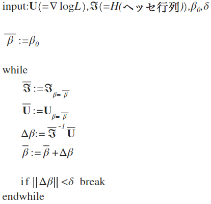

# 4章 推定

最尤推定法を用いて一般化線形モデルのパラメータの点推定と区間推定を求める方法を示す。

## 最尤推定

 - 一般化線形モデルの性質を満たす独立な確率変数$Y_{1}, \dots, Y_{N}$について考える
 - 共変量ベクトル : $\boldsymbol {\mathrm {x}}_{i} = \left( x_{i1}, \cdots, x_{ij}, \cdots, x_{ip} \right)^{T}$
 - 係数ベクトル : $\boldsymbol {\beta} = \left( \beta_{1}, \dots, \beta_{p} \right)^{T}$
 - $f\left( y_{i} ; \theta_{i} \right)$ : 指数型分布族に属する確率分布

$E\left( Y_{i} \right) = \mu_{i}$および$g\left( \mu_{i} \right) = \boldsymbol {\mathrm {x}}_{i}^{T} \boldsymbol {\beta}$という関係式によって$Y_{i}$に関係するパラメータ$\boldsymbol {\beta}$を推定したい。

### スコアベクトル(対数尤度関数の勾配ベクトル)の導出

$Y_{1}, \dots, Y_{N}$に対して表される尤度関数に対数をとり、対数尤度関数を得る。
$$
\begin{eqnarray}
L\left( { \theta_{1}, \dots, \theta_{N} } | { y_{1}, \dots, y_{N} } \right) & = & \prod _{i=1}^{N}{ f\left( y_{i} ; \theta_{i} \right) }\\
\log {L\left( { \theta_{1}, \dots, \theta_{N} } | { y_{1}, \dots, y_{N} } \right)} & = & \sum _{i=1}^{N}{\log {f\left( y_{i} ; \theta_{i} \right)}}\\
& = & \sum_{i=1}^{N}{\left[ y_{i}b\left( \theta_{i} \right) + c\left( \theta_{i} \right) + d\left( y_{i} \right) \right]}\\
& = & \sum _{i=1}^{N}{y_{i}b\left( \theta_{i} \right)} + \sum _{i=1}^{N}{c\left( \theta_{i} \right)} + \sum _{i=1}^{N}{d\left( y_{i} \right)}
\end{eqnarray}
$$

> 次の関係式を思い出して！
> $$
E\left(Y_{i}\right) = \mu_{i} = - \frac {c^{\prime}\left( \theta_{i} \right)}{b^{\prime}\left( \theta_{i} \right)}\\
Var\left( Y_{i} \right) = \frac { b^{\prime\prime}\left( \theta_{i} \right)c^{\prime}\left( \theta_{i} \right) - c^{\prime\prime}\left( \theta_{i} \right)b^{\prime}\left( \theta_{i} \right) }{\left[ b^{\prime}\left( \theta_{i} \right) \right]^{3}}\\
g\left( \mu_{i} \right) = \boldsymbol {\mathrm {x}}_{i}^{T}\boldsymbol {\beta} = \eta_{i}
\quad
もしくは
\quad
\mu_{i} = h\left( \eta_{i} \right) = h\left( \boldsymbol {\mathrm {x}}_{i}^{T} \boldsymbol {\beta} \right)
$$

パラメータ$\beta_{j}$の最尤推定値を得るため、微分の連鎖法則にもとづいて微分すると
$$
\begin{eqnarray}
\mathrm {U}_{j} \equiv \frac {\partial \log {L\left( \theta_{i}, \dots, \theta_{N} ; y_{1}, \dots, y_{N} \right)}}{\partial \beta_{j}} & = & \sum _{i=1}^{N}{\left[ \frac {\partial \log {L\left( \theta_{i} ; y_{i} \right)}}{\partial \beta_{j}} \right]} \quad (j=1,\dots,p)\\
& = & \sum _{i=1}^{N}{\left[ \frac {\partial \log {L\left( \theta_{i} ; y_{i} \right)}}{\partial \theta_{i}} \cdot \frac {\partial \theta_{i}}{\partial \mu_{i}} \cdot \frac {\partial \mu_{i}}{\partial \beta_{j}} \right]}
\end{eqnarray} 
$$
となる。式(6)の右辺の各項を分けて計算するとそれぞれ次式になる。

これらを式(6)に代入すると次式で表される。
$$
\mathrm {U}_{j} = \sum _{i=1}^{N}{\left[ \frac {(y_{i} - \mu_{i})}{Var\left( Y_{i} \right)} x_{ij} \left( \frac {\partial \mu_{i}}{\partial \eta_{i}} \right) \right]} \quad (j=1,\dots,p)
$$

対数尤度関数の勾配ベクトル
$$
\boldsymbol {\mathrm {U}} = \left[ \mathrm {U}_{1}, \dots, \mathrm {U}_{j}, \dots, \mathrm {U}_{p} \right]^{T}
$$

### 情報行列$\Im$の導出
> 情報行列と回帰係数の分散推定量との関係
>
> **情報行列**
> $$
\Im\left( \boldsymbol {\beta} \right) = - \frac {{\partial}^{2} \log {L\left( \boldsymbol {\theta}, \boldsymbol {y} \right)}}{{\partial \boldsymbol {\beta}}^{2}}
$$
> **回帰係数の分散推定量**
> $$
Var\left( \boldsymbol {\beta} \right) = {\Im\left( \boldsymbol {\beta} \right)}^{-1}
$$

情報行列$\Im$は、$U_{j}, j=1, \dots, p$の分散共分散行列に等しいが、その$\left( j , k \right)$要素を
$$
{\Im}_{jk} = E\left[ U_{j} U_{k} \right]
$$
と表す。$Y_{i}$が独立で$E\left[ \left( Y_{i} - {\mu}_{i} \right)\left( Y_{l} - {\mu}_{l} \right) \right] = 0, i \neq l$が成り立つことを考慮すると、式(4.18)より
$$
\begin{eqnarray}
{\Im}_{jk} & = & E\left\{ \sum _{i=1}^{N}{\left[ \frac {\left( Y_{i} - {\mu}_{i} \right)}{Var\left( Y_{i} \right)} x_{ij} \left( \frac {\partial \mu_{i}}{\partial \eta_{i}} \right) \right]} \sum _{ l=1 }^{ N }{ \left[ \frac { \left( Y_{ l }-{ \mu  }_{ l } \right)  }{ Var\left( Y_{ l } \right)  } x_{ lk }\left( \frac { \partial \mu _{ l } }{ \partial \eta _{ l } }  \right)  \right]  }  \right\}\\
& = & E\left\{ \left[ \frac { \left( Y_{ 1 }-{ \mu  }_{ 1 } \right)  }{ Var\left( Y_{ 1 } \right)  } x_{ 1j }\left( \frac { \partial \mu _{ 1 } }{ \partial \eta _{ 1 } }  \right) +\cdots +\frac { \left( Y_{ i }-{ \mu  }_{ i } \right)  }{ Var\left( Y_{ i } \right)  } x_{ ij }\left( \frac { \partial \mu _{ i } }{ \partial \eta _{ i } }  \right) +\cdots +\frac { \left( Y_{ N }-{ \mu  }_{ N } \right)  }{ Var\left( Y_{ N } \right)  } x_{ Nj }\left( \frac { \partial \mu _{ N } }{ \partial \eta _{ N } }  \right)  \right] \\ \cdot \left[ \frac { \left( Y_{ 1 }-{ \mu  }_{ 1 } \right)  }{ Var\left( Y_{ 1 } \right)  } x_{ 1k }\left( \frac { \partial \mu _{ 1 } }{ \partial \eta _{ 1 } }  \right) +\cdots +\frac { \left( Y_{ l }-{ \mu  }_{ l } \right)  }{ Var\left( Y_{ l } \right)  } x_{ lk }\left( \frac { \partial \mu _{ l } }{ \partial \eta _{ l } }  \right) +\cdots \frac { \left( Y_{ N }-{ \mu  }_{ N } \right)  }{ Var\left( Y_{ N } \right)  } x_{ Nk }\left( \frac { \partial \mu _{ N } }{ \partial \eta _{ N } }  \right)  \right]  \right\}
\end{eqnarray}
$$
各要素を掛け合わせた(分配した)時、$E\left[ \left( Y_{i} - \mu_{i} \right)\left( Y_{l} - \mu_{l} \right) \right] = 0 \quad (i \neq l)$なので
$$
\begin{eqnarray} E\left[ \frac { \left( Y_{ i }-{ \mu  }_{ i } \right)  }{ Var\left( Y_{ i } \right)  } x_{ ij }\left( \frac { \partial \mu _{ i } }{ \partial \eta _{ i } }  \right) \cdot \frac { \left( Y_{ l }-{ \mu  }_{ l } \right)  }{ Var\left( Y_{ l } \right)  } x_{ lk }\left( \frac { \partial \mu _{ l } }{ \partial \eta _{ l } }  \right)  \right]  & = & E\left[ \frac { \left( Y_{ i }-{ \mu  }_{ i } \right) \left( Y_{ l }-{ \mu  }_{ l } \right)  }{ Var\left( Y_{ i } \right) Var\left( Y_{ l } \right)  } x_{ ij }x_{ lk }\left( \frac { \partial \mu _{ i } }{ \partial \eta _{ i } }  \right) \left( \frac { \partial \mu _{ l } }{ \partial \eta _{ l } }  \right)  \right]  \\  & = & \frac { E\left[ \left( Y_{ i }-{ \mu  }_{ i } \right) \left( Y_{ l }-{ \mu  }_{ l } \right)  \right]  }{ Var\left( Y_{ i } \right) Var\left( Y_{ l } \right)  } x_{ ij }x_{ lk }\left( \frac { \partial \mu _{ i } }{ \partial \eta _{ i } }  \right) \left( \frac { \partial \mu _{ l } }{ \partial \eta _{ l } }  \right)  \\  & = & 0 \end{eqnarray}
$$
となり、$i=l$の要素しか残らない(0とならない)。よって、
$$
\begin{eqnarray} { \Im  }_{ jk } & = & \sum _{ i=1 }^{ N }{ \frac { E\left[ { \left( Y_{ i }-{ \mu  }_{ i } \right)  }^{ 2 } \right]  }{ { Var\left( Y_{ i } \right)  }^{ 2 } } x_{ ij }x_{ ik }{ \left( \frac { \partial \mu _{ i } }{ \partial \eta _{ i } }  \right)  }^{ 2 } }  \\  & = & \sum _{ i=1 }^{ N }{ \frac { x_{ ij }x_{ ik } }{ { Var\left( Y_{ i } \right)  } } { \left( \frac { \partial \mu _{ i } }{ \partial \eta _{ i } }  \right)  }^{ 2 } } \qquad \left( E\left[ { \left( Y_{ i }-{ \mu  }_{ i } \right)  }^{ 2 } \right] =Var\left( Y_{ i } \right) より \right)  \end{eqnarray}
$$
情報行列の各要素は↑上式になる。

### ニュートン法アルゴリズム
