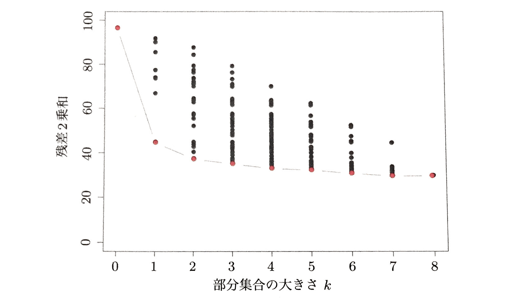

# 変数選択

最小2乗推定

$$
\hat {\beta} = \left( X^{T} X \right)^{-1} X^{T} y
$$

だけでは満足できない点が2つある。

 1. **予測精度** : 最小二乗推定は小さなバイアス $E\left[ \hat {f}\left( x \right) - y \right]^{2}$ と大きな分散 $\sigma^{2} = \frac {1}{N - p} \sum _{i=1}^{N}{\left( y - \hat {f}\left( x \right) \right)^{2}}$ を持つことが多いが、係数を縮小したり、いくつかの係数を0にしたりすることで、予測精度が向上する場合もある。バイアスを少し犠牲にして予測値の分散を減少させ、その結果、全体の予測精度が向上するのである
 2. **解釈** : 予測変数 $y$ の数が多いと最も影響の大きい変数の部分集合を決めたくなるものである。「全体像」を捉えるために細部を犠牲にしても構わないという考え方である。

この節では線形回帰の変数選択手法をいくつか紹介する。変数選択により変数の一部のみを選んで残りをモデルから除外し、残された入力に対する係数を推定するために最小二乗法回帰を用いる。変数を選択するためには、いくつかの異なるアプローチがある。

## 最良変数組み合わせ選択
最良部分集合による回帰では、**最も小さい残差2乗和 $RSS\left( \beta \right) = \sum _{i=1}^{N}{\left( y_{i} - f\left( x_{i} \right) \right)^{2}}$ が得られる大きさ $k$ の変数部分集合を、あらゆる $k \in \left\{ 0,1,2,\dots,p  \right\}$ から求める。**しかし、効率的なアルゴリズムである**跳躍限定法**(leaps and bounds)でも、$p$ はせいぜい30か40程度までしか扱うことができない。

> #### $k$を決める方法
> 最良部分集合曲線(上図の下方境界線)は必ず減少するため、部分集合の大きさ$k$を決定するために用いることはできない。選択には数多くの規準があるが、一般的には**期待予測誤差**を最小化する最も小さいモデルを選ぶ。

## 前向き/後向き漸次的選択法
変数のあらゆる組み合わせを探索しなくても、もっと良い方法がある。**前向き漸次的選択法**は、切片の値から開始して、推定を最も改善する説明変数を順次モデルに加えていく。予測変数の数が多い場合にはこの手法は多くの計算が必要になるように思えるが、現在の射影行列をOR分解することによって、次の候補を直ちに決定できる効率的な更新アルゴリズムがあるため、心配いらない。最良部分集合回帰と同様に、前向き漸次的選択法により、部分集合の大きさが$k$である場合の最良のモデルを順次決定していくことができる。