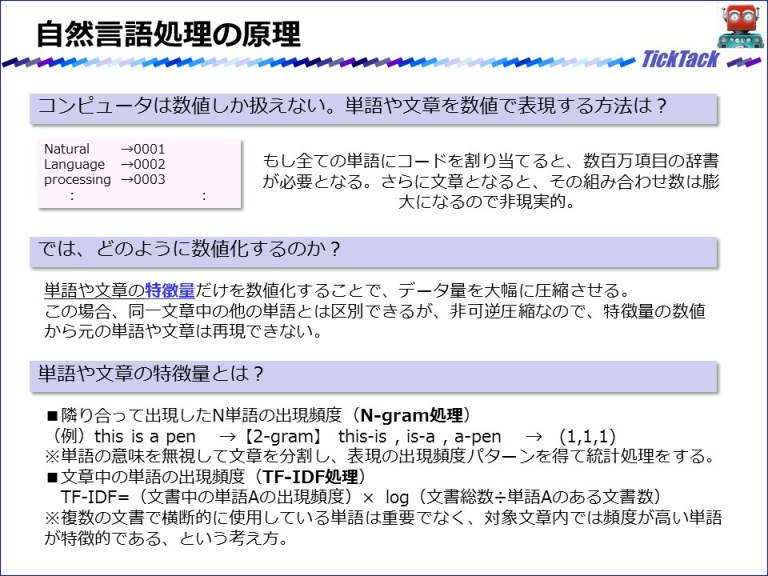

# [前処理]ベクトル変換

    
「<strong>単語</strong>」「<strong>文章</strong>」→「<strong>特徴ベクトル</strong>」

## 自然言語処理とは
### 自然言語処理の原理

## 英語の自然言語処理
> 単語や文章の特徴量は、英語の場合では上の図にあるような「N-gram処理」や「TF-IDF処理」が一般的です。どの文章でも使われているような単語は重要でなく、対象となる文章内では高頻度の単語が特徴的である、というのが基本的な考え方になります。

### 日本語の自然言語処理
> 日本語をコンピュータで処理をするためには、まず国語辞典や文法の知識、一般常識等をデータベース化しておく必要があります。しかし、自然言語は生き物のように変化し、常に新しい言葉、新しい用法も生まれ、一つの言葉が多数の意味を持ったり、その意味も変化します。

> 人間も言語情報を完全に処理している訳ではなく、多数の解釈の中から最も「妥当な」解釈を判断していると言われます。その「妥当性」を、コンピュータに実装することは難しいのです。

> 自然言語処理の難しさの根本原因は、自然言語が本質的に持ち、多様な解釈を可能とする「曖昧さ」にあるのです。

> 自然言語処理の最も身近な例は、「かな漢字変換」です。また日常生活欠かせない「検索エンジン」は、日本語の自然言語処理のおかげで利用することができ、「機械翻訳」の研究成果で自然言語処理は発達してきたとも言えます。

> 日本語は、英語のようにスペースで単語が区切られていないため、まず文章から単語を切り出す必要があります。この処理を「形態素解析」と言います。次に文章の構造をコンピュータで取り扱える形式にしますが、一般的には「係り受け構造」で表現します。そこからさらに、「意味解析」、「文脈解析」と進みますが、未だに研究段階であり精度の良い確立した手法はありません。詳しくは専門書を参考にしてください。

<table>
    <tr>
        <td>
            
        </td>
        <td>
            
        </td>
    </tr>
</table>

> 英語圏で開発された優れた技術やサービスを日本語で利用しようとしても、単語区切りにスペースを設定しているため日本語では正常に動作しません。このような問題を解決するためにも、日本語の自然言語処理において、単語を切り出す「形態素解析」は非常に重要な技術です。

> この形態素解析では、単語分割に加えて「品詞付与」などの処理も同時に行います。品詞付与とは、文章中の単語が名詞か動詞かといった品詞に分類する処理です。この品詞情報を用いることで、単語分割処理の精度が高まり、文章中から名詞だけ取り出してキーワードにするようことが出来ます。

> この形態素解析ソフトウェアとして有名なのが、「MeCab」というオープンソース（OSS）です。非常に優れた性能を持ち、しかも誰でも無料で使えるので、興味のある方はWebサイトからダウンロードして勉強してみてください。

> このMeCabがあれば、機械学習で利用可能な英語用の自然言語処理でも、ある程度利用が可能となります。単語の類似度計算程度なら簡単に利用できるようになります。

---
## 解析ステップ

 1) **形態素解析** : 日本語のように、単語間に区切りのない言語では、テキストを単語に分割する。また、単語が語形変化している場合には、原形に戻す。さらに、単語の品詞を決定する。 
 2) **構文解析** : 単語間の構文的関係を決定する 
 3) **意味解析** : 単語、文の意味を決定する 
 4) **文脈解析** : 複数の文にまたがる処理(テキストの構造の解析,照応の解析,省略の補完)を行う

## 辞書とコーパス

### 辞書

---
## 参考文献

 - [言語処理100本ノック 2015](http://www.cl.ecei.tohoku.ac.jp/nlp100/#)